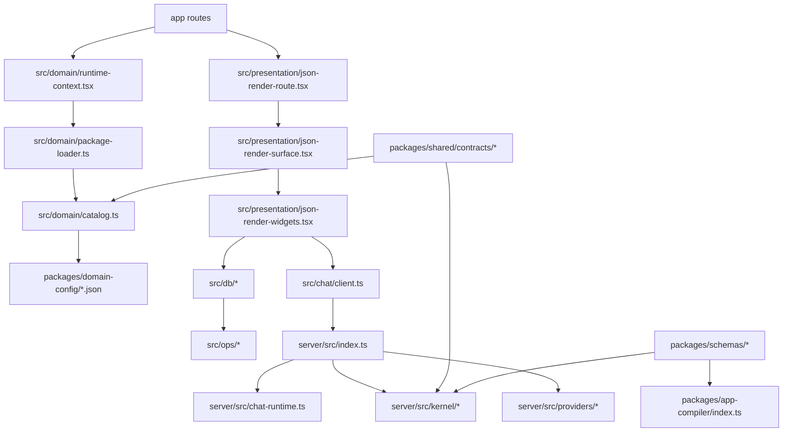

# Utopia Codebase File-by-File Review

Generated locally: 2026-07-28T16:08:24.017Z
Updated locally: 2026-07-28T19:19:13Z

Scope: original scan covered tracked files only. The 2026-07-28 update addendum covers the current local uncommitted platform work as well. Vendor/build outputs under `node_modules`, untracked caches, and local secrets are excluded. Native generated projects and binary assets are listed with shorter notes. Review flags are prompts for human inspection, not confirmed defects.

## Executive Read

- Utopia is a package-driven personal app platform: Expo shell -> app/package runtime -> JSON-render surface -> local SQLite operation store -> optional server/provider/AI runtime.
- Strongest code asset: contract-first architecture with schemas, package validation, operation logs, provider replay tests, and many focused gates.
- Main product asset: package runtime plus app factory path. Food is now treated as a reference app/source fixture, not the company.
- Main engineering risk: contract/runtime duplication across `packages/shared`, `packages/schemas`, `src/domain`, `src/ops`, and `server/src/kernel`.
- Main maintainability risk: large orchestration files mixing UI, IO, state, and policy. Some split work has started, but the shape is still mid-refactor.
- Current local proof: `release:proof:exports`, `gate:fast`, `config:validate`, `typecheck`, `doctor`, GitHub factory tests, package compiler tests, focused renderer/install/registry tests, and `git diff --check` passed locally.
- Current release blockers: signed Android APK/AAB evidence is missing, and physical-device release evidence is missing.

## Weak Points

1. `src/presentation/json-render-widgets.tsx` is still a UI god file even after a first domain-widget split. It imports chat, DB, sync, package-change, health, settings, runtime, and undo. Continue splitting by widget family plus side-effect hooks.
2. `server/src/index.ts` is still a server god entrypoint even after HTTP-helper extraction. It owns HTTP routing, CORS, auth, body limits, chat, providers, health, package registry, and abort controllers. Extract route modules.
3. Two canonical kernels exist: client `src/ops/*` and server `server/src/kernel/*`. They may drift unless shared contracts/tests force parity.
4. Package/domain contracts are spread across JSON schemas, TS contracts, compiler validation, client catalog parsing, and server package validation. One schema authority should generate the rest.
5. Food config is huge. It is now split into source chunks locally, but the compiled artifact remains large and must roundtrip deterministically.
6. Generated native `android/` and `ios/` are tracked. Useful for release, but easy to create noisy drift during Expo upgrades.
7. Many quality gates exist. The gate doc/release-proof scripts are better now, but the team must keep "local green" distinct from "signed release accepted."
8. Provider, chat, and factory code have many env-controlled modes. Good for local/dev, but needs clear production profile docs and secret-boundary tests kept current.
9. App routes are thin, but many route files duplicate JsonRenderRoute wiring. Route config could be data-driven.
10. Lots of test helpers use permissive `any`/memory DB shims. Acceptable in tests, but they can mask real SQLite/API behavior.
11. GitHub App Factory is promising, but currently produces simple record/dashboard apps only. It is not yet a universal app generator.
12. App Library trust now shows checksum/publisher/signature metadata, but real cryptographic signature verification is not implemented.

## 2026-07-28 Local Update Addendum

This addendum covers current local work that may still be uncommitted.

### Current Local Delta

- Modified tracked files: `README.md`, `package.json`, `app/install.tsx`, `packages/app-compiler/index.ts`, `packages/shared/contracts/package-install.ts`, `server/src/index.ts`, `src/db/app-package-registry.ts`, `src/domain/package-change-templates.ts`, `src/domain/package-install.ts`, `src/presentation/json-render-widgets.tsx`, and related tests.
- Modified tracked files also now include Expo/iOS config and schema/widget registry changes for the scientific calculator package.
- New local files: GitHub hygiene/workflows, app-factory docs/scripts, release gate scripts, package authoring CLI, Food package-source chunks, reference app fixtures, renderer domain-widget split, iOS CocoaPods support files, and a scientific calculator reference package.
- Nothing staged, committed, pushed, or merged as of this update.

### Updated Connection Map

```mermaid
flowchart TD
  Request[requests/app-idea.md or labeled GitHub issue] --> FactoryWorkflow[.github/workflows/generate-utopia-app.yml]
  FactoryWorkflow --> FactoryScript[scripts/factory/generate-app-from-prompt.ts]
  FactoryScript --> OpenAI[OpenAI Responses API via OPENAI_API_KEY]
  FactoryScript --> AppCompiler[packages/app-compiler/index.ts]
  AppCompiler --> ReviewArtifact[reviewable source/package/preview artifact]
  ReviewArtifact --> InstallScreen[app/install.tsx]
  InstallScreen --> InstallContract[packages/shared/contracts/package-install.ts]
  InstallScreen --> Registry[src/db/app-package-registry.ts]
  Registry --> AppRoute[app/apps/[installationId].tsx]
  AppRoute --> JsonRoute[src/presentation/json-render-route.tsx]
  JsonRoute --> JsonSurface[src/presentation/json-render-surface.tsx]
  JsonSurface --> CoreWidgets[src/presentation/json-render-widgets.tsx]
  JsonSurface --> DomainWidgets[src/presentation/json-render-domain-widgets.tsx]
```

### New/Changed File Notes

#### .dependency-cruiser.cjs

- Role: dependency boundary guard.
- Good: gives architecture rules a runnable checker.
- Review next: ensure the rule set fails on real forbidden imports and is wired into the intended gate.

#### .github/CODEOWNERS

- Role: GitHub ownership baseline.
- Good: improves review routing.
- Review next: confirm owners are real maintainers before publishing.

#### .github/dependabot.yml

- Role: dependency update automation.
- Good: basic supply-chain hygiene.
- Review next: group noisy native/Expo updates so generated native drift stays manageable.

#### .github/workflows/scorecard.yml

- Role: OpenSSF/security posture workflow.
- Good: raises baseline GitHub security signal.
- Review next: confirm permissions are least-privilege and output is actionable.

#### .github/ISSUE_TEMPLATE/utopia-app-request.yml

- Role: plain-English app request entrypoint.
- Good: lets fork users request apps without editing code.
- Review next: make issue body extraction robust enough for GitHub's generated YAML/Markdown format.

#### .github/workflows/generate-utopia-app.yml

- Role: fork-local app factory workflow.
- Good: supports manual dispatch, request-file push, and labeled issue generation; requires `OPENAI_API_KEY`; avoids `pull_request` secret exposure.
- Weak: does not open a PR or commit generated output; user must download artifact.
- Review next: add optional PR creation in the user's fork, still without leaking secrets.

#### CODE_OF_CONDUCT.md / SUPPORT.md

- Role: GitHub community baseline.
- Good: makes repo more publishable.
- Review next: replace placeholders with real support/security contacts before launch.

#### docs/*

- Role: strategy, trust, gates, release, architecture, commercialization, package authoring, reference apps.
- Good: converts the roast into verticals and contracts.
- Weak: docs are ahead of implementation in some places.
- Review next: mark every claim as `implemented`, `local-proof`, `blocked`, or `planned`.

#### requests/app-idea.md

- Role: default natural-language app request.
- Good: simple first fork path.
- Review next: add examples for family, group, and small-company apps.

#### scripts/factory/generate-app-from-prompt.ts

- Role: OpenAI-backed natural-language-to-package-source generator.
- Good: strict structured output, local compiler validation, no private credentials in output.
- Weak: assumes OpenAI response shape and simple app types; output quality needs adversarial prompts.
- Review next: add fixtures for malformed model JSON, oversized prompts, unsafe provider/native requests, and empty issue bodies.

#### scripts/factory/run-generate-app-from-prompt.mjs

- Role: Node wrapper for TS factory script.
- Good: keeps GitHub workflow simple.
- Review next: ensure failures are readable to nontechnical fork users.

#### scripts/package/create-utopia-app.ts

- Role: package authoring MVP CLI.
- Good: gives local creators a non-AI path.
- Weak: still developer-facing.
- Review next: turn into a guided prompt flow and generate screenshots/preview notes.

#### scripts/gates/*

- Role: fast, platform, local release, and release proof gates.
- Good: separates local export proof from signed Android/physical-device proof.
- Weak: full `release:proof:all` is expected to block until real APK/AAB and device evidence exist.
- Review next: wire exact artifact/evidence creation docs for signed Android and physical-device runs.

#### scripts/quality/check-food-package-source-roundtrip.ts

- Role: proof that Food source chunks compile back to the current package.
- Good: makes huge config safer to edit.
- Review next: require this gate whenever Food source chunks or compiled package change.

#### scripts/quality/split-food-package-source.mjs

- Role: one-time/source-maintenance splitter for Food package JSON.
- Good: reduces review pain.
- Review next: clarify whether it is canonical or a migration helper.

#### server/src/http-utils.ts

- Role: extracted server HTTP helpers.
- Good: first split out of `server/src/index.ts`.
- Weak: route ownership is still mostly centralized.
- Review next: continue by extracting route modules with tests.

#### src/presentation/json-render-domain-widgets.tsx

- Role: extracted domain/reference widget family.
- Good: reduces `json-render-widgets.tsx` size and clarifies that some widgets are reference/domain adapters.
- Weak: shares helper/styles through the generic widget file, which can create coupling.
- Review next: move shared widget utilities/styles into neutral modules and split system widgets next.

#### app/install.tsx

- Role: App Library install/registry/installed-app shelf.
- Good: now shows trust badges, checksum, publisher, signature metadata, installed app metadata, and archive-from-shelf.
- Weak: update flow is not implemented; archive is not data wipe; screenshots/categories are still mostly docs.
- Review next: add update preview/diff and a clear "archive vs delete data" distinction.

#### packages/shared/contracts/package-install.ts

- Role: install preview/approval/trust contract.
- Good: checksum verification, publisher metadata, signature metadata validation, invalid signature metadata blocking.
- Weak: signature is metadata only, not cryptographic verification.
- Review next: implement real signature verification and key trust policy.

#### src/db/app-package-registry.ts

- Role: app package install, activation, rollback, archive, package state.
- Good: archive preserves package state/evidence and hides from active shelf.
- Weak: install/update/archive/delete lifecycle needs a cleaner state machine.
- Review next: add explicit statuses, update receipts, and delete-data path behind confirmation.

#### src/domain/package-change-templates.ts

- Role: safe package-edit template generator.
- Good: widget edit targeting now finds screens containing named widgets and preserves stable ids.
- Weak: still heuristic and prompt-fragile.
- Review next: replace phrase heuristics with structured intent parsing/validation.

#### src/domain/package-install.ts

- Role: install fetch/preview helpers and UI trust summary.
- Good: centralizes user-facing trust labels.
- Weak: labels may drift from contract semantics if not tested with all trust states.
- Review next: add table-driven trust-copy tests.

#### src/presentation/json-render-widgets.tsx

- Role: generic/system JSON-render widget registry.
- Good: smaller after domain-widget extraction; stale Food copy removed from generic capture/data-home text.
- Weak: still too large and side-effect-heavy.
- Review next: split chat, health, settings, package editor, data-home, capture, and generic display widgets.

#### tests/platform/github-app-factory.test.ts

- Role: factory workflow/script guard.
- Good: checks no `pull_request`, issue label guard, structured output normalization.
- Weak: no live OpenAI smoke unless key is available.
- Review next: add optional env-gated live smoke that redacts all request/response secrets.

#### tests/domain/package-install.test.ts

- Role: install/trust contract coverage.
- Good: covers checksum, publisher, signature present/missing/invalid, trust labels.
- Review next: add real signature cases once crypto verification exists.

#### tests/domain/app-package-registry.test.ts

- Role: package activation/rollback/archive/template safety.
- Good: covers archive semantics and widget edit targeting.
- Review next: add real SQLite mirror tests for archive/list/update lifecycle.

### Detailed File Snapshots

Use this shape when expanding the older file-by-file section: `Purpose`, `What happens inside`, `Inputs`, `Outputs`, `Touches`, `Risk`, `Best next test`.

#### app.json

- Purpose: Expo app identity and native permission/config bridge.
- What happens inside: defines name, slug, description, platforms, Android predictive-back behavior, Android permissions, EAS project id, and owner.
- Inputs: Expo CLI, EAS, native prebuild/export commands.
- Outputs: native project settings consumed by Android/iOS builds.
- Touches: app identity, release metadata, Android microphone permission.
- Risk: slug/owner rename affects EAS/release identity; `RECORD_AUDIO` expands native permission surface and should be justified by a package capability.
- Best next test: `npm run doctor`, `npm run export:android`, and native permission contract check.

#### app/install.tsx

- Purpose: App Library install, registry browsing, preview, open, and archive surface.
- What happens inside: loads registry/package URLs, previews package via trust contract, renders trust badges/rows, installs after approval receipt, lists active installations, opens installed apps, archives apps from the shelf.
- Inputs: route `url` param, registry URL, package URL, bundled registry, local SQLite database.
- Outputs: installed app record, approval receipt, navigation to `/apps/:installationId`, archived shelf state.
- Touches: `installApprovedAppPackage`, `archiveAppInstallation`, `PackageInstallPreview`, runtime context.
- Risk: update flow absent; archive is not delete; installed apps need clearer data-retention copy.
- Best next test: add UI-level test for blocked preview, verified preview, installed app open, and archive.

#### packages/shared/contracts/package-install.ts

- Purpose: package install trust and approval contract.
- What happens inside: parses install targets, validates registry manifests, computes canonical package checksum, builds install preview, checks runtime compatibility, validates publisher/signature metadata, builds and verifies approval receipts.
- Inputs: package JSON, source URL, optional registry package, optional expected checksum.
- Outputs: `PackageInstallPreview`, `PackageInstallApprovalReceipt`, install validation errors.
- Touches: package validation, canonical JSON hashing, native capability support checks.
- Risk: signature is metadata validation only; no cryptographic signature verification yet.
- Best next test: table-drive checksum missing/mismatch/verified plus signature missing/present/invalid/crypto-verified once implemented.

#### src/domain/package-install.ts

- Purpose: client helper layer around package-install contracts.
- What happens inside: fetches package/registry JSON, builds preview candidates, exposes bundled demo registry/package, checks descriptor-preview match, produces user-facing trust labels and rows.
- Inputs: URL string, fetcher, registry package metadata.
- Outputs: candidate package JSON, preview rows, trust summary labels.
- Touches: bundled domain manifest bridge, package install contract.
- Risk: user-facing copy can drift from contract semantics.
- Best next test: trust-copy snapshot tests for every preview state.

#### src/db/app-package-registry.ts

- Purpose: local package installation and activation state.
- What happens inside: bootstraps bundled package, stores package JSON by key, creates installations, activates approved installs, previews/applies package diffs, rolls back active package, archives non-default installations, hydrates install metadata/state.
- Inputs: SQLite DB, package JSON, approval receipts, package diff requests.
- Outputs: active package, app installation rows, package state rows, receipt evidence.
- Touches: SQLite tables, app package loader, package change templates, approval hash evidence.
- Risk: install/update/archive/delete lifecycle is spread across helper functions instead of one explicit state machine.
- Best next test: real SQLite test for install -> list -> archive -> reopen -> active package still readable.

#### src/domain/package-change-templates.ts

- Purpose: deterministic safe package-edit template generator.
- What happens inside: turns constrained natural-language prompts into JSON Patch operations for tables, fields, screens, widgets, control room, workflow-like changes, and theme edits.
- Inputs: active `AppPackage`, user prompt.
- Outputs: `AppPackageChangeRequest` with reviewable patch list.
- Touches: allowed patch paths, package registry preview/apply flow, widget intent templates.
- Risk: heuristic matching can edit wrong screen/component; current fix improves named-widget targeting but still needs structured intent parsing.
- Best next test: adversarial prompts for ambiguous screen/widget names and forbidden patch paths.

#### packages/app-compiler/index.ts

- Purpose: source-folder-to-app-package compiler.
- What happens inside: reads app/source folder parts, normalizes collections/queries/screens, validates links, emits compiled package and preview metadata.
- Inputs: `source/app.json`, `collections/*.json`, `queries/*.json`, `screens/*.json`, optional acceptance/capability files.
- Outputs: compiled `*.v1.json` package and `preview.json`.
- Touches: shared package contracts, widget contracts, schema registry tests, package-source fixtures.
- Risk: compiler is becoming a second schema authority unless generated from shared contracts.
- Best next test: malformed source fixture for missing query, unknown widget, bad field type, duplicate ids, unsafe native capability.

#### scripts/factory/generate-app-from-prompt.ts

- Purpose: GitHub/OpenAI natural-language app factory.
- What happens inside: reads prompt, requires `OPENAI_API_KEY`, calls Responses API with strict JSON schema, normalizes model output, compiles package source, writes prompt/source/package/preview/raw-output/manifest artifact.
- Inputs: Markdown prompt file, OpenAI key, model name, output directory.
- Outputs: reviewable app artifact under `dist/github-app-factory`.
- Touches: OpenAI network API, package compiler, canonical checksum.
- Risk: prompt injection/output weirdness; issue body format may include template labels; no live smoke without safe key.
- Best next test: unsafe prompt fixture that asks for secrets/native permissions and must fail or strip unsafe output.

#### .github/workflows/generate-utopia-app.yml

- Purpose: fork-local app generation workflow.
- What happens inside: triggers on manual dispatch, request-file push, or labeled issue; installs deps; checks `OPENAI_API_KEY`; converts issue body to request file; runs factory; uploads artifact.
- Inputs: `requests/app-idea.md`, issue body, repo secret, model input.
- Outputs: GitHub Actions artifact.
- Touches: Actions secrets, issue events, package factory.
- Risk: user experience stops at downloadable artifact; no generated PR; issue-body extraction is minimal.
- Best next test: static workflow test plus a dry-run fixture for issue body rendering.

#### .github/ISSUE_TEMPLATE/utopia-app-request.yml

- Purpose: non-code app request form.
- What happens inside: collects app idea and boundaries, applies `utopia-app-request` label.
- Inputs: user-written issue fields.
- Outputs: labeled issue body for factory workflow.
- Touches: GitHub issue event path.
- Risk: generated issue body may include headings/formatting the factory prompt does not expect.
- Best next test: parse a real rendered issue body and prove factory prompt stays clean.

#### src/presentation/json-render-surface.tsx

- Purpose: turns package-declared UI components into JSON-render component specs.
- What happens inside: maps standard display widgets and runtime widgets to registered component names, binds records/query results, preserves action navigation, handles package chrome.
- Inputs: active UI surface, records, native permissions/provider sync, density.
- Outputs: JSON render spec with element tree and widget component names.
- Touches: widget registry, package UI contracts, renderer tests.
- Risk: widget map is another authority that can drift from schema/contract/catalog.
- Best next test: widget catalog drift test for every `APP_PACKAGE_WIDGET_KINDS` value.

#### src/presentation/json-render-widgets.tsx

- Purpose: main runtime widget registry and implementation file.
- What happens inside: defines helper functions/styles, generic widgets, side-effect widgets for chat/health/settings/data homes/package editing/capture, scientific calculator, and registry bindings to domain widgets.
- Inputs: JSON-render widget props, router, DB/runtime context, settings, health/provider/chat APIs.
- Outputs: rendered React Native widgets and side effects like navigation, package edits, capture writes, health/settings changes.
- Touches: many subsystems; this is still the highest coupling file.
- Risk: very large file with UI, parser/evaluator logic, DB writes, network-ish calls, and shared styles mixed.
- Best next test: split scientific calculator evaluator into pure module with unit tests, then split side-effect widget families.

#### src/presentation/json-render-domain-widgets.tsx

- Purpose: extracted domain/reference widget family.
- What happens inside: renders hero, use-first carousel, timeline, recipe card, receipt review card, shelf, and ask bar widgets using shared helpers/styles.
- Inputs: JSON-render widget props.
- Outputs: React Native domain-styled widget surfaces.
- Touches: generic widget helpers/styles and router.
- Risk: imports helpers/styles from `json-render-widgets.tsx`, creating coupling back to the big file.
- Best next test: extract `json-render-widget-utils.ts` and prove no circular import.

#### apps/scientific-calculator/source/*

- Purpose: source-package example for a non-Food app.
- What happens inside: declares app metadata, `calculation` collection, history query, calculator/functions/history screens, and schema-native acceptance.
- Inputs: package compiler.
- Outputs: `apps/scientific-calculator/scientific-calculator.v1.json` and `preview.json`.
- Touches: `scientificCalculator` widget contract/schema/surface map.
- Risk: proves widget-specific apps, but calculator evaluation currently lives in the generic widget file, not package source.
- Best next test: compile fixture, render home screen, evaluate expressions like `sin(45 deg)`, `ln(e)`, `sqrt(144)`, bad syntax.

#### server/src/index.ts

- Purpose: main local/server entrypoint.
- What happens inside: accepts HTTP requests, handles auth/CORS/body parsing, routes chat/provider/package/MCP/health endpoints, owns abort/runtime wiring.
- Inputs: HTTP requests, env config, provider credentials via server-side config.
- Outputs: JSON/SSE responses and runtime/provider side effects.
- Touches: chat runtime, provider adapters, MCP server, HTTP helpers.
- Risk: still too much route ownership in one file.
- Best next test: route-module extraction with parity tests per route family.

#### server/src/http-utils.ts

- Purpose: extracted HTTP helper utilities.
- What happens inside: centralizes low-level request/response helpers formerly inside `server/src/index.ts`.
- Inputs: Node HTTP request/response objects.
- Outputs: parsed request bodies, normalized responses, headers/errors.
- Touches: server entrypoint.
- Risk: helper split is useful but not enough; route policy remains in entrypoint.
- Best next test: unit tests for body limits, invalid JSON, CORS/options, and auth failure response shape.

#### scripts/gates/*

- Purpose: named quality and release proof entrypoints.
- What happens inside: runs fast dev checks, platform exports, local release checks, signed Android artifact proof, and physical-device evidence proof.
- Inputs: local repo, generated build artifacts/evidence files.
- Outputs: pass/fail/block status and evidence JSON.
- Touches: Expo export, TypeScript, doctor, chat proof scripts, Android release artifacts, device proof file.
- Risk: `release:proof:all` should block until real signed/device artifacts exist; do not water it down.
- Best next test: run `release:proof:exports` after any release-facing change and document signed/device blockers separately.

#### ios/*

- Purpose: generated/native iOS project and CocoaPods integration.
- What happens inside: Xcode project now references Pods, privacy manifest, Expo module provider, resource/framework phases, and Info.plist generated values.
- Inputs: Expo prebuild/CocoaPods/EAS.
- Outputs: iOS native build project.
- Touches: release signing, privacy manifests, native modules.
- Risk: generated native drift can be noisy and hard to review.
- Best next test: `npm run check:ios-export`, then real iOS native build when release lane starts.

### Current Blockers To Assign

1. Signed Android release proof: produce release APK/AAB and make `release:proof:signed-android` pass.
2. Physical device proof: create `app/build/evidence/physical-device-release.json` without serial/secrets and make `release:proof:physical-device` pass.
3. Real signature verification: turn signature metadata into cryptographic verification with key trust policy.
4. App Library update flow: registry version diff, changed permissions/providers/widgets, approval receipt, activation.
5. Widget split: extract shared widget utilities/styles, then split system widget families.
6. Server route split: extract chat, provider, package, MCP, and health route modules from `server/src/index.ts`.
7. GitHub factory hardening: issue body parsing, unsafe prompt tests, optional PR creation in fork, optional live smoke with safe env.
8. Package authoring UX: make `create:utopia-app` a guided 10-minute creator flow.

## Single External-Agent Review Prompt

Use this prompt with other agents to cover gaps:

```text
You are reviewing /Users/srinivasvaddi/Projects/utopia locally. Do not push, merge, stage, or log secrets. Do not edit packages/domain-shared. Preserve user changes. Food is only a reference app, not the company.

Goal: independently audit Utopia as a local-first package runtime/app factory for personal, family, group, and small-company apps. Read CODEBASE_FILE_BY_FILE_REVIEW.md first, then verify the current worktree directly instead of trusting the document.

Focus on one review lane and produce concrete findings with file paths, line numbers, severity, exact risk, and proposed fix:

1. GitHub App Factory: .github/workflows/generate-utopia-app.yml, .github/ISSUE_TEMPLATE/utopia-app-request.yml, requests/app-idea.md, scripts/factory/*, tests/platform/github-app-factory.test.ts. Check fork safety, OPENAI_API_KEY handling, issue-body parsing, prompt injection, artifact quality, and whether generated app packages are reviewable.
2. App Library Trust/Install: app/install.tsx, src/domain/package-install.ts, packages/shared/contracts/package-install.ts, src/db/app-package-registry.ts, tests/domain/package-install.test.ts, tests/domain/app-package-registry.test.ts. Check checksum/publisher/signature semantics, archive vs delete, install/update lifecycle, approval receipts, and missing crypto verification.
3. Package Authoring/Compiler: packages/app-compiler/index.ts, scripts/package/create-utopia-app.ts, tests/fixtures/package-source/*, tests/platform/package-compiler.test.ts, tests/platform/create-utopia-app.test.ts. Check whether a user can create a useful app in 10 minutes and whether schema/query/screen validation is strong.
4. Renderer/Widgets: src/presentation/json-render-surface.tsx, src/presentation/json-render-widgets.tsx, src/presentation/json-render-domain-widgets.tsx, tests/presentation/json-render-reference-app.test.ts. Check generic runtime boundaries, domain leakage, side effects inside widgets, mobile UI risk, and next split points.
5. Server/Runtime Boundaries: server/src/index.ts, server/src/http-utils.ts, server/src/kernel/*, src/ops/*, src/chat/client.ts. Check route separation, auth/body-limit correctness, client/server kernel drift, deterministic chat contracts, and production profile risk.
6. Release/Gates/Supply Chain: package.json scripts, scripts/gates/*, scripts/quality/*release*, docs/platform-release-contract.md, docs/release-security.md. Check which gates prove local debug, export, signed release, physical device, or security posture. Do not conflate these proof levels.

Before reporting, run only the smallest relevant checks for your lane. If you run any command, include pass/fail and exact command. If a gate is expected to block, call it BLOCKED, not failed. End with: top 5 fixes, files to edit, tests to add, and residual risk.
```

## How Pieces Connect



## Largest Text Files

- package-lock.json: 10986 lines
- server/src/tools/catalog.ts: 3654 lines
- apps/food/food.v1.json: 2868 lines
- packages/domain-config/domains/food.v1.json: 2868 lines
- src/presentation/json-render-widgets.tsx: 2467 lines
- server/src/runtime/state.ts: 2001 lines
- server/package-lock.json: 1806 lines
- server/src/index.ts: 1794 lines
- src/domain/package-migrations.ts: 1493 lines
- src/domain/package-change-templates.ts: 1342 lines
- packages/app-compiler/index.ts: 1099 lines
- src/domain/cloud-vault.ts: 1061 lines
- src/chat/client.ts: 1039 lines
- src/db/migrations.ts: 1006 lines
- src/domain/package-sharing.ts: 990 lines
- server/src/agents/executor.ts: 976 lines
- src/presentation/json-render-surface.tsx: 930 lines
- src/db/app-package-registry.ts: 912 lines
- server/test/reactive-proposal-executor.ts: 909 lines
- src/domain/package-control-room.ts: 899 lines
- src/domain/catalog.ts: 820 lines
- scripts/quality/run-utopia-connected.ts: 809 lines
- packages/domain-config/schemas/domain.v1.schema.json: 764 lines
- server/src/agents/retrieval.ts: 761 lines
- server/src/providers/sheets/push.ts: 739 lines

## File-by-File Notes

### .github

#### .github/ISSUE_TEMPLATE/bug.yml

- Role: GitHub issue/PR/CI metadata.
- Size: 39 lines
- Review flags: `network_or_secret_boundary`

#### .github/ISSUE_TEMPLATE/config.yml

- Role: GitHub issue/PR/CI metadata.
- Size: 6 lines
- Review flags: `network_or_secret_boundary`

#### .github/ISSUE_TEMPLATE/feature.yml

- Role: GitHub issue/PR/CI metadata.
- Size: 34 lines

#### .github/pull_request_template.md

- Role: GitHub issue/PR/CI metadata.
- Size: 23 lines

#### .github/workflows/expo-quality.yml

- Role: GitHub issue/PR/CI metadata.
- Size: 64 lines

### .gitignore

#### .gitignore

- Role: Binary asset or generated platform artifact; inspect only when changing branding/release assets.
- Size: binary/non-text

### .gitleaks.toml

#### .gitleaks.toml

- Role: Repo support file.
- Size: 13 lines

### AGENTS.md

#### AGENTS.md

- Role: Repo-specific working rules and required gates.
- Size: 17 lines
- Review flags: `network_or_secret_boundary`

### android

#### android/.gitignore

- Role: Binary asset or generated platform artifact; inspect only when changing branding/release assets.
- Size: binary/non-text
- Review flags: `generated_native_drift`

#### android/app/build.gradle

- Role: Generated Expo Android native project and release resources.
- Size: 204 lines
- Connects to: `expo/scripts/resolveAppEntry`
- Review flags: `network_or_secret_boundary`, `generated_native_drift`

#### android/app/proguard-rules.pro

- Role: Binary asset or generated platform artifact; inspect only when changing branding/release assets.
- Size: binary/non-text
- Review flags: `generated_native_drift`

#### android/app/src/debug/AndroidManifest.xml

- Role: Generated Expo Android native project and release resources.
- Size: 8 lines
- Review flags: `network_or_secret_boundary`, `generated_native_drift`

#### android/app/src/debugOptimized/AndroidManifest.xml

- Role: Generated Expo Android native project and release resources.
- Size: 8 lines
- Review flags: `network_or_secret_boundary`, `generated_native_drift`

#### android/app/src/main/AndroidManifest.xml

- Role: Generated Expo Android native project and release resources.
- Size: 67 lines
- Review flags: `network_or_secret_boundary`, `generated_native_drift`

#### android/app/src/main/java/app/utopia/MainActivity.kt

- Role: Generated Expo Android native project and release resources.
- Size: 85 lines
- Review flags: `network_or_secret_boundary`, `generated_native_drift`

#### android/app/src/main/java/app/utopia/MainApplication.kt

- Role: Generated Expo Android native project and release resources.
- Size: 47 lines
- Review flags: `generated_native_drift`

#### android/app/src/main/res/drawable-hdpi/splashscreen_logo.png

- Role: Binary asset or generated platform artifact; inspect only when changing branding/release assets.
- Size: binary/non-text
- Review flags: `generated_native_drift`

#### android/app/src/main/res/drawable-mdpi/splashscreen_logo.png

- Role: Binary asset or generated platform artifact; inspect only when changing branding/release assets.
- Size: binary/non-text
- Review flags: `generated_native_drift`

#### android/app/src/main/res/drawable-xhdpi/splashscreen_logo.png

- Role: Binary asset or generated platform artifact; inspect only when changing branding/release assets.
- Size: binary/non-text
- Review flags: `generated_native_drift`

#### android/app/src/main/res/drawable-xxhdpi/splashscreen_logo.png

- Role: Binary asset or generated platform artifact; inspect only when changing branding/release assets.
- Size: binary/non-text
- Review flags: `generated_native_drift`

#### android/app/src/main/res/drawable-xxxhdpi/splashscreen_logo.png

- Role: Binary asset or generated platform artifact; inspect only when changing branding/release assets.
- Size: binary/non-text
- Review flags: `generated_native_drift`

#### android/app/src/main/res/drawable/ic_launcher_background.xml

- Role: Generated Expo Android native project and release resources.
- Size: 6 lines
- Review flags: `network_or_secret_boundary`, `generated_native_drift`

#### android/app/src/main/res/drawable/rn_edit_text_material.xml

- Role: Generated Expo Android native project and release resources.
- Size: 38 lines
- Review flags: `network_or_secret_boundary`, `generated_native_drift`

#### android/app/src/main/res/mipmap-anydpi-v26/ic_launcher.xml

- Role: Generated Expo Android native project and release resources.
- Size: 6 lines
- Review flags: `network_or_secret_boundary`, `generated_native_drift`

#### android/app/src/main/res/mipmap-anydpi-v26/ic_launcher_round.xml

- Role: Generated Expo Android native project and release resources.
- Size: 6 lines
- Review flags: `network_or_secret_boundary`, `generated_native_drift`

#### android/app/src/main/res/mipmap-hdpi/ic_launcher.webp

- Role: Binary asset or generated platform artifact; inspect only when changing branding/release assets.
- Size: binary/non-text
- Review flags: `generated_native_drift`

#### android/app/src/main/res/mipmap-hdpi/ic_launcher_background.webp

- Role: Binary asset or generated platform artifact; inspect only when changing branding/release assets.
- Size: binary/non-text
- Review flags: `generated_native_drift`

#### android/app/src/main/res/mipmap-hdpi/ic_launcher_foreground.webp

- Role: Binary asset or generated platform artifact; inspect only when changing branding/release assets.
- Size: binary/non-text
- Review flags: `generated_native_drift`

#### android/app/src/main/res/mipmap-hdpi/ic_launcher_monochrome.webp

- Role: Binary asset or generated platform artifact; inspect only when changing branding/release assets.
- Size: binary/non-text
- Review flags: `generated_native_drift`

#### android/app/src/main/res/mipmap-hdpi/ic_launcher_round.webp

- Role: Binary asset or generated platform artifact; inspect only when changing branding/release assets.
- Size: binary/non-text
- Review flags: `generated_native_drift`

#### android/app/src/main/res/mipmap-mdpi/ic_launcher.webp

- Role: Binary asset or generated platform artifact; inspect only when changing branding/release assets.
- Size: binary/non-text
- Review flags: `generated_native_drift`

#### android/app/src/main/res/mipmap-mdpi/ic_launcher_background.webp

- Role: Binary asset or generated platform artifact; inspect only when changing branding/release assets.
- Size: binary/non-text
- Review flags: `generated_native_drift`

#### android/app/src/main/res/mipmap-mdpi/ic_launcher_foreground.webp

- Role: Binary asset or generated platform artifact; inspect only when changing branding/release assets.
- Size: binary/non-text
- Review flags: `generated_native_drift`

#### android/app/src/main/res/mipmap-mdpi/ic_launcher_monochrome.webp

- Role: Binary asset or generated platform artifact; inspect only when changing branding/release assets.
- Size: binary/non-text
- Review flags: `generated_native_drift`

#### android/app/src/main/res/mipmap-mdpi/ic_launcher_round.webp

- Role: Binary asset or generated platform artifact; inspect only when changing branding/release assets.
- Size: binary/non-text
- Review flags: `generated_native_drift`

#### android/app/src/main/res/mipmap-xhdpi/ic_launcher.webp

- Role: Binary asset or generated platform artifact; inspect only when changing branding/release assets.
- Size: binary/non-text
- Review flags: `generated_native_drift`

#### android/app/src/main/res/mipmap-xhdpi/ic_launcher_background.webp

- Role: Binary asset or generated platform artifact; inspect only when changing branding/release assets.
- Size: binary/non-text
- Review flags: `generated_native_drift`

#### android/app/src/main/res/mipmap-xhdpi/ic_launcher_foreground.webp

- Role: Binary asset or generated platform artifact; inspect only when changing branding/release assets.
- Size: binary/non-text
- Review flags: `generated_native_drift`

#### android/app/src/main/res/mipmap-xhdpi/ic_launcher_monochrome.webp

- Role: Binary asset or generated platform artifact; inspect only when changing branding/release assets.
- Size: binary/non-text
- Review flags: `generated_native_drift`

#### android/app/src/main/res/mipmap-xhdpi/ic_launcher_round.webp

- Role: Binary asset or generated platform artifact; inspect only when changing branding/release assets.
- Size: binary/non-text
- Review flags: `generated_native_drift`

#### android/app/src/main/res/mipmap-xxhdpi/ic_launcher.webp

- Role: Binary asset or generated platform artifact; inspect only when changing branding/release assets.
- Size: binary/non-text
- Review flags: `generated_native_drift`

#### android/app/src/main/res/mipmap-xxhdpi/ic_launcher_background.webp

- Role: Binary asset or generated platform artifact; inspect only when changing branding/release assets.
- Size: binary/non-text
- Review flags: `generated_native_drift`

#### android/app/src/main/res/mipmap-xxhdpi/ic_launcher_foreground.webp

- Role: Binary asset or generated platform artifact; inspect only when changing branding/release assets.
- Size: binary/non-text
- Review flags: `generated_native_drift`

#### android/app/src/main/res/mipmap-xxhdpi/ic_launcher_monochrome.webp

- Role: Binary asset or generated platform artifact; inspect only when changing branding/release assets.
- Size: binary/non-text
- Review flags: `generated_native_drift`

#### android/app/src/main/res/mipmap-xxhdpi/ic_launcher_round.webp

- Role: Binary asset or generated platform artifact; inspect only when changing branding/release assets.
- Size: binary/non-text
- Review flags: `generated_native_drift`

#### android/app/src/main/res/mipmap-xxxhdpi/ic_launcher.webp

- Role: Binary asset or generated platform artifact; inspect only when changing branding/release assets.
- Size: binary/non-text
- Review flags: `generated_native_drift`

#### android/app/src/main/res/mipmap-xxxhdpi/ic_launcher_background.webp

- Role: Binary asset or generated platform artifact; inspect only when changing branding/release assets.
- Size: binary/non-text
- Review flags: `generated_native_drift`

#### android/app/src/main/res/mipmap-xxxhdpi/ic_launcher_foreground.webp

- Role: Binary asset or generated platform artifact; inspect only when changing branding/release assets.
- Size: binary/non-text
- Review flags: `generated_native_drift`

#### android/app/src/main/res/mipmap-xxxhdpi/ic_launcher_monochrome.webp

- Role: Binary asset or generated platform artifact; inspect only when changing branding/release assets.
- Size: binary/non-text
- Review flags: `generated_native_drift`

#### android/app/src/main/res/mipmap-xxxhdpi/ic_launcher_round.webp

- Role: Binary asset or generated platform artifact; inspect only when changing branding/release assets.
- Size: binary/non-text
- Review flags: `generated_native_drift`

#### android/app/src/main/res/values-night/colors.xml

- Role: Generated Expo Android native project and release resources.
- Size: 1 lines
- Review flags: `generated_native_drift`

#### android/app/src/main/res/values/colors.xml

- Role: Generated Expo Android native project and release resources.
- Size: 5 lines
- Review flags: `generated_native_drift`

#### android/app/src/main/res/values/strings.xml

- Role: Generated Expo Android native project and release resources.
- Size: 5 lines
- Review flags: `generated_native_drift`

#### android/app/src/main/res/values/styles.xml

- Role: Generated Expo Android native project and release resources.
- Size: 14 lines
- Review flags: `network_or_secret_boundary`, `generated_native_drift`

#### android/build.gradle

- Role: Generated Expo Android native project and release resources.
- Size: 25 lines
- Review flags: `network_or_secret_boundary`, `generated_native_drift`

#### android/gradle.properties

- Role: Generated Expo Android native project and release resources.
- Size: 63 lines
- Review flags: `network_or_secret_boundary`, `generated_native_drift`

#### android/gradle/wrapper/gradle-wrapper.jar

- Role: Binary asset or generated platform artifact; inspect only when changing branding/release assets.
- Size: binary/non-text
- Review flags: `generated_native_drift`

#### android/gradle/wrapper/gradle-wrapper.properties

- Role: Generated Expo Android native project and release resources.
- Size: 8 lines
- Review flags: `network_or_secret_boundary`, `generated_native_drift`

#### android/gradlew

- Role: Generated Expo Android native project and release resources.
- Size: 249 lines
- Review flags: `network_or_secret_boundary`, `generated_native_drift`

#### android/gradlew.bat

- Role: Generated Expo Android native project and release resources.
- Size: 99 lines
- Review flags: `network_or_secret_boundary`, `generated_native_drift`

#### android/settings.gradle

- Role: Generated Expo Android native project and release resources.
- Size: 40 lines
- Review flags: `generated_native_drift`

### app.json

#### app.json

- Role: Repo support file.
- Size: 78 lines
- Top JSON keys: `expo`

### app/_layout.tsx

#### app/_layout.tsx

- Role: Expo Router screen/entry file; binds navigation to runtime/presentation.
- Size: 95 lines
- Connects to: `expo-router`, `react-native`, `react`, `expo-status-bar`, `expo-splash-screen`, `@/src/db/provider`, `@/src/domain/catalog`, `@/src/platform/incoming-share`
- Review flags: `async_lifecycle`

### app/(tabs)

#### app/(tabs)/_layout.tsx

- Role: Expo Router tab screen; usually delegates to JSON-render route.
- Size: 127 lines
- Connects to: `expo-router`, `expo-symbols`, `react-native`, `@/packages/shared/contracts/package`, `@/src/domain/runtime-context`

#### app/(tabs)/chat.tsx

- Role: Expo Router tab screen; usually delegates to JSON-render route.
- Size: 11 lines
- Connects to: `expo-router`, `@/src/presentation/json-render-route`

#### app/(tabs)/food.tsx

- Role: Expo Router tab screen; usually delegates to JSON-render route.
- Size: 6 lines
- Connects to: `@/src/presentation/json-render-route`

#### app/(tabs)/index.tsx

- Role: Expo Router tab screen; usually delegates to JSON-render route.
- Size: 19 lines
- Connects to: `expo-router`, `react`, `@/src/domain/runtime-context`, `@/src/presentation/json-render-route`

#### app/(tabs)/settings.tsx

- Role: Expo Router tab screen; usually delegates to JSON-render route.
- Size: 6 lines
- Connects to: `@/src/presentation/json-render-route`

#### app/(tabs)/sources.tsx

- Role: Expo Router tab screen; usually delegates to JSON-render route.
- Size: 6 lines
- Connects to: `@/src/presentation/json-render-route`

### app/+html.tsx

#### app/+html.tsx

- Role: Expo Router screen/entry file; binds navigation to runtime/presentation.
- Size: 50 lines
- Connects to: `expo-router/html`, `react`
- Review flags: `network_or_secret_boundary`

### app/+native-intent.ts

#### app/+native-intent.ts

- Role: Expo Router screen/entry file; binds navigation to runtime/presentation.
- Size: 18 lines
- Exports: `redirectSystemPath`

### app/+not-found.tsx

#### app/+not-found.tsx

- Role: Expo Router screen/entry file; binds navigation to runtime/presentation.
- Size: 6 lines
- Connects to: `@/src/presentation/json-render-route`

### app/account.tsx

#### app/account.tsx

- Role: Expo Router screen/entry file; binds navigation to runtime/presentation.
- Size: 326 lines
- Connects to: `react`, `react-native`, `expo-router`, `@/src/domain/account-cloud`, `@/src/db/provider`, `@/src/domain/runtime-context`, `@/src/theme`
- Review flags: `async_lifecycle`

### app/apps

#### app/apps/[installationId].tsx

- Role: Expo Router screen/entry file; binds navigation to runtime/presentation.
- Size: 132 lines
- Connects to: `expo-router`, `react`, `react-native`, `@/packages/shared/contracts/app-installation`, `@/packages/shared/contracts/package`, `@/src/db/app-package-registry`, `@/src/db/provider`, `@/src/domain/runtime-context`
- Review flags: `async_lifecycle`

### app/capture.tsx

#### app/capture.tsx

- Role: Expo Router screen/entry file; binds navigation to runtime/presentation.
- Size: 6 lines
- Connects to: `@/src/presentation/json-render-route`

### app/collection

#### app/collection/[id].tsx

- Role: Expo Router screen/entry file; binds navigation to runtime/presentation.
- Size: 23 lines
- Connects to: `expo-router`, `@/src/presentation/json-render-route`

### app/collection.tsx

#### app/collection.tsx

- Role: Expo Router screen/entry file; binds navigation to runtime/presentation.
- Size: 23 lines
- Connects to: `expo-router`, `@/src/presentation/json-render-route`

### app/config.tsx

#### app/config.tsx

- Role: Expo Router screen/entry file; binds navigation to runtime/presentation.
- Size: 6 lines
- Connects to: `@/src/presentation/json-render-route`

### app/health-diagnostics.tsx

#### app/health-diagnostics.tsx

- Role: Expo Router screen/entry file; binds navigation to runtime/presentation.
- Size: 6 lines
- Connects to: `@/src/presentation/json-render-route`

### app/install.tsx

#### app/install.tsx

- Role: Expo Router screen/entry file; binds navigation to runtime/presentation.
- Size: 270 lines
- Connects to: `expo-router`, `react`, `react-native`, `@/packages/shared/contracts/package-install`, `@/src/db/app-package-registry`, `@/src/db/provider`, `@/src/domain/package-install`, `@/src/domain/runtime-context`
- Review flags: `network_or_secret_boundary`

### app/package-control-room.tsx

#### app/package-control-room.tsx

- Role: Expo Router screen/entry file; binds navigation to runtime/presentation.
- Size: 439 lines
- Connects to: `react`, `react-native`, `@/src/db/app-package-registry`, `@/src/db/provider`, `@/src/domain/runtime-context`, `@/src/domain/package-control-room`, `@/src/theme`
- Review flags: `json_boundary`

### app/record

#### app/record/[id].tsx

- Role: Expo Router screen/entry file; binds navigation to runtime/presentation.
- Size: 10 lines
- Connects to: `expo-router`, `@/src/presentation/json-render-route`

### app/record.tsx

#### app/record.tsx

- Role: Expo Router screen/entry file; binds navigation to runtime/presentation.
- Size: 10 lines
- Connects to: `expo-router`, `@/src/presentation/json-render-route`

### app/search.tsx

#### app/search.tsx

- Role: Expo Router screen/entry file; binds navigation to runtime/presentation.
- Size: 6 lines
- Connects to: `@/src/presentation/json-render-route`

### app/system.tsx

#### app/system.tsx

- Role: Expo Router screen/entry file; binds navigation to runtime/presentation.
- Size: 6 lines
- Connects to: `@/src/presentation/json-render-route`

### app/vault.tsx

#### app/vault.tsx

- Role: Expo Router screen/entry file; binds navigation to runtime/presentation.
- Size: 42 lines
- Connects to: `react-native`, `expo-router`, `@/src/theme`

### app/vault.web.tsx

#### app/vault.web.tsx

- Role: Expo Router screen/entry file; binds navigation to runtime/presentation.
- Size: 288 lines
- Connects to: `react`, `react-native`, `@/src/domain/package-sharing`, `@/src/domain/runtime-context`, `@/src/theme`

### apps

#### apps/food/food.v1.json

- Role: Large installable Food app package; main vertical proof artifact.
- Size: 2868 lines
- Top JSON keys: `$schema`, `schema_version`, `id`, `label`, `home_surface`, `surfaces`, `collections`, `rich_detail_schema`
- Review flags: `network_or_secret_boundary`, `large_product_config_blast_radius`

### assets

#### assets/fonts/SpaceMono-Regular.ttf

- Role: Binary asset or generated platform artifact; inspect only when changing branding/release assets.
- Size: binary/non-text

#### assets/images/android-icon-background.png

- Role: Binary asset or generated platform artifact; inspect only when changing branding/release assets.
- Size: binary/non-text

#### assets/images/android-icon-foreground.png

- Role: Binary asset or generated platform artifact; inspect only when changing branding/release assets.
- Size: binary/non-text

#### assets/images/android-icon-monochrome.png

- Role: Binary asset or generated platform artifact; inspect only when changing branding/release assets.
- Size: binary/non-text

#### assets/images/favicon.png

- Role: Binary asset or generated platform artifact; inspect only when changing branding/release assets.
- Size: binary/non-text

#### assets/images/icon.png

- Role: Binary asset or generated platform artifact; inspect only when changing branding/release assets.
- Size: binary/non-text

#### assets/images/splash-icon.png

- Role: Binary asset or generated platform artifact; inspect only when changing branding/release assets.
- Size: binary/non-text

### CHANGELOG.md

#### CHANGELOG.md

- Role: Repo support file.
- Size: 161 lines
- Review flags: `network_or_secret_boundary`

### CONTRIBUTING.md

#### CONTRIBUTING.md

- Role: Repo support file.
- Size: 30 lines

### eas.json

#### eas.json

- Role: Repo support file.
- Size: 32 lines
- Top JSON keys: `cli`, `build`, `submit`

### fastlane

#### fastlane/metadata/android/en-US/changelogs/1.txt

- Role: Android store metadata and screenshots.
- Size: 2 lines

#### fastlane/metadata/android/en-US/changelogs/3.txt

- Role: Android store metadata and screenshots.
- Size: 2 lines

#### fastlane/metadata/android/en-US/changelogs/4.txt

- Role: Android store metadata and screenshots.
- Size: 2 lines

#### fastlane/metadata/android/en-US/full_description.txt

- Role: Android store metadata and screenshots.
- Size: 8 lines

#### fastlane/metadata/android/en-US/images/phoneScreenshots/01-today.png

- Role: Binary asset or generated platform artifact; inspect only when changing branding/release assets.
- Size: binary/non-text

#### fastlane/metadata/android/en-US/images/phoneScreenshots/02-kitchen.png

- Role: Binary asset or generated platform artifact; inspect only when changing branding/release assets.
- Size: binary/non-text

#### fastlane/metadata/android/en-US/images/phoneScreenshots/03-shop.png

- Role: Binary asset or generated platform artifact; inspect only when changing branding/release assets.
- Size: binary/non-text

#### fastlane/metadata/android/en-US/short_description.txt

- Role: Android store metadata and screenshots.
- Size: 2 lines

#### fastlane/metadata/android/en-US/title.txt

- Role: Android store metadata and screenshots.
- Size: 2 lines

### FEATURES.md

#### FEATURES.md

- Role: Repo support file.
- Size: 41 lines
- Review flags: `network_or_secret_boundary`

### ios

#### ios/.gitignore

- Role: Binary asset or generated platform artifact; inspect only when changing branding/release assets.
- Size: binary/non-text
- Review flags: `generated_native_drift`

#### ios/.xcode.env

- Role: Generated Expo iOS native project and release resources.
- Size: 12 lines
- Review flags: `generated_native_drift`

#### ios/Podfile

- Role: Binary asset or generated platform artifact; inspect only when changing branding/release assets.
- Size: binary/non-text
- Review flags: `generated_native_drift`

#### ios/Podfile.properties.json

- Role: Generated Expo iOS native project and release resources.
- Size: 7 lines
- Top JSON keys: `expo.jsEngine`, `EX_DEV_CLIENT_NETWORK_INSPECTOR`, `expo.inlineModules.watchedDirectories`, `expo.inlineModules.xcodeProjectTargets`
- Review flags: `generated_native_drift`

#### ios/Utopia.xcodeproj/project.pbxproj

- Role: Generated Expo iOS native project and release resources.
- Size: 439 lines
- Connects to: `expo/scripts/resolveAppEntry`, `path`
- Review flags: `generated_native_drift`

#### ios/Utopia.xcodeproj/xcshareddata/xcschemes/Utopia.xcscheme

- Role: Binary asset or generated platform artifact; inspect only when changing branding/release assets.
- Size: binary/non-text
- Review flags: `generated_native_drift`

#### ios/Utopia/AppDelegate.swift

- Role: Generated Expo iOS native project and release resources.
- Size: 70 lines
- Review flags: `generated_native_drift`

#### ios/Utopia/Images.xcassets/AppIcon.appiconset/App-Icon-1024x1024@1x.png

- Role: Binary asset or generated platform artifact; inspect only when changing branding/release assets.
- Size: binary/non-text
- Review flags: `generated_native_drift`

#### ios/Utopia/Images.xcassets/AppIcon.appiconset/Contents.json

- Role: Generated Expo iOS native project and release resources.
- Size: 14 lines
- Top JSON keys: `images`, `info`
- Review flags: `generated_native_drift`

#### ios/Utopia/Images.xcassets/Contents.json

- Role: Generated Expo iOS native project and release resources.
- Size: 7 lines
- Top JSON keys: `info`
- Review flags: `generated_native_drift`

#### ios/Utopia/Images.xcassets/SplashScreenBackground.colorset/Contents.json

- Role: Generated Expo iOS native project and release resources.
- Size: 20 lines
- Top JSON keys: `colors`, `info`
- Review flags: `generated_native_drift`

#### ios/Utopia/Images.xcassets/SplashScreenLogo.imageset/Contents.json

- Role: Generated Expo iOS native project and release resources.
- Size: 23 lines
- Top JSON keys: `images`, `info`
- Review flags: `generated_native_drift`

#### ios/Utopia/Images.xcassets/SplashScreenLogo.imageset/image.png

- Role: Binary asset or generated platform artifact; inspect only when changing branding/release assets.
- Size: binary/non-text
- Review flags: `generated_native_drift`

#### ios/Utopia/Images.xcassets/SplashScreenLogo.imageset/image@2x.png

- Role: Binary asset or generated platform artifact; inspect only when changing branding/release assets.
- Size: binary/non-text
- Review flags: `generated_native_drift`

#### ios/Utopia/Images.xcassets/SplashScreenLogo.imageset/image@3x.png

- Role: Binary asset or generated platform artifact; inspect only when changing branding/release assets.
- Size: binary/non-text
- Review flags: `generated_native_drift`

#### ios/Utopia/Info.plist

- Role: Generated Expo iOS native project and release resources.
- Size: 87 lines
- Review flags: `network_or_secret_boundary`, `generated_native_drift`

#### ios/Utopia/SplashScreen.storyboard

- Role: Generated Expo iOS native project and release resources.
- Size: 46 lines
- Review flags: `generated_native_drift`

#### ios/Utopia/Supporting/Expo.plist

- Role: Generated Expo iOS native project and release resources.
- Size: 14 lines
- Review flags: `network_or_secret_boundary`, `generated_native_drift`

#### ios/Utopia/Utopia-Bridging-Header.h

- Role: Binary asset or generated platform artifact; inspect only when changing branding/release assets.
- Size: binary/non-text
- Review flags: `generated_native_drift`

#### ios/Utopia/Utopia.entitlements

- Role: Binary asset or generated platform artifact; inspect only when changing branding/release assets.
- Size: binary/non-text
- Review flags: `generated_native_drift`

### LICENSE

#### LICENSE

- Role: Repo support file.
- Size: 201 lines
- Review flags: `network_or_secret_boundary`

### metro.config.js

#### metro.config.js

- Role: Repo support file.
- Size: 10 lines
- Connects to: `expo/metro-config`

### package-lock.json

#### package-lock.json

- Role: Repo support file.
- Size: 10986 lines
- Top JSON keys: `name`, `version`, `lockfileVersion`, `requires`, `packages`
- Review flags: `network_or_secret_boundary`

### package.json

#### package.json

- Role: Root Expo/app/test script manifest; central command surface.
- Size: 201 lines
- Top JSON keys: `name`, `main`, `version`, `dependencies`, `devDependencies`, `scripts`, `private`, `expo`
- Review flags: `network_or_secret_boundary`

### packages/app-compiler

#### packages/app-compiler/index.ts

- Role: Compiles source-folder app packages into validated package JSON.
- Size: 1099 lines
- Connects to: `node:fs`, `node:path`, `@/packages/shared/contracts/package`, `@/packages/shared/contracts/native-capabilities`, `@/packages/shared/contracts/native-capability-kinds`, `@/packages/shared/contracts/query`, `@/packages/shared/contracts/ui-widgets`, `@/packages/shared/contracts/ui-primitives`
- Exports: `AppPackageSourceApp`, `AppPackageSourceCollection`, `AppPackageSourceQuery`, `AppPackageSourceScreen`, `AppPackageSourceRule`, `AppPackageSourceCapabilities`, `AppPackageSourceFolder`, `PackageCompilerIssue`
- Review flags: `large_file_split_candidate`, `json_boundary`

### packages/domain-config

#### packages/domain-config/agents/registry.v1.json

- Role: Domain package data, provider metadata, skills, or catalog config.
- Size: 112 lines
- Top JSON keys: `$schema`, `schema_version`, `agents`
- Review flags: `network_or_secret_boundary`

#### packages/domain-config/chat/chat-send-request.v1.schema.json

- Role: Domain package data, provider metadata, skills, or catalog config.
- Size: 77 lines
- Top JSON keys: `$schema`, `$id`, `title`, `type`, `anyOf`, `required`, `properties`, `additionalProperties`
- Review flags: `network_or_secret_boundary`

#### packages/domain-config/chat/chat-stream-event.v1.schema.json

- Role: Domain package data, provider metadata, skills, or catalog config.
- Size: 67 lines
- Top JSON keys: `$schema`, `$id`, `title`, `oneOf`
- Review flags: `network_or_secret_boundary`

#### packages/domain-config/domain-catalog.v1.json

- Role: Domain package data, provider metadata, skills, or catalog config.
- Size: 41 lines
- Top JSON keys: `$schema`, `schema_version`, `shell_version`, `active_domain_id`, `shell`, `domains`

#### packages/domain-config/domains/food.v1.json

- Role: Bundled domain manifest for app runtime/catalog.
- Size: 2868 lines
- Top JSON keys: `$schema`, `schema_version`, `id`, `label`, `home_surface`, `surfaces`, `collections`, `rich_detail_schema`
- Review flags: `network_or_secret_boundary`

#### packages/domain-config/domains/health.v1.json

- Role: Bundled domain manifest for app runtime/catalog.
- Size: 372 lines
- Top JSON keys: `$schema`, `schema_version`, `id`, `label`, `home_surface`, `surfaces`, `collections`, `visual_identity`

#### packages/domain-config/domains/plants.v1.json

- Role: Bundled domain manifest for app runtime/catalog.
- Size: 366 lines
- Top JSON keys: `$schema`, `schema_version`, `id`, `label`, `home_surface`, `surfaces`, `collections`, `visual_identity`

#### packages/domain-config/providers/notion/metadata.v1.json

- Role: Domain package data, provider metadata, skills, or catalog config.
- Size: 43 lines
- Top JSON keys: `provider`, `schema_version`, `api`, `required_env`, `webhook`, `operations`, `contracts`
- Review flags: `network_or_secret_boundary`

#### packages/domain-config/providers/notion/surface.v1.json

- Role: Domain package data, provider metadata, skills, or catalog config.
- Size: 29 lines
- Top JSON keys: `provider`, `schema_version`, `name`, `supports`, `output_contract`

#### packages/domain-config/schemas/action-event.v1.schema.json

- Role: JSON schema contract for domains, records, commands, workflows, approvals, or chat.
- Size: 92 lines
- Top JSON keys: `$schema`, `$id`, `title`, `type`, `required`, `properties`, `additionalProperties`
- Review flags: `network_or_secret_boundary`

#### packages/domain-config/schemas/agent-handoff.v1.schema.json

- Role: JSON schema contract for domains, records, commands, workflows, approvals, or chat.
- Size: 80 lines
- Top JSON keys: `$schema`, `$id`, `title`, `type`, `required`, `properties`, `additionalProperties`
- Review flags: `network_or_secret_boundary`

#### packages/domain-config/schemas/agent-registry.v1.schema.json

- Role: JSON schema contract for domains, records, commands, workflows, approvals, or chat.
- Size: 54 lines
- Top JSON keys: `$schema`, `$id`, `title`, `type`, `required`, `properties`, `additionalProperties`
- Review flags: `network_or_secret_boundary`

#### packages/domain-config/schemas/approval/REPORT.md

- Role: JSON schema contract for domains, records, commands, workflows, approvals, or chat.
- Size: 59 lines

#### packages/domain-config/schemas/approval/fixtures/accept.json

- Role: Approval schema test fixture.
- Size: 50 lines
- Top JSON keys: `schema_version`, `id`, `workspace_id`, `actor`, `local_actor`, `authority`, `proposal_id`, `action_id`

#### packages/domain-config/schemas/approval/fixtures/action-binding.json

- Role: Approval schema test fixture.
- Size: 49 lines
- Top JSON keys: `schema_version`, `id`, `workspace_id`, `actor`, `local_actor`, `authority`, `proposal_id`, `action_id`

#### packages/domain-config/schemas/approval/fixtures/ai-sdk-approval.json

- Role: Approval schema test fixture.
- Size: 26 lines
- Top JSON keys: `id`, `object`, `created`, `model`, `choices`

#### packages/domain-config/schemas/approval/fixtures/capability-escalation.json

- Role: Approval schema test fixture.
- Size: 49 lines
- Top JSON keys: `schema_version`, `id`, `workspace_id`, `actor`, `local_actor`, `authority`, `proposal_id`, `action_id`

#### packages/domain-config/schemas/approval/fixtures/expired.json

- Role: Approval schema test fixture.
- Size: 49 lines
- Top JSON keys: `schema_version`, `id`, `workspace_id`, `actor`, `local_actor`, `authority`, `proposal_id`, `action_id`

#### packages/domain-config/schemas/approval/fixtures/replay.json

- Role: Approval schema test fixture.
- Size: 49 lines
- Top JSON keys: `schema_version`, `id`, `workspace_id`, `actor`, `local_actor`, `authority`, `proposal_id`, `action_id`

#### packages/domain-config/schemas/approval/fixtures/revision-drift.json

- Role: Approval schema test fixture.
- Size: 49 lines
- Top JSON keys: `schema_version`, `id`, `workspace_id`, `actor`, `local_actor`, `authority`, `proposal_id`, `action_id`

#### packages/domain-config/schemas/approval/fixtures/tampered-idempotency-key.json

- Role: Approval schema test fixture.
- Size: 49 lines
- Top JSON keys: `schema_version`, `id`, `workspace_id`, `actor`, `local_actor`, `authority`, `proposal_id`, `action_id`

#### packages/domain-config/schemas/approval/fixtures/tampered-operation-hash.json

- Role: Approval schema test fixture.
- Size: 49 lines
- Top JSON keys: `schema_version`, `id`, `workspace_id`, `actor`, `local_actor`, `authority`, `proposal_id`, `action_id`

#### packages/domain-config/schemas/approval/fixtures/tampered-proposal-hash.json

- Role: Approval schema test fixture.
- Size: 49 lines
- Top JSON keys: `schema_version`, `id`, `workspace_id`, `actor`, `local_actor`, `authority`, `proposal_id`, `action_id`

#### packages/domain-config/schemas/approval/fixtures/wrong-actor.json

- Role: Approval schema test fixture.
- Size: 49 lines
- Top JSON keys: `schema_version`, `id`, `workspace_id`, `actor`, `local_actor`, `authority`, `proposal_id`, `action_id`

#### packages/domain-config/schemas/approval/fixtures/wrong-workspace.json

- Role: Approval schema test fixture.
- Size: 49 lines
- Top JSON keys: `schema_version`, `id`, `workspace_id`, `actor`, `local_actor`, `authority`, `proposal_id`, `action_id`

#### packages/domain-config/schemas/approval/reactive-proposal-approval.v1.schema.json

- Role: JSON schema contract for domains, records, commands, workflows, approvals, or chat.
- Size: 257 lines
- Top JSON keys: `$schema`, `$id`, `title`, `type`, `required`, `properties`, `additionalProperties`
- Review flags: `network_or_secret_boundary`

#### packages/domain-config/schemas/command.v1.schema.json

- Role: JSON schema contract for domains, records, commands, workflows, approvals, or chat.
- Size: 88 lines
- Top JSON keys: `$schema`, `$id`, `title`, `type`, `required`, `properties`, `additionalProperties`
- Review flags: `network_or_secret_boundary`

#### packages/domain-config/schemas/domain-catalog.v1.schema.json

- Role: JSON schema contract for domains, records, commands, workflows, approvals, or chat.
- Size: 43 lines
- Top JSON keys: `$schema`, `$id`, `title`, `type`, `required`, `properties`, `additionalProperties`
- Review flags: `network_or_secret_boundary`

#### packages/domain-config/schemas/domain.v1.schema.json

- Role: JSON schema contract for domains, records, commands, workflows, approvals, or chat.
- Size: 764 lines
- Top JSON keys: `$schema`, `$id`, `title`, `type`, `required`, `properties`, `$defs`, `additionalProperties`
- Review flags: `network_or_secret_boundary`

#### packages/domain-config/schemas/food-detail.v1.schema.json

- Role: JSON schema contract for domains, records, commands, workflows, approvals, or chat.
- Size: 424 lines
- Top JSON keys: `$schema`, `$id`, `title`, `type`, `required`, `properties`, `$defs`, `additionalProperties`
- Review flags: `network_or_secret_boundary`

#### packages/domain-config/schemas/record.v1.schema.json

- Role: JSON schema contract for domains, records, commands, workflows, approvals, or chat.
- Size: 57 lines
- Top JSON keys: `$schema`, `$id`, `title`, `type`, `required`, `properties`, `$defs`, `additionalProperties`
- Review flags: `network_or_secret_boundary`

#### packages/domain-config/schemas/source-snapshot.v1.schema.json

- Role: JSON schema contract for domains, records, commands, workflows, approvals, or chat.
- Size: 17 lines
- Top JSON keys: `$schema`, `$id`, `title`, `type`, `required`, `properties`, `additionalProperties`
- Review flags: `network_or_secret_boundary`

#### packages/domain-config/schemas/undo.v1.schema.json

- Role: JSON schema contract for domains, records, commands, workflows, approvals, or chat.
- Size: 45 lines
- Top JSON keys: `$schema`, `$id`, `title`, `type`, `required`, `properties`, `additionalProperties`
- Review flags: `network_or_secret_boundary`

#### packages/domain-config/schemas/workflow.v1.schema.json

- Role: JSON schema contract for domains, records, commands, workflows, approvals, or chat.
- Size: 18 lines
- Top JSON keys: `$schema`, `$id`, `title`, `type`, `required`, `properties`, `additionalProperties`
- Review flags: `network_or_secret_boundary`

#### packages/domain-config/skills/food.md

- Role: Domain package data, provider metadata, skills, or catalog config.
- Size: 43 lines

#### packages/domain-config/skills/health.md

- Role: Domain package data, provider metadata, skills, or catalog config.
- Size: 8 lines

#### packages/domain-config/skills/plants.md

- Role: Domain package data, provider metadata, skills, or catalog config.
- Size: 8 lines

#### packages/domain-config/templates/generated/notion-import.md

- Role: Generated Notion/Sheets/template output derived from domain config.
- Size: 229 lines
- Review flags: `network_or_secret_boundary`

#### packages/domain-config/templates/generated/sheets/home.csv

- Role: Binary asset or generated platform artifact; inspect only when changing branding/release assets.
- Size: binary/non-text

#### packages/domain-config/templates/generated/sheets/household.csv

- Role: Binary asset or generated platform artifact; inspect only when changing branding/release assets.
- Size: binary/non-text

#### packages/domain-config/templates/generated/sheets/kitchen.csv

- Role: Binary asset or generated platform artifact; inspect only when changing branding/release assets.
- Size: binary/non-text

#### packages/domain-config/templates/generated/sheets/meals.csv

- Role: Binary asset or generated platform artifact; inspect only when changing branding/release assets.
- Size: binary/non-text

#### packages/domain-config/templates/generated/sheets/purchases.csv

- Role: Binary asset or generated platform artifact; inspect only when changing branding/release assets.
- Size: binary/non-text

#### packages/domain-config/templates/generated/sheets/recipes.csv

- Role: Binary asset or generated platform artifact; inspect only when changing branding/release assets.
- Size: binary/non-text

#### packages/domain-config/templates/generated/sheets/records.csv

- Role: Binary asset or generated platform artifact; inspect only when changing branding/release assets.
- Size: binary/non-text

#### packages/domain-config/templates/generated/sheets/relations.csv

- Role: Binary asset or generated platform artifact; inspect only when changing branding/release assets.
- Size: binary/non-text

#### packages/domain-config/templates/generated/sheets/schema.csv

- Role: Binary asset or generated platform artifact; inspect only when changing branding/release assets.
- Size: binary/non-text

#### packages/domain-config/templates/generated/sheets/shopping.csv

- Role: Binary asset or generated platform artifact; inspect only when changing branding/release assets.
- Size: binary/non-text

#### packages/domain-config/templates/generated/sheets/sources.csv

- Role: Binary asset or generated platform artifact; inspect only when changing branding/release assets.
- Size: binary/non-text

#### packages/domain-config/templates/generated/sheets/visual-identity.csv

- Role: Binary asset or generated platform artifact; inspect only when changing branding/release assets.
- Size: binary/non-text

#### packages/domain-config/templates/generated/template-summary.json

- Role: Generated Notion/Sheets/template output derived from domain config.
- Size: 24 lines
- Top JSON keys: `generated_at`, `template_id`, `food_collections`, `notion_databases`, `sheets_tabs`, `output_files`

#### packages/domain-config/templates/package-change-templates/package-change-blueprints.v1.json

- Role: Package/data-plane authoring template or schema.
- Size: 85 lines
- Top JSON keys: `schema_version`, `theme`, `workflow`
- Review flags: `network_or_secret_boundary`

#### packages/domain-config/templates/package-change-templates/package-change-blueprints.v1.schema.json

- Role: Package/data-plane authoring template or schema.
- Size: 214 lines
- Top JSON keys: `$schema`, `$id`, `type`, `additionalProperties`, `required`, `properties`, `$defs`
- Review flags: `network_or_secret_boundary`

#### packages/domain-config/templates/package-change-templates/widget-screen-intents.v1.json

- Role: Package/data-plane authoring template or schema.
- Size: 176 lines
- Top JSON keys: `schema_version`, `intents`
- Review flags: `network_or_secret_boundary`

#### packages/domain-config/templates/package-change-templates/widget-screen-intents.v1.schema.json

- Role: Package/data-plane authoring template or schema.
- Size: 179 lines
- Top JSON keys: `$schema`, `$id`, `type`, `additionalProperties`, `required`, `properties`, `$defs`
- Review flags: `network_or_secret_boundary`

#### packages/domain-config/templates/utopia-data-plane-template.v1.json

- Role: Package/data-plane authoring template or schema.
- Size: 324 lines
- Top JSON keys: `$schema`, `schema_version`, `id`, `title`, `status`, `principles`, `authority_modes`, `notion`
- Review flags: `network_or_secret_boundary`

#### packages/domain-config/templates/utopia-data-plane-template.v1.schema.json

- Role: Package/data-plane authoring template or schema.
- Size: 64 lines
- Top JSON keys: `$schema`, `title`, `type`, `required`, `properties`
- Review flags: `network_or_secret_boundary`

#### packages/domain-config/workflows/meal-plan-to-shopping.v1.json

- Role: Declarative workflow package config.
- Size: 14 lines
- Top JSON keys: `schema_version`, `id`, `domain`, `label`, `steps`, `write_policy`

#### packages/domain-config/workflows/phase4_compensation_probe.v1.json

- Role: Declarative workflow package config.
- Size: 33 lines
- Top JSON keys: `schema_version`, `id`, `domain`, `label`, `steps`, `write_policy`

#### packages/domain-config/workflows/phase4_replay_workflow.v1.json

- Role: Declarative workflow package config.
- Size: 34 lines
- Top JSON keys: `schema_version`, `id`, `domain`, `label`, `steps`, `write_policy`

#### packages/domain-config/workflows/receipt-to-kitchen.v1.json

- Role: Declarative workflow package config.
- Size: 14 lines
- Top JSON keys: `schema_version`, `id`, `domain`, `label`, `steps`, `write_policy`

#### packages/domain-config/workflows/weekly-food-reset.v1.json

- Role: Declarative workflow package config.
- Size: 15 lines
- Top JSON keys: `schema_version`, `id`, `domain`, `label`, `trigger`, `steps`, `write_policy`

### packages/schemas

#### packages/schemas/src/app-package-schemas.ts

- Role: Runtime schema registry and package validation helper.
- Size: 471 lines
- Connects to: `@/packages/shared/contracts/ui-widgets`
- Exports: `APP_PACKAGE_SCHEMA_DRAFT`, `APP_PACKAGE_SCHEMA_ID_V2`, `APP_PACKAGE_SCHEMA_ID_V3`, `appPackageSchemaV2`, `appPackageSchemaV3`, `appPackageSchema`
- Review flags: `network_or_secret_boundary`

#### packages/schemas/src/index.ts

- Role: Runtime schema registry and package validation helper.
- Size: 31 lines

#### packages/schemas/src/package-registry.ts

- Role: Runtime schema registry and package validation helper.
- Size: 97 lines
- Connects to: `node:fs`, `node:path`, `node:url`, `./app-package-schemas`
- Exports: `AppPackageSchemaRegistryEntry`, `APP_PACKAGE_FIXTURE_DIR`, `APP_PACKAGE_FIXTURE_MANIFEST_PATH`, `APP_PACKAGE_SCHEMA_REGISTRY`, `SchemaRegistryDiagnostic`, `getAppPackageSchemaEntry`, `validateAppPackageSchemaRegistry`, `AppPackageFixtureCase`
- Review flags: `json_boundary`

#### packages/schemas/src/package-validation.ts

- Role: Runtime schema registry and package validation helper.
- Size: 304 lines
- Connects to: `ajv/dist/2020`, `ajv-formats`, `node:module`, `ajv`, `@/packages/shared/contracts/package`, `@/packages/shared/contracts/canonical-json`, `./app-package-schemas`, `./package-registry`
- Exports: `ArtifactValidationCategory`, `ArtifactValidationIssue`, `ValidateArtifactInput`, `ValidateArtifactResult`, `validateArtifact`, `collectArtifactCategories`, `collectArtifactValidationCategories`, `canonicalArtifactHash`
- Review flags: `loose_types`, `network_or_secret_boundary`

### packages/shared

#### packages/shared/contracts/app-installation.ts

- Role: Shared TypeScript contract used by app, compiler, and server.
- Size: 97 lines
- Connects to: `zod`
- Exports: `DEFAULT_WORKSPACE_ID`, `DEFAULT_APP_INSTALLATION_ID`, `WorkspaceId`, `AppInstallationId`, `AppInstallationStatus`, `AppInstallationPackageBinding`, `AppInstallationApproval`, `AppInstallationActivation`

#### packages/shared/contracts/canonical-json.ts

- Role: Shared TypeScript contract used by app, compiler, and server.
- Size: 11 lines
- Connects to: `json-canonicalize`, `js-sha256`
- Exports: `canonicalJson`, `sha256Canonical`

#### packages/shared/contracts/confidence.ts

- Role: Shared TypeScript contract used by app, compiler, and server.
- Size: 74 lines
- Exports: `CONFIDENCE_BANDS`, `ConfidenceBand`, `ConfidenceValue`, `clampConfidenceScore`, `confidenceBandFromScore`, `normalizeConfidence`

#### packages/shared/contracts/index.ts

- Role: Shared TypeScript contract used by app, compiler, and server.
- Size: 31 lines

#### packages/shared/contracts/native-capabilities.ts

- Role: Shared TypeScript contract used by app, compiler, and server.
- Size: 44 lines
- Connects to: `./package`
- Exports: `SUPPORTED_NATIVE_INTENT_KINDS`, `SUPPORTED_EXPO_PERMISSION_NAMES`, `SUPPORTED_ANDROID_PERMISSION_NAMES`, `nativeCapabilitySupportErrors`

#### packages/shared/contracts/native-capability-kinds.ts

- Role: Shared TypeScript contract used by app, compiler, and server.
- Size: 18 lines
- Exports: `APP_PACKAGE_NATIVE_INTENT_KINDS`, `AppPackageNativeIntentKind`, `APP_PACKAGE_NATIVE_INTENT_KIND_SET`, `isAppPackageNativeIntentKind`

#### packages/shared/contracts/operation.ts

- Role: Shared TypeScript contract used by app, compiler, and server.
- Size: 44 lines
- Connects to: `./records`
- Exports: `OperationKind`, `OperationActor`, `OperationOrigin`, `Operation`, `OperationResult`, `OperationDiff`, `ApplyOperationOptions`
- Review flags: `network_or_secret_boundary`

#### packages/shared/contracts/package-authoring.ts

- Role: Shared TypeScript contract used by app, compiler, and server.
- Size: 220 lines
- Connects to: `./package`
- Exports: `PACKAGE_AUTHORING_CHANGE_SCHEMA_VERSION`, `PACKAGE_AUTHORING_EVALUATION_SCHEMA_VERSION`, `PACKAGE_AUTHORING_APPROVAL_SCHEMA_VERSION`, `PACKAGE_AUTHORING_MAX_PATCH_OPERATIONS`, `PACKAGE_AUTHORING_MAX_PATCH_BYTES`, `PACKAGE_AUTHORING_MAX_POINTER_DEPTH`, `PackageAuthoringPatchOp`, `PackageAuthoringPatchProposal`
- Review flags: `json_boundary`, `network_or_secret_boundary`

#### packages/shared/contracts/package-change.ts

- Role: Shared TypeScript contract used by app, compiler, and server.
- Size: 24 lines
- Exports: `isAllowedAppPackagePatchPath`

#### packages/shared/contracts/package-install.ts

- Role: Shared TypeScript contract used by app, compiler, and server.
- Size: 387 lines
- Connects to: `./package`, `./native-capabilities`, `./canonical-json`
- Exports: `UTOPIA_REGISTRY_SCHEMA_VERSION`, `UTOPIA_INSTALL_PREVIEW_SCHEMA_VERSION`, `UTOPIA_INSTALL_APPROVAL_SCHEMA_VERSION`, `UTOPIA_APP_INSTALLATION_SCHEMA_VERSION`, `UtopiaRegistryPackage`, `UtopiaRegistryManifest`, `PackageInstallTarget`, `PackageInstallTrustStatus`
- Review flags: `loose_types`, `network_or_secret_boundary`

#### packages/shared/contracts/package-registry.ts

- Role: Shared TypeScript contract used by app, compiler, and server.
- Size: 9 lines

#### packages/shared/contracts/package.ts

- Role: Shared TypeScript contract used by app, compiler, and server.
- Size: 573 lines
- Connects to: `./query`, `./ui-primitives`, `./ui-widgets`, `./native-capability-kinds`, `./canonical-json`, `./native-capabilities`
- Exports: `FieldType`, `ComputedFieldSpec`, `CollectionSpec`, `ViewSpec`, `PackageSurfaceSpec`, `A2UiAction`, `A2UiComponent`, `A2UiSurface`
- Review flags: `loose_types`

#### packages/shared/contracts/plugin.ts

- Role: Shared TypeScript contract used by app, compiler, and server.
- Size: 435 lines
- Connects to: `./canonical-json`
- Exports: `PLUGIN_SCHEMA_VERSION`, `PLUGIN_LOCK_SCHEMA_VERSION`, `PLUGIN_RESOLVER_CONSUMERS`, `PluginClass`, `PluginResolverConsumer`, `PluginRuntimeTarget`, `PluginFallback`, `PluginManifest`

#### packages/shared/contracts/query.ts

- Role: Shared TypeScript contract used by app, compiler, and server.
- Size: 31 lines
- Exports: `QueryValue`, `QueryPredicate`, `QuerySort`, `QuerySpec`, `QueryResult`

#### packages/shared/contracts/receipts.ts

- Role: Shared TypeScript contract used by app, compiler, and server.
- Size: 51 lines
- Exports: `ReactiveProposalVerificationReceipt`, `ReactiveProviderWritebackReceipt`, `ReactiveProposalApprovalReceipt`, `ReactiveProposalExecutionReceipt`

#### packages/shared/contracts/records.ts

- Role: Shared TypeScript contract used by app, compiler, and server.
- Size: 40 lines
- Exports: `RecordProvider`, `CanonicalRelation`, `CanonicalSource`, `CanonicalProvenance`, `CanonicalRecord`

#### packages/shared/contracts/rules.ts

- Role: Shared TypeScript contract used by app, compiler, and server.
- Size: 89 lines
- Connects to: `./package`
- Exports: `RuleContext`, `ProposalEvent`, `OperationProposal`, `OperationProposalEnvelope`
- Review flags: `network_or_secret_boundary`

#### packages/shared/contracts/ui-primitives.ts

- Role: Shared TypeScript contract used by app, compiler, and server.
- Size: 24 lines
- Exports: `APP_PACKAGE_UI_COMPONENT_KINDS`, `AppPackageUiComponentKind`, `APP_PACKAGE_UI_COMPONENT_KIND_SET`, `APP_PACKAGE_UI_ACTION_KINDS`, `AppPackageUiActionKind`, `APP_PACKAGE_UI_ACTION_KIND_SET`, `APP_PACKAGE_UI_TONES`, `AppPackageUiTone`

#### packages/shared/contracts/ui-widgets.ts

- Role: Shared TypeScript contract used by app, compiler, and server.
- Size: 43 lines
- Exports: `APP_PACKAGE_WIDGET_KINDS`, `AppPackageWidgetKind`, `APP_PACKAGE_WIDGET_KIND_SET`, `isAppPackageWidgetKind`

#### packages/shared/contracts/workflow.ts

- Role: Shared TypeScript contract used by app, compiler, and server.
- Size: 62 lines
- Exports: `WorkflowStepStatus`, `WorkflowStepDefinition`, `WorkflowStepReceipt`, `WorkflowCheckpointStep`, `WorkflowCheckpointPayload`, `WorkflowReceiptSummary`

### PRIVACY.md

#### PRIVACY.md

- Role: Repo support file.
- Size: 38 lines
- Review flags: `network_or_secret_boundary`

### README.md

#### README.md

- Role: Product thesis and developer map for Utopia.
- Size: 295 lines

### ROADMAP.md

#### ROADMAP.md

- Role: Repo support file.
- Size: 44 lines
- Review flags: `network_or_secret_boundary`

### scripts/adb-direct-actions.sh

#### scripts/adb-direct-actions.sh

- Role: Developer utility or config validation script.
- Size: 28 lines

### scripts/android

#### scripts/android/install-play-proof-pack.sh

- Role: Developer utility or config validation script.
- Size: 38 lines

### scripts/domain-config-validator.mjs

#### scripts/domain-config-validator.mjs

- Role: Developer utility or config validation script.
- Size: 335 lines
- Connects to: `ajv/dist/2020.js`, `node:fs`, `node:path`, `node:url`
- Exports: `validateDomainConfig`
- Review flags: `json_boundary`, `network_or_secret_boundary`

### scripts/quality

#### scripts/quality/android-harness.sh

- Role: Quality gate, smoke test, proof, or evidence script.
- Size: 56 lines

#### scripts/quality/apply-utopia-notion-home.py

- Role: Quality gate, smoke test, proof, or evidence script.
- Size: 467 lines
- Review flags: `network_or_secret_boundary`

#### scripts/quality/apply-utopia-product-surface.py

- Role: Quality gate, smoke test, proof, or evidence script.
- Size: 694 lines
- Review flags: `network_or_secret_boundary`

#### scripts/quality/check-accessibility-smoke.mjs

- Role: Quality gate, smoke test, proof, or evidence script.
- Size: 243 lines
- Connects to: `node:fs`, `node:path`, `node:module`, `node:child_process`, `./evidence-provenance.mjs`, `./web-static-server.mjs`
- Review flags: `env_coupled`, `network_or_secret_boundary`

#### scripts/quality/check-android-release-artifacts.sh

- Role: Quality gate, smoke test, proof, or evidence script.
- Size: 185 lines
- Connects to: `node:fs`, `./scripts/quality/evidence-provenance.mjs`
- Review flags: `json_boundary`

#### scripts/quality/check-app-installation-foundation.ts

- Role: Quality gate, smoke test, proof, or evidence script.
- Size: 195 lines
- Connects to: `node:fs`, `node:path`, `@/src/db/app-package-registry`, `@/src/db/migrations`, `@/packages/shared/contracts/app-installation`, `@/packages/shared/contracts/package-install`, `@/packages/shared/contracts/package`, `@/src/domain/catalog`
- Review flags: `json_boundary`, `network_or_secret_boundary`

#### scripts/quality/check-chat-product-language.ts

- Role: Quality gate, smoke test, proof, or evidence script.
- Size: 31 lines
- Connects to: `../../src/chat/client`
- Review flags: `json_boundary`

#### scripts/quality/check-cloud-portability.mjs

- Role: Quality gate, smoke test, proof, or evidence script.
- Size: 100 lines
- Connects to: `node:fs`, `node:path`

#### scripts/quality/check-control-plane-separation.sh

- Role: Quality gate, smoke test, proof, or evidence script.
- Size: 18 lines

#### scripts/quality/check-data-plane-template.mjs

- Role: Quality gate, smoke test, proof, or evidence script.
- Size: 140 lines
- Connects to: `node:fs`, `node:path`
- Review flags: `json_boundary`, `network_or_secret_boundary`

#### scripts/quality/check-disposable-lane-guards.mjs

- Role: Quality gate, smoke test, proof, or evidence script.
- Size: 90 lines
- Connects to: `node:assert/strict`, `node:child_process`, `node:fs`, `node:url`, `./require-disposable-lane.mjs`
- Review flags: `env_coupled`, `network_or_secret_boundary`

#### scripts/quality/check-food-app-vibe.mjs

- Role: Quality gate, smoke test, proof, or evidence script.
- Size: 104 lines
- Connects to: `node:fs`, `node:path`

#### scripts/quality/check-food-golden-path.ts

- Role: Quality gate, smoke test, proof, or evidence script.
- Size: 459 lines
- Connects to: `node:crypto`, `node:fs`, `node:path`, `./evidence-provenance.mjs`, `../../src/domain/catalog`, `../../src/db/app-package-registry`, `../../src/db/migrations`, `../../src/db/recovery`
- Review flags: `loose_types`, `json_boundary`

#### scripts/quality/check-food-schema-depth.mjs

- Role: Quality gate, smoke test, proof, or evidence script.
- Size: 78 lines
- Connects to: `node:fs`

#### scripts/quality/check-health-connect-android.sh

- Role: Quality gate, smoke test, proof, or evidence script.
- Size: 43 lines

#### scripts/quality/check-ios-export.mjs

- Role: Quality gate, smoke test, proof, or evidence script.
- Size: 63 lines
- Connects to: `node:fs`, `node:path`, `node:child_process`, `./evidence-provenance.mjs`

#### scripts/quality/check-json-render-only-ui.mjs

- Role: Quality gate, smoke test, proof, or evidence script.
- Size: 43 lines
- Connects to: `node:fs`, `node:path`

#### scripts/quality/check-kernel-boundaries.ts

- Role: Quality gate, smoke test, proof, or evidence script.
- Size: 257 lines
- Connects to: `node:fs`, `node:path`

#### scripts/quality/check-live-provider-writeback.ts

- Role: Quality gate, smoke test, proof, or evidence script.
- Size: 604 lines
- Connects to: `node:child_process`, `node:fs`, `node:path`, `../../src/db/outbox`, `../../src/providers/writeback`, `../../src/settings/utopia-settings`, `../../tests/helpers/memory-db`, `../../packages/shared/contracts/app-installation`
- Review flags: `env_coupled`, `json_boundary`, `network_or_secret_boundary`

#### scripts/quality/check-local-query-contract.ts

- Role: Quality gate, smoke test, proof, or evidence script.
- Size: 15 lines
- Connects to: `node:child_process`

#### scripts/quality/check-local-query-server-contract.ts

- Role: Quality gate, smoke test, proof, or evidence script.
- Size: 62 lines
- Connects to: `node:assert/strict`, `node:fs`, `node:path`, `../../server/src/agents/chat-agent`
- Review flags: `env_coupled`, `json_boundary`

#### scripts/quality/check-mcp-official-only.mjs

- Role: Quality gate, smoke test, proof, or evidence script.
- Size: 71 lines
- Connects to: `node:fs`, `node:path`
- Review flags: `network_or_secret_boundary`

#### scripts/quality/check-native-capability-contract.mjs

- Role: Quality gate, smoke test, proof, or evidence script.
- Size: 145 lines
- Connects to: `node:fs`, `node:path`, `node:child_process`
- Review flags: `json_boundary`

#### scripts/quality/check-native-visual-matrix.sh

- Role: Quality gate, smoke test, proof, or evidence script.
- Size: 228 lines
- Connects to: `./scripts/quality/evidence-provenance.mjs`
- Review flags: `network_or_secret_boundary`

#### scripts/quality/check-no-spike-artifacts.mjs

- Role: Quality gate, smoke test, proof, or evidence script.
- Size: 23 lines
- Connects to: `node:fs`, `node:path`

#### scripts/quality/check-operation-boundary-grep.sh

- Role: Quality gate, smoke test, proof, or evidence script.
- Size: 27 lines

#### scripts/quality/check-package-builder-api.ts

- Role: Quality gate, smoke test, proof, or evidence script.
- Size: 280 lines
- Connects to: `node:child_process`, `node:fs`, `node:crypto`, `node:path`, `node:os`
- Review flags: `loose_types`, `async_lifecycle`, `json_boundary`, `network_or_secret_boundary`

#### scripts/quality/check-package-owned-routes.mjs

- Role: Quality gate, smoke test, proof, or evidence script.
- Size: 66 lines
- Connects to: `node:fs`, `node:path`, `node:child_process`
- Review flags: `json_boundary`

#### scripts/quality/check-performance-budget.mjs

- Role: Quality gate, smoke test, proof, or evidence script.
- Size: 91 lines
- Connects to: `node:fs`, `node:path`, `node:child_process`, `./evidence-provenance.mjs`
- Review flags: `json_boundary`

#### scripts/quality/check-phase1-sqlite-runtime.sh

- Role: Quality gate, smoke test, proof, or evidence script.
- Size: 278 lines

#### scripts/quality/check-phase3-chat-rollback-idempotency.ts

- Role: Quality gate, smoke test, proof, or evidence script.
- Size: 186 lines
- Connects to: `node:child_process`, `node:fs`, `node:crypto`, `node:path`, `node:os`, `node:process`
- Review flags: `async_lifecycle`, `json_boundary`, `network_or_secret_boundary`

#### scripts/quality/check-phase3-chat-send.ts

- Role: Quality gate, smoke test, proof, or evidence script.
- Size: 281 lines
- Connects to: `node:child_process`, `node:fs`, `node:crypto`, `node:path`, `node:os`, `node:process`
- Review flags: `async_lifecycle`, `json_boundary`, `network_or_secret_boundary`

#### scripts/quality/check-phase3-chat-undo.ts

- Role: Quality gate, smoke test, proof, or evidence script.
- Size: 202 lines
- Connects to: `node:child_process`, `node:fs`, `node:crypto`, `node:path`, `node:os`, `node:process`
- Review flags: `async_lifecycle`, `json_boundary`, `network_or_secret_boundary`

#### scripts/quality/check-phase4-mcp-tool-contract.ts

- Role: Quality gate, smoke test, proof, or evidence script.
- Size: 586 lines
- Connects to: `node:fs`, `node:crypto`, `node:path`, `node:os`, `node:process`
- Review flags: `env_coupled`, `json_boundary`, `network_or_secret_boundary`

#### scripts/quality/check-phase4-mcp-workflow-replay-http.ts

- Role: Quality gate, smoke test, proof, or evidence script.
- Size: 628 lines
- Connects to: `node:crypto`, `node:http`, `node:fs`, `node:path`, `node:os`, `node:process`
- Review flags: `async_lifecycle`, `json_boundary`, `network_or_secret_boundary`

#### scripts/quality/check-phase4-mcp-workflow-replay.ts

- Role: Quality gate, smoke test, proof, or evidence script.
- Size: 293 lines
- Connects to: `node:fs`, `node:crypto`, `node:path`, `node:os`
- Review flags: `env_coupled`, `json_boundary`

#### scripts/quality/check-phase5-notion-adapter.ts

- Role: Quality gate, smoke test, proof, or evidence script.
- Size: 407 lines
- Connects to: `node:crypto`, `node:fs`, `node:path`, `node:os`, `../../server/src/providers/webhooks/notion`, `../../server/src/providers/notion/webhook`, `../../server/src/providers/notion/pull`, `../../server/src/providers/notion/push`
- Review flags: `env_coupled`, `json_boundary`, `network_or_secret_boundary`

#### scripts/quality/check-phase6-sheets-adapter.ts

- Role: Quality gate, smoke test, proof, or evidence script.
- Size: 66 lines
- Connects to: `node:fs`, `node:path`, `../../server/src/providers/sheets/workbook`, `../../server/src/providers/sheets/push`, `../../server/src/providers/sheets/health`, `../../server/src/providers/sheets/pull`
- Review flags: `json_boundary`

#### scripts/quality/check-phase7-chat-client-cross-surface.ts

- Role: Quality gate, smoke test, proof, or evidence script.
- Size: 112 lines
- Connects to: `node:child_process`, `node:fs`, `node:path`, `node:os`, `node:crypto`
- Review flags: `async_lifecycle`, `json_boundary`, `network_or_secret_boundary`

#### scripts/quality/check-platform-package-portability.mjs

- Role: Quality gate, smoke test, proof, or evidence script.
- Size: 88 lines
- Connects to: `node:fs`, `node:path`
- Review flags: `network_or_secret_boundary`

#### scripts/quality/check-product-polish-review.mjs

- Role: Quality gate, smoke test, proof, or evidence script.
- Size: 124 lines
- Connects to: `node:fs`, `node:path`, `node:child_process`, `./evidence-provenance.mjs`
- Review flags: `env_coupled`, `json_boundary`

#### scripts/quality/check-provider-clear-restore.ts

- Role: Quality gate, smoke test, proof, or evidence script.
- Size: 418 lines
- Connects to: `node:fs`, `node:path`, `../../src/domain/catalog`, `../../src/db/records`, `../../src/db/sources`, `../../src/ops/apply`, `../../src/ops/undo`, `../../src/providers/provider-local-copy`
- Review flags: `loose_types`, `json_boundary`, `network_or_secret_boundary`

#### scripts/quality/check-reactive-provider-writeback.ts

- Role: Quality gate, smoke test, proof, or evidence script.
- Size: 200 lines
- Connects to: `node:fs`, `node:os`, `node:path`, `../../server/src/kernel/reactive-proposal-executor`
- Review flags: `env_coupled`, `json_boundary`, `network_or_secret_boundary`

#### scripts/quality/check-release-readiness.mjs

- Role: Quality gate, smoke test, proof, or evidence script.
- Size: 119 lines
- Connects to: `node:fs`, `node:path`, `node:child_process`, `./evidence-provenance.mjs`
- Review flags: `env_coupled`, `json_boundary`, `network_or_secret_boundary`

#### scripts/quality/check-responsive-visual-matrix.mjs

- Role: Quality gate, smoke test, proof, or evidence script.
- Size: 135 lines
- Connects to: `node:fs`, `node:path`, `node:module`, `node:child_process`, `./evidence-provenance.mjs`, `./web-static-server.mjs`
- Review flags: `env_coupled`, `network_or_secret_boundary`

#### scripts/quality/check-roundtrip.ts

- Role: Quality gate, smoke test, proof, or evidence script.
- Size: 309 lines
- Connects to: `node:fs`, `node:crypto`, `node:path`, `../../src/domain/catalog`, `../../src/db/records`, `../../src/db/migrations`, `../../src/db/recovery`, `../../src/ops/apply`
- Review flags: `loose_types`, `json_boundary`

#### scripts/quality/check-sync-merge.ts

- Role: Quality gate, smoke test, proof, or evidence script.
- Size: 216 lines
- Connects to: `node:fs`, `node:path`, `../../src/domain/catalog`, `../../src/domain/runtime`, `../../src/db/records`, `../../src/providers/merge`
- Review flags: `loose_types`, `json_boundary`, `network_or_secret_boundary`

#### scripts/quality/check-utopia-completion-audit.mjs

- Role: Quality gate, smoke test, proof, or evidence script.
- Size: 222 lines
- Connects to: `node:fs`, `node:path`, `node:child_process`, `./evidence-provenance.mjs`, `./utopia-acceptance-registry.mjs`
- Review flags: `env_coupled`, `json_boundary`, `network_or_secret_boundary`

#### scripts/quality/check-visual-state-matrix.mjs

- Role: Quality gate, smoke test, proof, or evidence script.
- Size: 86 lines
- Connects to: `node:fs`, `node:path`, `node:child_process`, `./evidence-provenance.mjs`

#### scripts/quality/check-web-product-smoke.mjs

- Role: Quality gate, smoke test, proof, or evidence script.
- Size: 232 lines
- Connects to: `node:fs`, `node:path`, `node:module`, `./evidence-provenance.mjs`, `./web-static-server.mjs`
- Review flags: `env_coupled`, `json_boundary`, `network_or_secret_boundary`

#### scripts/quality/check-widget-catalog.mjs

- Role: Quality gate, smoke test, proof, or evidence script.
- Size: 140 lines
- Connects to: `node:fs`, `node:path`, `node:child_process`
- Exports: `JSON_RENDER_WIDGET_REGISTRY`
- Review flags: `json_boundary`

#### scripts/quality/check-workflow-resume-cancel.ts

- Role: Quality gate, smoke test, proof, or evidence script.
- Size: 353 lines
- Connects to: `node:fs`, `node:path`, `./evidence-provenance.mjs`, `node:child_process`, `../../tests/helpers/memory-db`, `../../src/workflows/runtime`
- Review flags: `json_boundary`

#### scripts/quality/cleanup-notion-proof-artifacts.mjs

- Role: Quality gate, smoke test, proof, or evidence script.
- Size: 129 lines
- Connects to: `node:fs`, `node:path`
- Review flags: `env_coupled`, `network_or_secret_boundary`

#### scripts/quality/collect-device-evidence.sh

- Role: Quality gate, smoke test, proof, or evidence script.
- Size: 36 lines

#### scripts/quality/collect-release-evidence.sh

- Role: Quality gate, smoke test, proof, or evidence script.
- Size: 163 lines

#### scripts/quality/evidence-provenance.mjs

- Role: Quality gate, smoke test, proof, or evidence script.
- Size: 160 lines
- Connects to: `node:crypto`, `node:fs`, `node:path`, `node:child_process`
- Exports: `currentGit`, `currentDirtyDiffHash`, `readEvidence`, `validateEvidenceEnvelope`, `validateSha256Artifact`, `validateSourceArtifactReceipt`
- Review flags: `json_boundary`

#### scripts/quality/generate-data-plane-artifacts.mjs

- Role: Quality gate, smoke test, proof, or evidence script.
- Size: 222 lines
- Connects to: `node:fs`, `node:path`
- Review flags: `json_boundary`, `network_or_secret_boundary`

#### scripts/quality/refresh-assetlinks-fingerprint.sh

- Role: Quality gate, smoke test, proof, or evidence script.
- Size: 42 lines

#### scripts/quality/require-disposable-lane.mjs

- Role: Quality gate, smoke test, proof, or evidence script.
- Size: 105 lines
- Connects to: `node:crypto`
- Exports: `providerAuthorizationDigest`, `validateDisposableLane`
- Review flags: `network_or_secret_boundary`

#### scripts/quality/run-android-utopia-e2e-proof.sh

- Role: Quality gate, smoke test, proof, or evidence script.
- Size: 177 lines

#### scripts/quality/run-emulatorx-health-connect.sh

- Role: Quality gate, smoke test, proof, or evidence script.
- Size: 111 lines

#### scripts/quality/run-google-sheets-live-proof.sh

- Role: Quality gate, smoke test, proof, or evidence script.
- Size: 161 lines
- Review flags: `network_or_secret_boundary`

#### scripts/quality/run-google-sheets-scenario-proof.sh

- Role: Quality gate, smoke test, proof, or evidence script.
- Size: 389 lines
- Review flags: `network_or_secret_boundary`

#### scripts/quality/run-local-postgres-live-proof.sh

- Role: Quality gate, smoke test, proof, or evidence script.
- Size: 168 lines
- Review flags: `network_or_secret_boundary`

#### scripts/quality/run-local-postgres-scenario-proof.sh

- Role: Quality gate, smoke test, proof, or evidence script.
- Size: 322 lines
- Review flags: `network_or_secret_boundary`

#### scripts/quality/run-notion-live-proof.sh

- Role: Quality gate, smoke test, proof, or evidence script.
- Size: 19 lines
- Review flags: `network_or_secret_boundary`

#### scripts/quality/run-notion-scenario-proof.sh

- Role: Quality gate, smoke test, proof, or evidence script.
- Size: 479 lines
- Review flags: `network_or_secret_boundary`

#### scripts/quality/run-platform-day1.mjs

- Role: Quality gate, smoke test, proof, or evidence script.
- Size: 123 lines
- Connects to: `node:fs`, `node:path`, `node:child_process`

#### scripts/quality/run-postgres-live-proof.sh

- Role: Quality gate, smoke test, proof, or evidence script.
- Size: 24 lines
- Review flags: `network_or_secret_boundary`

#### scripts/quality/run-provider-live-proofs.sh

- Role: Quality gate, smoke test, proof, or evidence script.
- Size: 101 lines
- Review flags: `network_or_secret_boundary`

#### scripts/quality/run-provider-standalone-visual-proof.sh

- Role: Quality gate, smoke test, proof, or evidence script.
- Size: 206 lines
- Connects to: `./scripts/quality/evidence-provenance.mjs`
- Review flags: `network_or_secret_boundary`

#### scripts/quality/run-utopia-acceptance.mjs

- Role: Quality gate, smoke test, proof, or evidence script.
- Size: 107 lines
- Connects to: `node:child_process`, `node:fs`, `node:path`, `./evidence-provenance.mjs`
- Review flags: `env_coupled`

#### scripts/quality/run-utopia-connected.ts

- Role: Quality gate, smoke test, proof, or evidence script.
- Size: 809 lines
- Connects to: `node:sqlite`, `node:fs`, `node:path`, `node:os`, `node:url`, `@/packages/shared/contracts/package-install`, `@/src/domain/catalog`, `@/src/domain/account-cloud`
- Review flags: `large_file_split_candidate`, `loose_types`, `async_lifecycle`, `json_boundary`, `network_or_secret_boundary`

#### scripts/quality/run-utopia-h1-e2e.ts

- Role: Quality gate, smoke test, proof, or evidence script.
- Size: 602 lines
- Connects to: `node:sqlite`, `node:fs`, `node:path`, `node:os`, `node:url`, `@/packages/app-compiler`, `@/packages/shared/contracts/package-install`, `@/src/domain/catalog`
- Review flags: `loose_types`, `async_lifecycle`, `json_boundary`

#### scripts/quality/smoke-ai-providers.py

- Role: Quality gate, smoke test, proof, or evidence script.
- Size: 361 lines
- Review flags: `network_or_secret_boundary`

#### scripts/quality/test-evidence-provenance.mjs

- Role: Quality gate, smoke test, proof, or evidence script.
- Size: 88 lines
- Connects to: `node:assert/strict`, `node:fs`, `node:os`, `node:path`, `node:child_process`, `./evidence-provenance.mjs`

#### scripts/quality/utopia-acceptance-registry.mjs

- Role: Quality gate, smoke test, proof, or evidence script.
- Size: 55 lines
- Connects to: `node:fs`, `node:path`
- Exports: `readAcceptanceRegistry`, `assertAcceptanceRegistry`, `listBlockingIssues`, `getAcceptanceMode`, `getDebugAppAcceptance`, `getSignedReleaseAcceptance`

#### scripts/quality/validate-external-automation.sh

- Role: Quality gate, smoke test, proof, or evidence script.
- Size: 111 lines
- Review flags: `network_or_secret_boundary`

#### scripts/quality/verify-release-assetlinks.sh

- Role: Quality gate, smoke test, proof, or evidence script.
- Size: 97 lines
- Review flags: `network_or_secret_boundary`

#### scripts/quality/web-static-server.mjs

- Role: Quality gate, smoke test, proof, or evidence script.
- Size: 89 lines
- Connects to: `node:child_process`, `node:http`, `node:fs`, `node:path`
- Exports: `ensureWebBaseUrl`
- Review flags: `env_coupled`, `network_or_secret_boundary`

#### scripts/quality/write-android-release-build-receipt.mjs

- Role: Quality gate, smoke test, proof, or evidence script.
- Size: 43 lines
- Connects to: `node:crypto`, `node:fs`, `node:path`, `./evidence-provenance.mjs`
- Review flags: `env_coupled`

### scripts/validate-domain-config.mjs

#### scripts/validate-domain-config.mjs

- Role: Developer utility or config validation script.
- Size: 14 lines
- Connects to: `./domain-config-validator.mjs`, `node:path`, `node:url`

### SECURITY.md

#### SECURITY.md

- Role: Repo support file.
- Size: 53 lines
- Review flags: `network_or_secret_boundary`

### server/package-lock.json

#### server/package-lock.json

- Role: Repo support file.
- Size: 1806 lines
- Top JSON keys: `name`, `version`, `lockfileVersion`, `requires`, `packages`
- Review flags: `network_or_secret_boundary`

### server/package.json

#### server/package.json

- Role: Server runtime/test dependency manifest.
- Size: 24 lines
- Top JSON keys: `name`, `private`, `version`, `description`, `type`, `scripts`, `dependencies`

### server/src

#### server/src/agents/chat-agent.ts

- Role: Server chat agent pipeline stage.
- Size: 424 lines
- Connects to: `@ai-sdk/openai`, `ai`, `zod`, `../types/local-query`
- Exports: `DEFAULT_CHAT_MODEL`, `ChatAgentConfig`, `localQuery`, `readChatAgentConfig`, `createChatAgentRuntime`, `chatAgent`, `ChatAgentSource`, `ChatAgentToolCall`
- Review flags: `loose_types`, `env_coupled`, `async_lifecycle`, `network_or_secret_boundary`

#### server/src/agents/domain.ts

- Role: Server chat agent pipeline stage.
- Size: 32 lines
- Connects to: `@/packages/shared/contracts/confidence`
- Exports: `applyDomainPolicy`

#### server/src/agents/executor.ts

- Role: Server chat agent pipeline stage.
- Size: 976 lines
- Connects to: `../../../src/domain/catalog`, `@/src/actions/policy`, `node:crypto`, `../runtime/state`, `../tools/catalog`, `../providers/notion/client`, `../providers/sheets/client`
- Exports: `AgentStep`, `ActionStatus`, `ActionReceipt`, `executeCommand`
- Review flags: `large_file_split_candidate`, `env_coupled`, `json_boundary`, `network_or_secret_boundary`

#### server/src/agents/planner.ts

- Role: Server chat agent pipeline stage.
- Size: 24 lines
- Exports: `AgentStep`, `ActionPlan`, `buildPlan`

#### server/src/agents/retrieval.ts

- Role: Server chat agent pipeline stage.
- Size: 761 lines
- Connects to: `../runtime/state`, `../providers/notion/pull`, `../providers/sheets/pull`
- Exports: `RetrievalProvider`, `RetrievalFactSensitivity`, `RetrievalFreshnessSource`, `RetrievalFreshness`, `RetrievalSnapshot`, `RetrievalResult`, `RetrievalProjectedFact`, `resetRetrievalRuntimeForTests`
- Review flags: `env_coupled`, `async_lifecycle`, `network_or_secret_boundary`

#### server/src/agents/verifier.ts

- Role: Server chat agent pipeline stage.
- Size: 184 lines
- Connects to: `zod`, `../runtime/state`
- Exports: `VerificationResult`, `VerifyInput`, `verifyResult`

#### server/src/chat-runtime-state.ts

- Role: Server HTTP/chat/resource glue.
- Size: 397 lines
- Connects to: `node:fs`, `node:path`, `./providers/json-state`
- Exports: `PersistedScopedIdempotencyRecord`, `PersistedRunState`, `getScopedIdempotencyRecord`, `setScopedIdempotencyRecord`, `ScopedIdempotencyReservationResult`, `reserveScopedIdempotencyRecord`, `completeScopedIdempotencyReservation`, `getRunState`
- Review flags: `env_coupled`, `json_boundary`

#### server/src/chat-runtime.ts

- Role: Server HTTP/chat/resource glue.
- Size: 205 lines
- Connects to: `node:crypto`, `./agents/domain`, `./agents/executor`, `./agents/planner`, `./agents/retrieval`, `./agents/verifier`, `./provenance`, `./agents/chat-agent`
- Exports: `runChatRuntime`
- Review flags: `json_boundary`, `network_or_secret_boundary`

#### server/src/chat-storage.ts

- Role: Server HTTP/chat/resource glue.
- Size: 9 lines

#### server/src/chat.ts

- Role: Server HTTP/chat/resource glue.
- Size: 635 lines
- Connects to: `node:crypto`, `./provenance`, `./chat-runtime`, `@/src/chat/citations`, `./chat-storage`, `./runtime/state`
- Exports: `ChatCitationTone`, `ChatStructuredAnswer`, `ChatMessageInput`, `ChatSendRequest`, `ChatSendMode`, `NormalizedChatSend`, `ChatOperationFingerprintInput`, `buildChatOperationFingerprint`
- Review flags: `json_boundary`, `network_or_secret_boundary`

#### server/src/conversations.ts

- Role: Server HTTP/chat/resource glue.
- Size: 282 lines
- Connects to: `./chat`, `node:fs`, `node:path`, `./providers/json-state`
- Exports: `getConversation`, `upsertConversation`, `appendServerMessage`, `setConversationResponseId`, `listConversations`, `ensureConversation`
- Review flags: `env_coupled`, `json_boundary`

#### server/src/health/snapshots.ts

- Role: Server HTTP/chat/resource glue.
- Size: 156 lines
- Connects to: `node:crypto`, `node:fs`, `node:path`
- Exports: `HealthSnapshotInput`, `saveHealthSnapshot`, `listHealthSnapshots`, `exportHealthSnapshots`, `deleteHealthSnapshot`
- Review flags: `env_coupled`, `json_boundary`

#### server/src/hono-read-routes.ts

- Role: Server HTTP/chat/resource glue.
- Size: 63 lines
- Connects to: `@hono/node-server`, `hono`, `node:http`, `./providers/notion/client`, `./providers/sheets/client`, `./security/auth`
- Exports: `isHonoReadRoute`, `handleHonoReadRoute`
- Review flags: `env_coupled`, `network_or_secret_boundary`

#### server/src/index.ts

- Role: Server HTTP/chat/resource glue.
- Size: 1794 lines
- Connects to: `http`, `node:crypto`, `./chat`, `./security/auth`, `./hono-read-routes`, `./mcp/official-server`, `./provider-webhook-response`, `./providers/contracts`
- Review flags: `large_file_split_candidate`, `loose_types`, `env_coupled`, `runtime_logging_check`, `async_lifecycle`

#### server/src/kernel/computed-fields.ts

- Role: Server canonical package/query/rules/reactive proposal kernel.
- Size: 320 lines
- Connects to: `./expression`, `./query`, `@/packages/shared/contracts/package`, `@/src/domain/canonical-json`
- Exports: `ComputedFieldInput`, `ComputedFieldResult`, `ComputedFieldGraphInput`, `ComputedFieldEvaluationContext`, `validateComputedFieldGraph`, `evaluateComputedFields`, `applyComputedFieldsToRows`, `createComputedFieldEvaluationContext`

#### server/src/kernel/decision-ledger.ts

- Role: Server canonical package/query/rules/reactive proposal kernel.
- Size: 149 lines
- Exports: `DecisionEvidence`, `DecisionAudit`, `DecisionApproval`, `CompensationProposal`, `DecisionLedgerEntry`, `createDecision`, `approveDecision`, `proposeCompensation`

#### server/src/kernel/expression.ts

- Role: Server canonical package/query/rules/reactive proposal kernel.
- Size: 26 lines
- Connects to: `json-logic-js`
- Exports: `Expression`, `ExpressionBudget`, `validateExpressionBudget`, `evaluateExpression`

#### server/src/kernel/install-reactive-runtime.ts

- Role: Server canonical package/query/rules/reactive proposal kernel.
- Size: 575 lines
- Connects to: `node:fs`, `node:path`, `@/src/domain/app-package-bridge`, `../../../src/domain/catalog`, `../runtime/state`, `../providers/json-state`, `./operation-observer`, `./reactive-observer`
- Exports: `startReactiveRuntimeWorker`, `wakeReactiveRuntimeWorker`, `stopReactiveRuntimeWorker`, `installReactiveRuntime`, `drainReactiveRuntimeOutbox`
- Review flags: `env_coupled`, `async_lifecycle`, `json_boundary`

#### server/src/kernel/living-rule-worker.ts

- Role: Server canonical package/query/rules/reactive proposal kernel.
- Size: 43 lines
- Connects to: `./package`, `./reactive-cycle`
- Exports: `runLivingRuleWorker`

#### server/src/kernel/operation-observer.ts

- Role: Server canonical package/query/rules/reactive proposal kernel.
- Size: 82 lines
- Exports: `OperationCommitEvent`, `OperationCommitObserver`, `OperationCommitFailure`, `OperationCommitFailureObserver`, `OperationCommitDeliveryResult`, `setOperationCommitObserver`, `setOperationCommitFailureObserver`, `notifyOperationCommit`

#### server/src/kernel/package-registry.ts

- Role: Server canonical package/query/rules/reactive proposal kernel.
- Size: 515 lines
- Connects to: `./computed-fields`, `./package`, `@/packages/shared/contracts/package-change`, `@/src/domain/canonical-json`, `node:fs`, `node:path`, `fast-json-patch`, `zod`
- Exports: `DEFAULT_WORKSPACE_ID`, `DEFAULT_APP_INSTALLATION_ID`, `WorkspaceState`, `InstallationPackageState`, `AppInstallationState`, `PackageRegistryReceipt`, `PackageChangeRequest`, `PackageChangeApprovalReceipt`
- Review flags: `json_boundary`

#### server/src/kernel/package-schema.ts

- Role: Server canonical package/query/rules/reactive proposal kernel.
- Size: 469 lines
- Connects to: `@/packages/shared/contracts/ui-widgets`
- Exports: `appPackageSchemaV2`, `appPackageSchemaV3`, `appPackageSchema`
- Review flags: `network_or_secret_boundary`

#### server/src/kernel/package.ts

- Role: Server canonical package/query/rules/reactive proposal kernel.
- Size: 458 lines
- Connects to: `@/packages/shared/contracts/package`, `@/packages/schemas/src`, `@/packages/shared/contracts/query`, `@/packages/shared/contracts/native-capabilities`, `@/packages/shared/contracts/native-capability-kinds`, `@/packages/shared/contracts/ui-primitives`, `@/packages/shared/contracts/ui-widgets`
- Exports: `validateAppPackage`, `normalizeOperationTemplate`, `operationTemplateName`

#### server/src/kernel/query-sql.ts

- Role: Server canonical package/query/rules/reactive proposal kernel.
- Size: 99 lines
- Connects to: `./query`
- Exports: `CompiledQuery`, `compileQueryToSql`

#### server/src/kernel/query-transition.ts

- Role: Server canonical package/query/rules/reactive proposal kernel.
- Size: 43 lines
- Connects to: `./query`, `@/src/domain/canonical-json`
- Exports: `QueryTransition`, `QueryTransitionEvent`, `detectQueryTransitions`

#### server/src/kernel/query.ts

- Role: Server canonical package/query/rules/reactive proposal kernel.
- Size: 94 lines
- Connects to: `@/packages/shared/contracts/query`, `@/src/domain/canonical-json`
- Exports: `matches`, `stableJson`, `stableHash`, `executeQuery`

#### server/src/kernel/reactive-cycle.ts

- Role: Server canonical package/query/rules/reactive proposal kernel.
- Size: 361 lines
- Connects to: `./package`, `./query`, `./query-transition`, `./rules`, `./computed-fields`, `./reactive-proposal-policy`, `@/src/domain/canonical-json`
- Exports: `ReactiveCycleInput`, `ReactiveCycleProposal`, `ReactiveCycleResult`, `runReactiveCycle`
- Review flags: `network_or_secret_boundary`

#### server/src/kernel/reactive-observer.ts

- Role: Server canonical package/query/rules/reactive proposal kernel.
- Size: 83 lines
- Connects to: `./package`, `./reactive-receipts`, `./living-rule-worker`, `./reactive-cycle`, `./operation-observer`
- Exports: `ReactiveObserverConfig`, `createReactiveCycleObserver`

#### server/src/kernel/reactive-outbox.ts

- Role: Server canonical package/query/rules/reactive proposal kernel.
- Size: 475 lines
- Connects to: `./operation-observer`, `./reactive-cycle`, `./reactive-proposal-schema`, `./rules`, `@/src/domain/canonical-json`
- Exports: `REACTIVE_OUTBOX_SCHEMA_VERSION`, `ReactiveOutboxStatus`, `ReactiveOutboxItem`, `ReactiveOutboxStore`, `ReactiveOutboxExecutionResult`, `ReactiveOutboxDrainResult`, `createReactiveOutboxStore`, `enqueueReactiveProposals`
- Review flags: `json_boundary`, `network_or_secret_boundary`

#### server/src/kernel/reactive-proposal-command.ts

- Role: Server canonical package/query/rules/reactive proposal kernel.
- Size: 84 lines
- Connects to: `@/packages/shared/contracts/package`
- Exports: `ReactiveProposalCommandPreview`, `previewReactiveProposalCommand`

#### server/src/kernel/reactive-proposal-executor.ts

- Role: Server canonical package/query/rules/reactive proposal kernel.
- Size: 669 lines
- Connects to: `../runtime/state`, `../providers/notion/push`, `../providers/notion/pull`, `../providers/sheets/push`, `../providers/sheets/pull`, `./reactive-proposal-command`, `@/packages/shared/contracts/receipts`, `./reactive-proposal-verification`
- Exports: `ReactiveProposalExecutionResult`, `executeReactiveProposal`, `executeReactiveProposalLive`, `executeReactiveProposalWithProviderWriteback`, `ProviderWritebackInput`, `ProviderWritebackResult`, `ReactiveProviderWritebackVerifier`
- Review flags: `json_boundary`, `network_or_secret_boundary`

#### server/src/kernel/reactive-proposal-policy.ts

- Role: Server canonical package/query/rules/reactive proposal kernel.
- Size: 137 lines
- Connects to: `@/packages/shared/contracts/package`
- Exports: `REACTIVE_PROPOSAL_POLICY_ID`, `REACTIVE_PROPOSAL_POLICY_VERSION`, `ReactiveProposalRisk`, `ReactiveProposalPolicyResult`, `ReactiveProposalDryRun`, `evaluateReactiveProposalPolicy`, `dryRunReactiveProposal`

#### server/src/kernel/reactive-proposal-schema.ts

- Role: Server canonical package/query/rules/reactive proposal kernel.
- Size: 133 lines
- Connects to: `zod`, `@/packages/shared/contracts/package`, `./rules`
- Exports: `proposalEventSchema`, `operationTemplateSchema`, `operationProposalEnvelopeSchema`, `parseProposalEvent`, `parseOperationTemplate`, `parseOperationProposalEnvelope`
- Review flags: `network_or_secret_boundary`

#### server/src/kernel/reactive-proposal-verification.ts

- Role: Server canonical package/query/rules/reactive proposal kernel.
- Size: 134 lines
- Connects to: `@/packages/shared/contracts/package`, `../runtime/state`, `@/packages/shared/contracts/receipts`
- Exports: `verifyReactiveProposalPostcondition`

#### server/src/kernel/reactive-receipts.ts

- Role: Server canonical package/query/rules/reactive proposal kernel.
- Size: 199 lines
- Exports: `REACTIVE_RECEIPT_SCHEMA_VERSION`, `ReactiveCycleReceipt`, `ReactiveProposalReceipt`, `ReactiveReceiptStore`, `ReactiveCycleReceiptInput`, `RecordReactiveCycleResult`, `createReactiveReceiptStore`, `recordReactiveCycle`
- Review flags: `json_boundary`

#### server/src/kernel/rules.ts

- Role: Server canonical package/query/rules/reactive proposal kernel.
- Size: 63 lines
- Connects to: `./expression`, `./reactive-proposal-policy`, `./package`, `@/packages/shared/contracts/rules`, `@/packages/shared/contracts/package`, `@/src/domain/canonical-json`
- Exports: `createOperationProposalIdempotencyKey`, `evaluateRules`

#### server/src/kernel/runtime.ts

- Role: Server canonical package/query/rules/reactive proposal kernel.
- Size: 60 lines
- Connects to: `./package`, `./query`, `./view`, `./computed-fields`
- Exports: `PackageRuntimeInput`, `PackageRuntimeOutput`, `evaluatePackage`

#### server/src/kernel/validation.ts

- Role: Server canonical package/query/rules/reactive proposal kernel.
- Size: 122 lines
- Connects to: `ajv/dist/2020`, `ajv-formats`, `node:module`, `ajv`, `fast-json-patch`, `zod`
- Exports: `actionEnvelopeSchema`, `parseWithSchema`, `compileJsonSchema`, `validateJsonSchema`, `diffJson`, `applyJsonDiff`
- Review flags: `network_or_secret_boundary`

#### server/src/kernel/view.ts

- Role: Server canonical package/query/rules/reactive proposal kernel.
- Size: 24 lines
- Connects to: `./package`, `./query`
- Exports: `ViewModel`, `renderView`

#### server/src/mcp/official-server.ts

- Role: Server MCP protocol adapter and scoped access.
- Size: 95 lines
- Connects to: `@modelcontextprotocol/sdk/server/streamableHttp.js`, `../security/auth`, `./sdk-server`
- Exports: `handleMcpRequest`
- Review flags: `loose_types`, `env_coupled`, `network_or_secret_boundary`

#### server/src/mcp/scoped-access.ts

- Role: Server MCP protocol adapter and scoped access.
- Size: 279 lines
- Connects to: `../security/auth`, `../resources/catalog`, `../tools/catalog`, `../runtime/state`, `../conversations`
- Exports: `McpScopeDeniedError`, `canReadScopedMcpResource`, `listScopedMcpResources`, `readScopedMcpResource`, `callScopedMcpTool`
- Review flags: `json_boundary`, `network_or_secret_boundary`

#### server/src/mcp/sdk-server.ts

- Role: Server MCP protocol adapter and scoped access.
- Size: 116 lines
- Connects to: `@modelcontextprotocol/sdk/server/index.js`, `@modelcontextprotocol/sdk/types.js`, `../security/auth`, `../security/policy`, `../resources/catalog`, `../tools/catalog`, `../tools/tool-validation`, `./scoped-access`
- Exports: `MCP_SERVER_NAME`, `MCP_SERVER_VERSION`, `createWonderMcpSdkServer`
- Review flags: `json_boundary`

#### server/src/provenance.ts

- Role: Server HTTP/chat/resource glue.
- Size: 57 lines
- Connects to: `./agents/retrieval`
- Exports: `SourceCitation`, `NormalizedCitation`, `normalizeCitations`, `toCitationsFromSnapshots`, `makeConversationProvenance`, `makeNoopProvenance`

#### server/src/provider-webhook-response.ts

- Role: Server HTTP/chat/resource glue.
- Size: 111 lines
- Connects to: `./providers/sync/notion`, `./providers/sync/sheets`
- Exports: `buildNotionWebhookResponse`, `buildSheetsWebhookResponse`
- Review flags: `network_or_secret_boundary`

#### server/src/providers/contracts.ts

- Role: Server provider contracts, persistence, undo, or webhook helpers.
- Size: 47 lines
- Exports: `MCP_PROVIDER_DATA_HOMES`, `McpProvider`, `MutableProvider`, `CanonicalProvider`, `ProviderOperation`, `CanonicalProviderSource`, `ProviderWriteResult`, `nowIsoNow`

#### server/src/providers/json-state.ts

- Role: Server provider contracts, persistence, undo, or webhook helpers.
- Size: 158 lines
- Connects to: `node:fs`, `node:path`
- Exports: `readJsonStateFile`, `writeJsonStateFileAtomic`, `mutateJsonStateFile`
- Review flags: `json_boundary`

#### server/src/providers/notion/citations.ts

- Role: Server Notion provider adapter.
- Size: 40 lines
- Connects to: `@/src/chat/citations`
- Exports: `notionSnapshotToCitations`
- Review flags: `network_or_secret_boundary`

#### server/src/providers/notion/client.ts

- Role: Server Notion provider adapter.
- Size: 303 lines
- Connects to: `@notionhq/client`
- Exports: `NOTION_API_VERSION`, `NOTION_BASE_URL`, `NOTION_DATA_SOURCE_QUERY_PATH`, `NOTION_REQUEST_TIMEOUT_MS`, `NotionClientConfig`, `NotionHeaderMap`, `NotionApiError`, `NotionApiResponse`
- Review flags: `env_coupled`, `async_lifecycle`, `json_boundary`, `network_or_secret_boundary`

#### server/src/providers/notion/discovery.ts

- Role: Server Notion provider adapter.
- Size: 45 lines
- Connects to: `./client`
- Exports: `NotionDataSource`, `NotionDiscoveryResult`, `discoverNotionDataSources`
- Review flags: `network_or_secret_boundary`

#### server/src/providers/notion/port.ts

- Role: Server Notion provider adapter.
- Size: 178 lines
- Connects to: `./client`
- Exports: `NotionQueryResponse`, `NotionWriteResponse`, `NotionPort`, `createSdkNotionPort`, `getNotionPort`, `setNotionPortForTests`
- Review flags: `loose_types`, `env_coupled`, `json_boundary`, `network_or_secret_boundary`

#### server/src/providers/notion/projection.ts

- Role: Server Notion provider adapter.
- Size: 54 lines
- Exports: `NotionPropertyMap`, `NotionCanonicalProjection`, `toNotionCanonicalProjection`

#### server/src/providers/notion/pull.ts

- Role: Server Notion provider adapter.
- Size: 417 lines
- Connects to: `./projection`, `./client`, `./port`, `./push`
- Exports: `NotionPullInput`, `NotionPullResult`, `NotionLivePullResult`, `NotionSourceSnapshot`, `pullNotionRecords`, `pullNotionRecordsLive`, `pullNotionRecordsFromProjection`
- Review flags: `json_boundary`, `network_or_secret_boundary`

#### server/src/providers/notion/push.ts

- Role: Server Notion provider adapter.
- Size: 574 lines
- Connects to: `../contracts`, `./client`, `./port`
- Exports: `NotionWriteInput`, `NotionSourceSnapshot`, `NotionWriteResult`, `buildNotionWriteSource`, `NotionPullRecord`, `NotionRecordPayload`, `normalizeNotionProperties`, `pickNotionUnsupportedProperties`
- Review flags: `network_or_secret_boundary`

#### server/src/providers/notion/webhook.ts

- Role: Server Notion provider adapter.
- Size: 244 lines
- Connects to: `node:crypto`, `./client`
- Exports: `extractWebhookEventId`, `verifyNotionWebhookSignature`, `normalizeWebhookEvent`, `normalizeWebhookBody`, `hasWebhookOrderHint`, `isDuplicateNotionWebhook`, `markNotionWebhookProcessed`, `webhookOutOfOrder`
- Review flags: `json_boundary`, `network_or_secret_boundary`

#### server/src/providers/sheets/client.ts

- Role: Server Google Sheets provider adapter.
- Size: 193 lines
- Connects to: `node:fs`, `googleapis`
- Exports: `SHEETS_API_BASE_URL`, `SHEETS_REQUEST_TIMEOUT_MS`, `SHEETS_WORKBOOK_TAB_PREFIX`, `SHEETS_WORKBOOK_DEFAULT_RANGE`, `SheetsClientConfig`, `SheetsApiResponse`, `readSheetsConfig`, `isSheetsConfigured`
- Review flags: `env_coupled`, `async_lifecycle`, `json_boundary`, `network_or_secret_boundary`

#### server/src/providers/sheets/health.ts

- Role: Server Google Sheets provider adapter.
- Size: 39 lines
- Connects to: `./client`
- Exports: `SheetsHealth`, `checkSheetsHealth`
- Review flags: `network_or_secret_boundary`

#### server/src/providers/sheets/port.ts

- Role: Server Google Sheets provider adapter.
- Size: 156 lines
- Connects to: `./client`
- Exports: `SheetsPort`, `createSdkSheetsPort`, `getSheetsPort`, `setSheetsPortForTests`
- Review flags: `loose_types`, `env_coupled`, `json_boundary`, `network_or_secret_boundary`

#### server/src/providers/sheets/projection.ts

- Role: Server Google Sheets provider adapter.
- Size: 147 lines
- Exports: `SheetsRow`, `SheetsRecordProjection`, `toSheetsCanonicalProjection`, `mapSheetRowToProjection`
- Review flags: `json_boundary`

#### server/src/providers/sheets/pull.ts

- Role: Server Google Sheets provider adapter.
- Size: 495 lines
- Connects to: `node:crypto`, `./projection`, `./client`, `./workbook`, `./port`
- Exports: `SheetsPullInput`, `SheetsPullResult`, `pullSheetsRecords`, `pullSheetsRecordsLive`
- Review flags: `json_boundary`, `network_or_secret_boundary`

#### server/src/providers/sheets/push.ts

- Role: Server Google Sheets provider adapter.
- Size: 739 lines
- Connects to: `node:crypto`, `../contracts`, `./client`, `./workbook`, `@/src/domain/canonical-json`, `./port`
- Exports: `SheetsWriteInput`, `buildSheetsWriteSource`, `buildSheetsCreateSource`, `buildSheetsUpdateSource`, `buildSheetsArchiveSource`, `writeSheetsRecord`, `writeSheetsRecordForMigration`
- Review flags: `json_boundary`, `network_or_secret_boundary`

#### server/src/providers/sheets/workbook.ts

- Role: Server Google Sheets provider adapter.
- Size: 86 lines
- Exports: `SheetsColumn`, `SheetsTab`, `SheetsWorkBookMetadata`, `WELL_KNOWN_TABS`, `CANONICAL_RUNTIME_TAB_NAME`, `WELL_KNOWN_RUNTIME_COLUMNS`, `REQUIRED_RUNTIME_COLUMNS`, `parseWorkBookMetadata`
- Review flags: `network_or_secret_boundary`

#### server/src/providers/sync/notion.ts

- Role: Server provider webhook-to-sync orchestration.
- Size: 179 lines
- Connects to: `../notion/client`, `../notion/webhook`, `../webhooks/notion`, `../notion/pull`
- Exports: `NotionSyncInput`, `NotionSyncResult`, `syncNotionFromWebhook`
- Review flags: `network_or_secret_boundary`

#### server/src/providers/sync/sheets.ts

- Role: Server provider webhook-to-sync orchestration.
- Size: 300 lines
- Connects to: `../sheets/client`, `../sheets/pull`, `../webhooks/sheets`
- Exports: `SheetsSyncInput`, `SheetsSyncResult`, `syncSheetsFromWebhook`
- Review flags: `network_or_secret_boundary`

#### server/src/providers/undo-worker.ts

- Role: Server provider contracts, persistence, undo, or webhook helpers.
- Size: 21 lines
- Connects to: `./undo`

#### server/src/providers/undo.ts

- Role: Server provider contracts, persistence, undo, or webhook helpers.
- Size: 236 lines
- Connects to: `../runtime/state`, `./notion/pull`, `./notion/push`, `./sheets/pull`, `./sheets/push`
- Exports: `ProviderUndoInput`, `ProviderUndoResult`, `executeProviderUndo`

#### server/src/providers/webhooks/notion.ts

- Role: Server webhook replay/idempotency state.
- Size: 236 lines
- Connects to: `node:fs`, `../json-state`, `../notion/webhook`
- Exports: `clearWebhookReplayState`, `getWebhookReplayState`, `isWebhookReplayDuplicate`, `inspectNotionWebhookEvent`, `markNotionWebhookEvent`
- Review flags: `env_coupled`, `json_boundary`, `network_or_secret_boundary`

#### server/src/providers/webhooks/sheets.ts

- Role: Server webhook replay/idempotency state.
- Size: 360 lines
- Connects to: `node:crypto`, `node:fs`, `../json-state`
- Exports: `SheetsWebhookEvent`, `normalizeSheetsWebhookEvent`, `hasSheetsWebhookOrderHint`, `clearWebhookReplayState`, `getWebhookReplayState`, `isWebhookReplayDuplicate`, `inspectSheetsWebhookEvent`, `extractWebhookEventId`
- Review flags: `env_coupled`, `json_boundary`, `network_or_secret_boundary`

#### server/src/resources/catalog.ts

- Role: Server HTTP/chat/resource glue.
- Size: 475 lines
- Connects to: `node:fs`, `node:path`, `node:url`, `../../../src/domain/catalog`, `../runtime/state`, `../conversations`
- Exports: `McpResource`, `McpResourceAuthorization`, `describeMcpResourceAuthorization`, `getMcpResourceUris`, `listMcpResources`, `readMcpResource`, `resolveResourceMimeType`
- Review flags: `env_coupled`, `network_or_secret_boundary`

#### server/src/responses.ts

- Role: Server HTTP/chat/resource glue.
- Size: 29 lines
- Connects to: `./chat`
- Exports: `ChatStreamEventType`, `ChatStreamEvent`
- Review flags: `network_or_secret_boundary`

#### server/src/runtime/state-records.ts

- Role: Server in-memory/runtime state document store.
- Size: 119 lines
- Connects to: `../../../src/domain/catalog`, `./state-types`
- Exports: `parseRecordManifest`, `normalizeRecord`

#### server/src/runtime/state-store.ts

- Role: Server in-memory/runtime state document store.
- Size: 82 lines
- Connects to: `node:fs`, `node:path`, `../providers/json-state`, `./state-types`
- Exports: `RUNTIME_STATE_PATH`, `createEmptyStore`, `normalizeOperationCommitOutbox`, `normalizeStore`, `isValidStore`, `loadStore`
- Review flags: `env_coupled`

#### server/src/runtime/state-types.ts

- Role: Server in-memory/runtime state document store.
- Size: 217 lines
- Connects to: `@/src/domain/runtime`, `@/src/domain/canonical-json`, `@/src/ops/operation`, `../kernel/operation-observer`
- Exports: `ActionRisk`, `RecordProvider`, `RecordSource`, `CanonicalRelation`, `McpRecord`, `ActionStatus`, `ActionEvent`, `OperationCommitOutboxItem`

#### server/src/runtime/state.ts

- Role: Server in-memory/runtime state document store.
- Size: 2001 lines
- Connects to: `node:child_process`, `node:fs`, `node:path`, `node:url`, `@/src/domain/runtime`, `@/src/ops/operation`, `@/src/ops/plan`, `../kernel/query`
- Exports: `drainOperationCommitOutbox`, `listOperationCommitOutbox`, `deleteRecord`, `restoreRecord`, `listRecords`, `findRecord`, `ProviderCanonicalRecordInput`, `ProviderCanonicalApplyResult`
- Review flags: `large_file_split_candidate`, `env_coupled`, `json_boundary`

#### server/src/runtime/workflows.ts

- Role: Server in-memory/runtime state document store.
- Size: 149 lines
- Connects to: `node:fs`, `node:path`, `../../../src/domain/catalog`, `./state-types`
- Exports: `loadCatalogWorkflows`
- Review flags: `json_boundary`

#### server/src/security/auth.ts

- Role: Server auth and policy boundary.
- Size: 508 lines
- Exports: `HeaderMap`, `RequestAuthorizationResult`, `McpScope`, `LOCAL_DEVELOPMENT_ENV`, `SERVER_TRUSTED_TOKENS_ENV`, `MCP_TRUSTED_TOKENS_ENV`, `MCP_TRUSTED_PRINCIPAL_ENV`, `MCP_TRUSTED_DOMAINS_ENV`
- Review flags: `env_coupled`, `json_boundary`, `network_or_secret_boundary`

#### server/src/security/policy.ts

- Role: Server auth and policy boundary.
- Size: 189 lines
- Connects to: `../../../src/domain/catalog`, `@/packages/shared/contracts/confidence`, `@/src/actions/policy`
- Exports: `McpToolKind`, `McpPolicy`, `getMcpToolKind`, `isMcpToolReadOnly`, `isMcpToolAllowed`, `evaluateMcpPolicy`, `isReviewOnlyTool`

#### server/src/server.ts

- Role: Server HTTP/chat/resource glue.
- Size: 2 lines

#### server/src/tools/catalog.ts

- Role: Server tool catalog and argument validation.
- Size: 3654 lines
- Connects to: `node:crypto`, `../security/policy`, `../resources/catalog`, `../runtime/state`, `../workflows/compensation`, `../workflows/checkpoint`, `../providers/notion/push`, `../providers/sheets/push`
- Exports: `McpToolDefinition`, `ToolResult`, `ValidationResult`, `WorkflowExecutionResult`, `WorkflowDependencyResult`, `WorkflowInputBinding`, `bindWorkflowStepInput`, `runWorkflow`
- Review flags: `large_file_split_candidate`, `json_boundary`, `network_or_secret_boundary`

#### server/src/tools/tool-validation.ts

- Role: Server tool catalog and argument validation.
- Size: 119 lines
- Connects to: `../tools/catalog`
- Exports: `validateArgsForTool`

#### server/src/types/command.ts

- Role: Server HTTP/chat/resource glue.
- Size: 59 lines
- Connects to: `@/packages/shared/contracts/confidence`, `@/src/actions/policy`
- Exports: `ActionStatus`, `ActionReceipt`, `CommandReceipt`, `InversePlanStep`, `ParsedCommandIntent`, `CommandPolicyDecision`
- Review flags: `network_or_secret_boundary`

#### server/src/types/json-logic-js.d.ts

- Role: Server HTTP/chat/resource glue.
- Size: 7 lines

#### server/src/types/local-query.ts

- Role: Server HTTP/chat/resource glue.
- Size: 522 lines
- Connects to: `@/packages/shared/contracts/query`, `../kernel/validation`, `../kernel/query`, `@/src/domain/canonical-json`
- Exports: `LOCAL_QUERY_SCHEMA_VERSION`, `LOCAL_QUERY_RESULT_SCHEMA_VERSION`, `LOCAL_QUERY_DEFAULT_MAX_ROWS`, `LOCAL_QUERY_HARD_MAX_ROWS`, `LOCAL_QUERY_MAX_PROJECTED_FIELDS`, `LOCAL_QUERY_MAX_OUTPUT_BYTES`, `LOCAL_QUERY_MAX_EXECUTION_MS`, `ValidationResult`
- Review flags: `network_or_secret_boundary`

#### server/src/workflow-checkpoint.ts

- Role: Server HTTP/chat/resource glue.
- Size: 2 lines

#### server/src/workflows/checkpoint.ts

- Role: Server workflow checkpoint/control/runner logic.
- Size: 319 lines
- Connects to: `node:fs`, `node:path`, `js-sha256`, `../providers/json-state`, `./control-machine`, `@/src/domain/canonical-json`
- Exports: `WorkflowStepCheckpoint`, `WorkflowRunCheckpoint`, `startWorkflowCheckpoint`, `markWorkflowStep`, `completeWorkflowCheckpoint`, `pauseWorkflowCheckpoint`, `resumeWorkflowCheckpoint`, `finalizeWorkflowCompensated`
- Review flags: `env_coupled`, `json_boundary`

#### server/src/workflows/compensation.ts

- Role: Server workflow checkpoint/control/runner logic.
- Size: 271 lines
- Connects to: `../runtime/state`
- Exports: `CompensationAction`, `WorkflowCompensationPlan`, `WorkflowCompensationResult`, `buildWorkflowCompensation`, `runWorkflowCompensation`

#### server/src/workflows/control-machine.ts

- Role: Server workflow checkpoint/control/runner logic.
- Size: 33 lines
- Connects to: `xstate`
- Exports: `WorkflowControlState`, `WorkflowControlEvent`, `transitionWorkflow`, `canTransitionWorkflow`

#### server/src/workflows/index.ts

- Role: Server workflow checkpoint/control/runner logic.
- Size: 6 lines

#### server/src/workflows/runner.ts

- Role: Server workflow checkpoint/control/runner logic.
- Size: 6 lines
- Connects to: `../tools/catalog`
- Exports: `WorkflowExecutionResult`, `runWorkflow`

### server/test

#### server/test/app-installation-foundation.ts

- Role: Server direct contract/regression test.
- Size: 89 lines
- Connects to: `node:assert/strict`, `node:fs`, `node:os`, `node:path`, `../src/kernel/package-registry`, `../src/kernel/package`
- Review flags: `runtime_logging_check`

#### server/test/approval-schema-contract.ts

- Role: Server direct contract/regression test.
- Size: 144 lines
- Connects to: `node:fs`, `node:path`, `../src/kernel/validation`
- Review flags: `runtime_logging_check`, `json_boundary`

#### server/test/canonical-verification.ts

- Role: Server direct contract/regression test.
- Size: 138 lines
- Connects to: `node:assert/strict`, `node:fs`, `node:os`, `node:path`
- Review flags: `env_coupled`, `runtime_logging_check`

#### server/test/canonical-writer-concurrency.ts

- Role: Server direct contract/regression test.
- Size: 61 lines
- Connects to: `node:assert/strict`, `node:child_process`, `node:fs`, `node:os`, `node:path`
- Review flags: `runtime_logging_check`, `async_lifecycle`, `json_boundary`

#### server/test/chat-agent-contract.ts

- Role: Server direct contract/regression test.
- Size: 131 lines
- Connects to: `node:assert/strict`, `../src/agents/chat-agent`
- Review flags: `loose_types`, `env_coupled`, `runtime_logging_check`, `async_lifecycle`, `network_or_secret_boundary`

#### server/test/chat-idempotency-request-concurrency.ts

- Role: Server direct contract/regression test.
- Size: 98 lines
- Connects to: `node:assert/strict`, `node:child_process`, `node:fs`, `node:crypto`, `node:path`, `node:os`
- Review flags: `runtime_logging_check`, `async_lifecycle`, `network_or_secret_boundary`

#### server/test/chat-idempotency-reservation-concurrency.ts

- Role: Server direct contract/regression test.
- Size: 49 lines
- Connects to: `node:assert/strict`, `node:child_process`, `node:fs`, `node:os`, `node:path`
- Review flags: `runtime_logging_check`, `async_lifecycle`

#### server/test/chat-isolation-contract.ts

- Role: Server direct contract/regression test.
- Size: 198 lines
- Connects to: `node:child_process`, `node:fs`, `node:crypto`, `node:path`, `node:os`, `node:process`
- Review flags: `runtime_logging_check`, `async_lifecycle`, `json_boundary`, `network_or_secret_boundary`

#### server/test/chat-restart-replay.ts

- Role: Server direct contract/regression test.
- Size: 122 lines
- Connects to: `node:assert/strict`, `node:child_process`, `node:fs`, `node:crypto`, `node:path`, `node:os`, `node:process`
- Review flags: `runtime_logging_check`, `async_lifecycle`, `network_or_secret_boundary`

#### server/test/chat-runtime-contract.ts

- Role: Server direct contract/regression test.
- Size: 33 lines
- Connects to: `node:assert/strict`, `node:fs`, `node:os`, `node:path`
- Review flags: `env_coupled`, `runtime_logging_check`

#### server/test/chat-runtime-state-contract.ts

- Role: Server direct contract/regression test.
- Size: 46 lines
- Connects to: `node:assert/strict`, `node:fs`, `node:os`, `node:path`
- Review flags: `env_coupled`, `runtime_logging_check`

#### server/test/computed-fields-replay.ts

- Role: Server direct contract/regression test.
- Size: 141 lines
- Connects to: `node:assert/strict`, `../src/kernel/computed-fields`, `../src/kernel/package`, `../src/kernel/runtime`
- Review flags: `runtime_logging_check`

#### server/test/decision-ledger.ts

- Role: Server direct contract/regression test.
- Size: 107 lines
- Connects to: `../src/kernel/decision-ledger`
- Review flags: `runtime_logging_check`

#### server/test/fixtures/canonical-writer-process.ts

- Role: Server test worker fixture.
- Size: 39 lines
- Review flags: `env_coupled`

#### server/test/fixtures/chat-idempotency-reservation-worker.ts

- Role: Server test worker fixture.
- Size: 20 lines
- Review flags: `env_coupled`, `async_lifecycle`

#### server/test/fixtures/json-state-concurrency-worker.ts

- Role: Server test worker fixture.
- Size: 26 lines
- Connects to: `../../src/providers/json-state`
- Review flags: `env_coupled`

#### server/test/fixtures/operation-commit-outbox-process.ts

- Role: Server test worker fixture.
- Size: 60 lines
- Connects to: `node:assert/strict`
- Review flags: `env_coupled`

#### server/test/fixtures/reactive-lease-worker-process.ts

- Role: Server test worker fixture.
- Size: 26 lines
- Connects to: `node:fs`
- Review flags: `env_coupled`, `async_lifecycle`

#### server/test/health-snapshot-sync.ts

- Role: Server direct contract/regression test.
- Size: 39 lines
- Connects to: `node:fs`, `node:path`, `node:os`, `../src/health/snapshots`
- Review flags: `env_coupled`, `runtime_logging_check`

#### server/test/ingress-parity-boundary.ts

- Role: Server direct contract/regression test.
- Size: 198 lines
- Connects to: `node:assert/strict`, `node:fs`, `node:os`, `node:path`, `\.\.\/runtime\/state`
- Review flags: `env_coupled`, `runtime_logging_check`

#### server/test/ingress-security.ts

- Role: Server direct contract/regression test.
- Size: 227 lines
- Connects to: `node:http`, `node:timers/promises`
- Review flags: `env_coupled`, `runtime_logging_check`, `json_boundary`, `network_or_secret_boundary`

#### server/test/json-state-concurrency.ts

- Role: Server direct contract/regression test.
- Size: 54 lines
- Connects to: `node:assert/strict`, `node:child_process`, `node:fs`, `node:os`, `node:path`, `node:process`
- Review flags: `runtime_logging_check`, `async_lifecycle`

#### server/test/kernel-validation.ts

- Role: Server direct contract/regression test.
- Size: 31 lines
- Connects to: `node:assert/strict`, `../src/kernel/validation`
- Review flags: `runtime_logging_check`, `network_or_secret_boundary`

#### server/test/living-rule-worker.ts

- Role: Server direct contract/regression test.
- Size: 188 lines
- Connects to: `node:assert/strict`, `../src/kernel/package`, `../src/kernel/living-rule-worker`
- Review flags: `runtime_logging_check`

#### server/test/local-query-contract.ts

- Role: Server direct contract/regression test.
- Size: 251 lines
- Connects to: `node:assert/strict`, `../src/types/local-query`
- Review flags: `runtime_logging_check`, `json_boundary`, `network_or_secret_boundary`

#### server/test/mcp-official-security.ts

- Role: Server direct contract/regression test.
- Size: 416 lines
- Connects to: `node:http`, `node:fs`, `node:path`, `node:os`
- Review flags: `env_coupled`, `runtime_logging_check`, `json_boundary`, `network_or_secret_boundary`

#### server/test/mcp-resource-contract.ts

- Role: Server direct contract/regression test.
- Size: 20 lines
- Connects to: `../src/resources/catalog`
- Review flags: `runtime_logging_check`

#### server/test/mcp-review-approval.ts

- Role: Server direct contract/regression test.
- Size: 106 lines
- Connects to: `node:assert/strict`, `node:fs`, `node:os`, `node:path`, `node:crypto`
- Review flags: `env_coupled`, `runtime_logging_check`, `json_boundary`

#### server/test/multiturn-conversation-contract.ts

- Role: Server direct contract/regression test.
- Size: 85 lines
- Connects to: `node:fs`, `node:path`, `node:os`
- Review flags: `env_coupled`, `runtime_logging_check`

#### server/test/notion/contract-notion-webhook.ts

- Role: Server direct contract/regression test.
- Size: 361 lines
- Connects to: `node:fs`, `node:path`, `node:os`, `node:crypto`, `../../src/providers/notion/webhook`, `../../src/providers/sync/notion`, `../../src/providers/webhooks/notion`, `../../src/providers/notion/pull`
- Review flags: `env_coupled`, `runtime_logging_check`, `json_boundary`, `network_or_secret_boundary`

#### server/test/notion/unit-notion-adapter.ts

- Role: Server direct contract/regression test.
- Size: 322 lines
- Connects to: `node:fs`, `node:path`, `node:os`, `../../src/providers/notion/pull`, `../../src/providers/notion/push`, `../../src/providers/notion/client`
- Review flags: `env_coupled`, `runtime_logging_check`, `json_boundary`, `network_or_secret_boundary`

#### server/test/operation-commit-transactional-outbox.ts

- Role: Server direct contract/regression test.
- Size: 64 lines
- Connects to: `node:assert/strict`, `node:child_process`, `node:fs`, `node:os`, `node:path`
- Review flags: `runtime_logging_check`, `json_boundary`

#### server/test/operation-observer.ts

- Role: Server direct contract/regression test.
- Size: 91 lines
- Connects to: `node:assert/strict`, `node:fs`, `node:os`, `node:path`
- Review flags: `env_coupled`, `runtime_logging_check`

#### server/test/package-contract.ts

- Role: Server direct contract/regression test.
- Size: 330 lines
- Connects to: `node:assert/strict`, `node:crypto`, `../src/kernel/package`
- Review flags: `loose_types`, `runtime_logging_check`, `json_boundary`, `network_or_secret_boundary`

#### server/test/package-registry-computed-fields.ts

- Role: Server direct contract/regression test.
- Size: 111 lines
- Connects to: `node:assert/strict`, `../src/kernel/computed-fields`, `../src/kernel/package-registry`, `../src/kernel/package`
- Review flags: `runtime_logging_check`

#### server/test/package-registry-persistence.ts

- Role: Server direct contract/regression test.
- Size: 67 lines
- Connects to: `node:assert/strict`, `node:fs`, `node:os`, `node:path`, `../src/kernel/package-registry`, `../src/kernel/package`
- Review flags: `runtime_logging_check`

#### server/test/package-runtime.ts

- Role: Server direct contract/regression test.
- Size: 41 lines
- Connects to: `node:assert/strict`, `../src/kernel/runtime`, `../src/kernel/package`
- Review flags: `runtime_logging_check`

#### server/test/package-validation.ts

- Role: Server direct contract/regression test.
- Size: 44 lines
- Connects to: `node:assert/strict`, `node:fs`, `@/packages/shared/contracts/package`, `@/packages/schemas/src`, `../src/kernel/package`
- Review flags: `runtime_logging_check`

#### server/test/provider-persistence-contract.ts

- Role: Server direct contract/regression test.
- Size: 40 lines
- Connects to: `node:assert/strict`, `node:fs`, `node:os`, `node:path`, `../src/providers/json-state`
- Review flags: `runtime_logging_check`, `json_boundary`

#### server/test/provider-retry-pagination-contract.ts

- Role: Server direct contract/regression test.
- Size: 243 lines
- Connects to: `node:assert/strict`, `node:fs`, `node:os`, `node:path`
- Review flags: `env_coupled`, `runtime_logging_check`, `json_boundary`, `network_or_secret_boundary`

#### server/test/provider-sync-sheets.ts

- Role: Server direct contract/regression test.
- Size: 223 lines
- Connects to: `node:fs`, `node:os`, `node:path`, `../src/providers/webhooks/sheets`, `../src/providers/sync/sheets`, `../src/providers/sheets/client`, `../src/providers/sheets/pull`, `../src/providers/sheets/port`
- Review flags: `env_coupled`, `runtime_logging_check`, `json_boundary`, `network_or_secret_boundary`

#### server/test/provider-undo-authority-contract.ts

- Role: Server direct contract/regression test.
- Size: 459 lines
- Connects to: `node:assert/strict`, `node:child_process`, `node:fs`, `node:os`, `node:path`, `node:http`
- Review flags: `env_coupled`, `runtime_logging_check`, `json_boundary`, `network_or_secret_boundary`

#### server/test/provider-webhook-ingress.ts

- Role: Server direct contract/regression test.
- Size: 107 lines
- Connects to: `node:crypto`, `node:fs`, `node:path`, `node:os`, `node:timers/promises`
- Review flags: `env_coupled`, `runtime_logging_check`, `json_boundary`, `network_or_secret_boundary`

#### server/test/provider-webhook-retry.ts

- Role: Server direct contract/regression test.
- Size: 71 lines
- Connects to: `node:fs`, `node:path`, `node:os`, `../src/providers/sync/notion`, `../src/providers/webhooks/notion`, `../src/providers/notion/port`
- Review flags: `env_coupled`, `runtime_logging_check`, `network_or_secret_boundary`

#### server/test/query-kernel.ts

- Role: Server direct contract/regression test.
- Size: 70 lines
- Connects to: `node:assert/strict`, `../src/kernel/query`, `../src/kernel/expression`
- Review flags: `runtime_logging_check`

#### server/test/query-parity.ts

- Role: Server direct contract/regression test.
- Size: 287 lines
- Connects to: `node:assert/strict`, `node:child_process`, `node:fs`, `node:os`, `node:path`, `../src/kernel/query`, `@/packages/shared/contracts/query`, `../src/kernel/query-sql`
- Review flags: `json_boundary`

#### server/test/query-sql.ts

- Role: Server direct contract/regression test.
- Size: 96 lines
- Connects to: `node:assert/strict`, `../src/kernel/query-sql`
- Review flags: `runtime_logging_check`

#### server/test/query-transition.ts

- Role: Server direct contract/regression test.
- Size: 26 lines
- Connects to: `node:assert/strict`, `../src/kernel/query-transition`, `../src/kernel/rules`
- Review flags: `runtime_logging_check`

#### server/test/reactive-cycle-replay.ts

- Role: Server direct contract/regression test.
- Size: 270 lines
- Connects to: `node:assert/strict`, `../src/kernel/package`, `../src/kernel/reactive-cycle`
- Review flags: `runtime_logging_check`, `network_or_secret_boundary`

#### server/test/reactive-observer-failure-receipt.ts

- Role: Server direct contract/regression test.
- Size: 53 lines
- Connects to: `node:assert/strict`, `node:fs`, `node:os`, `node:path`
- Review flags: `env_coupled`, `runtime_logging_check`

#### server/test/reactive-observer.ts

- Role: Server direct contract/regression test.
- Size: 75 lines
- Connects to: `node:assert/strict`, `node:fs`, `node:os`, `node:path`, `../src/kernel/package`
- Review flags: `env_coupled`, `runtime_logging_check`

#### server/test/reactive-outbox.ts

- Role: Server direct contract/regression test.
- Size: 282 lines
- Connects to: `node:assert/strict`, `../src/kernel/reactive-outbox`, `../src/kernel/reactive-cycle`, `../src/kernel/operation-observer`, `../src/kernel/rules`
- Review flags: `runtime_logging_check`, `network_or_secret_boundary`

#### server/test/reactive-proposal-command.ts

- Role: Server direct contract/regression test.
- Size: 53 lines
- Connects to: `node:assert/strict`, `../src/kernel/reactive-proposal-command`
- Review flags: `runtime_logging_check`

#### server/test/reactive-proposal-executor.ts

- Role: Server direct contract/regression test.
- Size: 909 lines
- Connects to: `node:assert/strict`, `node:crypto`, `node:fs`, `node:os`, `node:path`, `../src/kernel/reactive-outbox`, `../src/kernel/reactive-cycle`, `../src/kernel/operation-observer`
- Review flags: `large_file_split_candidate`, `env_coupled`, `runtime_logging_check`, `json_boundary`, `network_or_secret_boundary`

#### server/test/reactive-proposal-verification.ts

- Role: Server direct contract/regression test.
- Size: 90 lines
- Connects to: `node:assert/strict`, `../src/kernel/reactive-proposal-verification`, `../src/runtime/state`
- Review flags: `runtime_logging_check`

#### server/test/reactive-receipts.ts

- Role: Server direct contract/regression test.
- Size: 69 lines
- Connects to: `node:assert/strict`, `../src/kernel/reactive-receipts`
- Review flags: `runtime_logging_check`

#### server/test/reactive-runtime-drain.ts

- Role: Server direct contract/regression test.
- Size: 125 lines
- Connects to: `node:assert/strict`, `node:fs`, `node:os`, `node:path`, `../src/kernel/install-reactive-runtime`, `../src/kernel/reactive-outbox`, `../src/kernel/reactive-receipts`, `../src/kernel/reactive-cycle`
- Review flags: `runtime_logging_check`, `network_or_secret_boundary`

#### server/test/reactive-runtime-package-registry.ts

- Role: Server direct contract/regression test.
- Size: 66 lines
- Connects to: `node:assert/strict`, `node:fs`, `node:os`, `node:path`
- Review flags: `env_coupled`, `runtime_logging_check`

#### server/test/reactive-runtime-worker.ts

- Role: Server direct contract/regression test.
- Size: 265 lines
- Connects to: `node:assert/strict`, `node:child_process`, `node:fs`, `node:os`, `node:path`, `../src/kernel/reactive-cycle`, `../src/kernel/operation-observer`
- Review flags: `env_coupled`, `runtime_logging_check`, `async_lifecycle`, `json_boundary`, `network_or_secret_boundary`

#### server/test/retrieval-contract.ts

- Role: Server direct contract/regression test.
- Size: 59 lines
- Connects to: `node:assert/strict`, `../src/agents/retrieval`
- Review flags: `env_coupled`, `runtime_logging_check`, `network_or_secret_boundary`

#### server/test/retrieval-runtime-controls.ts

- Role: Server direct contract/regression test.
- Size: 97 lines
- Connects to: `node:assert/strict`, `node:fs`, `node:os`, `node:path`, `../src/providers/notion/port`
- Review flags: `env_coupled`, `runtime_logging_check`, `network_or_secret_boundary`

#### server/test/rule-engine.ts

- Role: Server direct contract/regression test.
- Size: 32 lines
- Connects to: `node:assert/strict`, `../src/kernel/rules`
- Review flags: `runtime_logging_check`

#### server/test/sheets-adapter-contract.ts

- Role: Server direct contract/regression test.
- Size: 239 lines
- Connects to: `node:crypto`, `../src/tools/catalog`, `../src/providers/sheets/pull`, `../src/providers/sheets/push`, `../src/providers/sheets/port`
- Review flags: `env_coupled`, `runtime_logging_check`, `json_boundary`, `network_or_secret_boundary`

#### server/test/startup-security.ts

- Role: Server direct contract/regression test.
- Size: 63 lines
- Connects to: `../src/security/auth`
- Review flags: `env_coupled`, `runtime_logging_check`, `network_or_secret_boundary`

#### server/test/state-causal-contract.ts

- Role: Server direct contract/regression test.
- Size: 46 lines
- Connects to: `node:assert/strict`, `node:fs`, `node:os`, `node:path`
- Review flags: `env_coupled`, `runtime_logging_check`

#### server/test/state-persistence-contract.ts

- Role: Server direct contract/regression test.
- Size: 50 lines
- Connects to: `node:assert/strict`, `node:fs`, `node:os`, `node:path`
- Review flags: `env_coupled`, `runtime_logging_check`

#### server/test/undo-lifecycle-contract.ts

- Role: Server direct contract/regression test.
- Size: 80 lines
- Connects to: `node:assert/strict`, `node:fs`, `node:os`, `node:path`
- Review flags: `env_coupled`, `runtime_logging_check`

#### server/test/view-and-package-registry.ts

- Role: Server direct contract/regression test.
- Size: 41 lines
- Connects to: `node:assert/strict`, `../src/kernel/query`, `../src/kernel/view`, `../src/kernel/package-registry`, `../src/kernel/package`
- Review flags: `runtime_logging_check`

#### server/test/workflow-checkpoint-contract.ts

- Role: Server direct contract/regression test.
- Size: 65 lines
- Connects to: `node:fs`, `node:path`, `node:os`
- Review flags: `env_coupled`, `runtime_logging_check`

#### server/test/workflow-control-machine.ts

- Role: Server direct contract/regression test.
- Size: 12 lines
- Connects to: `node:assert/strict`, `../src/workflows/control-machine`
- Review flags: `runtime_logging_check`

#### server/test/workflow-document-contract.ts

- Role: Server direct contract/regression test.
- Size: 32 lines
- Connects to: `../src/runtime/state`
- Review flags: `runtime_logging_check`

#### server/test/workflow-input-binding.ts

- Role: Server direct contract/regression test.
- Size: 125 lines
- Connects to: `node:fs`, `node:os`, `node:path`, `../src/tools/catalog`, `../src/runtime/state`
- Review flags: `env_coupled`, `runtime_logging_check`

### src/actions

#### src/actions/engine.ts

- Role: Client action policy/engine/undo adapter.
- Size: 268 lines
- Connects to: `expo-sqlite`, `@/src/db/actions`, `@/src/db/undo`, `./policy`
- Exports: `ActionCommand`, `ActionReceipt`, `Verification`, `ActionExecutionResult`, `makeCommandId`, `executeAction`, `getActionByCommand`, `getUndoState`
- Review flags: `json_boundary`

#### src/actions/policy.ts

- Role: Client action policy/engine/undo adapter.
- Size: 84 lines
- Connects to: `@/packages/shared/contracts/confidence`
- Exports: `ActionRisk`, `PolicyDecisionKind`, `DenyPolicyDecision`, `ClarifyPolicyDecision`, `ReviewPolicyDecision`, `ExecutePolicyDecision`, `PolicyDecision`, `policyDeniesExecution`

#### src/actions/undo.ts

- Role: Client action policy/engine/undo adapter.
- Size: 173 lines
- Connects to: `expo-sqlite`, `@/src/db/actions`, `@/src/db/undo`, `./engine`
- Exports: `UndoEligibility`, `UndoExecution`, `canUndo`, `executeUndo`

### src/ai

#### src/ai/runtime.ts

- Role: Client AI runtime abstraction.
- Size: 165 lines
- Connects to: `expo-sqlite`, `@/packages/domain-config/agents/registry.v1.json`, `@/src/domain/catalog`, `@/src/ops/apply`, `@/src/ops/operation`
- Exports: `AgentCapability`, `AgentRegistryEntry`, `AiRuntimeIntent`, `AiRuntimeContext`, `AiProposalRejection`, `AiProposalPlan`, `AiApplyResult`, `getAgentCapabilities`

### src/chat

#### src/chat/citations.ts

- Role: Client chat transport, direct provider, citations, and local query logic.
- Size: 80 lines
- Connects to: `@/src/chat/types`
- Exports: `defaultCitations`, `ensureCitations`, `citationLabel`, `Citation`, `toCitationsFromSnapshots`
- Review flags: `network_or_secret_boundary`

#### src/chat/client.ts

- Role: Client chat transport, direct provider, citations, and local query logic.
- Size: 1039 lines
- Connects to: `@/src/domain/catalog`, `@/src/db/conversations`, `expo-sqlite`, `@/src/chat/types`, `@/src/chat/direct-provider`, `@/src/settings/utopia-settings`, `@/src/db/records`, `@/src/domain/runtime`
- Exports: `ServerResponseMessage`, `ServerChatResponse`, `ServerUndoResponse`, `resolveChatServerConfig`, `makeWelcomeAnswer`, `sendChatMessage`, `selectDirectSourceRecords`, `buildDirectSourceContext`
- Review flags: `large_file_split_candidate`, `async_lifecycle`, `json_boundary`, `network_or_secret_boundary`

#### src/chat/direct-provider.ts

- Role: Client chat transport, direct provider, citations, and local query logic.
- Size: 122 lines
- Connects to: `@/src/settings/utopia-settings`
- Exports: `sendDirectModelMessage`, `testDirectModelProfile`
- Review flags: `async_lifecycle`, `json_boundary`, `network_or_secret_boundary`

#### src/chat/local-query.ts

- Role: Client chat transport, direct provider, citations, and local query logic.
- Size: 303 lines
- Connects to: `expo-sqlite`, `@/packages/shared/contracts/query`, `@/src/domain/runtime`, `@/src/domain/catalog`, `@/src/db/records`, `@/src/domain/canonical-json`, `@/packages/shared/contracts/app-installation`
- Exports: `LOCAL_QUERY_SCHEMA_VERSION`, `LOCAL_QUERY_RESULT_SCHEMA_VERSION`, `LOCAL_QUERY_HARD_MAX_ROWS`, `LOCAL_QUERY_MAX_PROJECTED_FIELDS`, `LOCAL_QUERY_MAX_OUTPUT_BYTES`, `LOCAL_QUERY_MAX_EXECUTION_MS`, `LocalQueryRequest`, `LocalQueryResultRow`
- Review flags: `network_or_secret_boundary`

#### src/chat/types.ts

- Role: Client chat transport, direct provider, citations, and local query logic.
- Size: 116 lines
- Connects to: `expo-sqlite`
- Exports: `ChatRole`, `CitationTone`, `ChatCitation`, `ChatAnswerRow`, `ChatAnswer`, `ChatMessage`, `ChatThread`, `ChatSendInput`
- Review flags: `network_or_secret_boundary`

### src/config

#### src/config/ai.ts

- Role: Client config source, runtime, sync, and AI settings logic.
- Size: 122 lines
- Connects to: `@/src/config/runtime`, `@/src/config/types`
- Exports: `AiConfigDraft`, `AiConfigPreview`, `previewAiConfigDraft`, `acceptAiConfigDraft`, `rollbackAiConfigDraft`
- Review flags: `json_boundary`

#### src/config/fetchers.ts

- Role: Client config source, runtime, sync, and AI settings logic.
- Size: 217 lines
- Connects to: `@/src/config/types`
- Exports: `ConfigFetcher`, `ConfigCredentials`, `ConfigFetchInput`, `ConfigFetchResult`, `registeredConfigSourceKinds`, `fetchConfigSource`
- Review flags: `loose_types`, `json_boundary`, `network_or_secret_boundary`

#### src/config/runtime.ts

- Role: Client config source, runtime, sync, and AI settings logic.
- Size: 330 lines
- Connects to: `@/src/config/types`
- Exports: `ConfigDocument`, `ConfigSnapshotInput`, `ConfigProposal`, `ConfigApplyResult`, `ConfigUndoReceipt`, `validateConfigSnapshot`, `buildConfigProposal`, `applyConfigProposal`
- Review flags: `json_boundary`

#### src/config/sync.ts

- Role: Client config source, runtime, sync, and AI settings logic.
- Size: 79 lines
- Connects to: `@/src/config/fetchers`, `@/src/config/runtime`, `@/src/config/types`
- Exports: `ConfigSyncStore`, `ConfigSyncResult`, `syncConfigSources`

#### src/config/types.ts

- Role: Client config source, runtime, sync, and AI settings logic.
- Size: 67 lines
- Exports: `ConfigSourceKind`, `ConfigActor`, `ConfigValidationStatus`, `ConfigConflictStatus`, `ConfigChangeMode`, `ConfigSourceLocation`, `ConfigSource`, `ConfigSnapshot`

### src/data

#### src/data/sample.ts

- Role: Repo support file.
- Size: 603 lines
- Exports: `FoodRecord`, `sampleRecordsAsCanonical`, `foodRecords`, `sourceRows`, `domains`

### src/db

#### src/db/actions.ts

- Role: Client SQLite persistence, migrations, repository layer, and DB provider.
- Size: 158 lines
- Connects to: `expo-sqlite`, `@/packages/shared/contracts/app-installation`
- Exports: `ActionStatus`, `ActionEvent`, `ActionWithUndo`, `createActionEvent`, `updateActionState`, `getAction`, `getActionByIdempotencyKey`, `getActionsForDomain`
- Review flags: `json_boundary`

#### src/db/app-package-registry.ts

- Role: Client SQLite persistence, migrations, repository layer, and DB provider.
- Size: 912 lines
- Connects to: `expo-sqlite`, `fast-json-patch`, `@/src/domain/app-package-bridge`, `@/src/domain/canonical-json`, `@/src/domain/catalog`, `@/src/domain/package-loader`, `@/packages/shared/contracts/app-installation`, `@/packages/shared/contracts/package`
- Exports: `AppPackageReceiptEvidence`, `AppPackageChangeRequest`, `AppPackageChangeApprovalReceipt`, `AppPackageChangePreview`, `ApprovedPackageInstallRequest`, `bootstrapAppPackageRegistry`, `getActiveAppPackage`, `activateAppPackage`
- Review flags: `large_file_split_candidate`, `async_lifecycle`, `json_boundary`

#### src/db/config.ts

- Role: Client SQLite persistence, migrations, repository layer, and DB provider.
- Size: 81 lines
- Connects to: `expo-sqlite`, `@/src/config/types`
- Exports: `ConfigDb`, `saveConfigSource`, `saveConfigSnapshot`, `saveConfigConflict`

#### src/db/conversations.ts

- Role: Client SQLite persistence, migrations, repository layer, and DB provider.
- Size: 203 lines
- Connects to: `expo-sqlite`, `@/packages/shared/contracts/app-installation`
- Exports: `ConversationRole`, `Message`, `Conversation`, `ConversationEnvelope`, `listConversations`, `getConversation`, `createConversation`, `upsertConversation`
- Review flags: `json_boundary`

#### src/db/migrations.ts

- Role: Client SQLite persistence, migrations, repository layer, and DB provider.
- Size: 1006 lines
- Connects to: `expo-sqlite`, `@/packages/shared/contracts/app-installation`, `@/src/domain/catalog`
- Exports: `DATABASE_NAME`, `DATABASE_VERSION`, `RecoveryExport`, `getDatabaseVersion`, `runMigrations`, `rollbackDatabase`, `exportRecoverySnapshot`
- Review flags: `large_file_split_candidate`, `network_or_secret_boundary`, `schema_migration_blast_radius`

#### src/db/outbox.ts

- Role: Client SQLite persistence, migrations, repository layer, and DB provider.
- Size: 153 lines
- Connects to: `expo-sqlite`, `@/packages/shared/contracts/app-installation`
- Exports: `OutboxStatus`, `OutboxEvent`, `OUTBOX_ACTION_PREFIXES`, `OUTBOX_PAYLOAD_VERSIONS`, `getOutboxSchemaVersion`, `isProviderWriteOutboxEvent`, `enqueueOutboxEvent`, `listOutboxEvents`
- Review flags: `json_boundary`

#### src/db/provider-status.ts

- Role: Client SQLite persistence, migrations, repository layer, and DB provider.
- Size: 187 lines
- Connects to: `expo-sqlite`, `@/src/db/outbox`, `@/src/db/sources`
- Exports: `ProviderStatusKey`, `ProviderSyncStatus`, `ProviderSyncSummary`, `getProviderSyncSummary`
- Review flags: `async_lifecycle`, `json_boundary`

#### src/db/provider.native.tsx

- Role: Client SQLite persistence, migrations, repository layer, and DB provider.
- Size: 131 lines
- Connects to: `react`, `react-native`, `expo-sqlite`, `@/src/db/migrations`, `@/src/db/app-package-registry`, `@/src/db/seed`, `@/src/domain/runtime-context`, `@/packages/shared/contracts/package`
- Exports: `UtopiaDatabase`, `useUtopiaDatabase`, `UtopiaDatabaseProvider`

#### src/db/provider.tsx

- Role: Client SQLite persistence, migrations, repository layer, and DB provider.
- Size: 2 lines

#### src/db/provider.web.tsx

- Role: Client SQLite persistence, migrations, repository layer, and DB provider.
- Size: 62 lines
- Connects to: `react`, `expo-sqlite`, `@/src/db/migrations`, `@/src/db/app-package-registry`, `@/src/db/seed`, `@/src/domain/runtime-context`, `@/packages/shared/contracts/package`, `@/packages/shared/contracts/app-installation`
- Exports: `UtopiaDatabase`, `useUtopiaDatabase`, `UtopiaDatabaseProvider`

#### src/db/records.ts

- Role: Client SQLite persistence, migrations, repository layer, and DB provider.
- Size: 463 lines
- Connects to: `@/packages/shared/contracts/records`, `@/packages/shared/contracts/app-installation`, `@/src/domain/runtime`, `@/src/domain/catalog`, `expo-sqlite`, `@/src/ops/apply`, `@/src/ops/undo`, `@/packages/shared/contracts/operation`
- Exports: `InstallationRecordScope`, `getRecord`, `getRecordForInstallation`, `getRecordsByIds`, `getRecordsByIdsForInstallation`, `listRecordsForDomain`, `listRecordsForDomainAndInstallation`, `listRecordsByCollections`
- Review flags: `async_lifecycle`, `json_boundary`

#### src/db/recovery.ts

- Role: Client SQLite persistence, migrations, repository layer, and DB provider.
- Size: 91 lines
- Connects to: `expo-sqlite`, `@/src/db/migrations`
- Exports: `importRecoverySnapshot`
- Review flags: `json_boundary`

#### src/db/seed.ts

- Role: Client SQLite persistence, migrations, repository layer, and DB provider.
- Size: 65 lines
- Connects to: `expo-sqlite`, `@/src/domain/catalog`, `@/src/db/records`, `@/src/data/sample`
- Exports: `seedDatabase`
- Review flags: `json_boundary`

#### src/db/sources.ts

- Role: Client SQLite persistence, migrations, repository layer, and DB provider.
- Size: 214 lines
- Connects to: `expo-sqlite`, `@/packages/shared/contracts/app-installation`, `@/packages/shared/contracts/records`
- Exports: `ProviderLink`, `SourceSnapshot`, `SourceCausality`, `upsertProviderLink`, `listProviderLinks`, `listProviderLinksForInstallation`, `getAllProviderLinks`, `getProviderLink`

#### src/db/undo.ts

- Role: Client SQLite persistence, migrations, repository layer, and DB provider.
- Size: 57 lines
- Connects to: `expo-sqlite`, `@/packages/shared/contracts/app-installation`
- Exports: `UndoRecord`, `createUndoEvent`, `getUndoForAction`, `listUndoEvents`, `removeUndoEvent`
- Review flags: `json_boundary`

#### src/db/workflows.ts

- Role: Client SQLite persistence, migrations, repository layer, and DB provider.
- Size: 120 lines
- Connects to: `expo-sqlite`, `@/packages/shared/contracts/app-installation`
- Exports: `WorkflowRunStatus`, `WorkflowRunRow`, `createWorkflowRun`, `updateWorkflowRun`, `getWorkflowRun`, `getWorkflowRunsForDomain`
- Review flags: `json_boundary`

### src/domain

#### src/domain/account-cloud.ts

- Role: Client package/domain runtime, app install/share/control-room, renderer transforms, and catalog.
- Size: 385 lines
- Connects to: `@/src/domain/canonical-json`
- Exports: `OIDC_ACCOUNT_SCHEMA_VERSION`, `OIDC_SESSION_SCHEMA_VERSION`, `OIDC_DEVICE_SCHEMA_VERSION`, `PROOF_OF_POSSESSION_SCHEMA_VERSION`, `CloudAccountStatus`, `CloudSessionStatus`, `CloudDeviceStatus`, `CloudAuthFlow`
- Review flags: `network_or_secret_boundary`

#### src/domain/app-package-bridge.ts

- Role: Client package/domain runtime, app install/share/control-room, renderer transforms, and catalog.
- Size: 193 lines
- Connects to: `@/packages/shared/contracts/package`, `@/packages/shared/contracts/query`, `@/src/domain/catalog`, `@/src/domain/canonical-json`
- Exports: `AppPackageBridgeResult`, `buildAppPackageFromManifest`

#### src/domain/canonical-json.ts

- Role: Client package/domain runtime, app install/share/control-room, renderer transforms, and catalog.
- Size: 2 lines

#### src/domain/catalog.ts

- Role: Client package/domain runtime, app install/share/control-room, renderer transforms, and catalog.
- Size: 820 lines
- Connects to: `../../packages/domain-config/domain-catalog.v1.json`, `../../packages/domain-config/domains/food.v1.json`, `../../packages/domain-config/domains/health.v1.json`, `../../packages/domain-config/domains/plants.v1.json`, `../../packages/shared/contracts/package`, `../../packages/shared/contracts/native-capability-kinds`, `../../packages/shared/contracts/ui-primitives`, `../../packages/shared/contracts/ui-widgets`
- Exports: `CatalogSchemaVersion`, `DomainSchemaVersion`, `DomainStatus`, `DomainId`, `CollectionId`, `Surface`, `VisualToken`, `DomainVisualIdentity`
- Review flags: `large_file_split_candidate`, `network_or_secret_boundary`

#### src/domain/cloud-portability.ts

- Role: Client package/domain runtime, app install/share/control-room, renderer transforms, and catalog.
- Size: 139 lines
- Exports: `CloudMetadataTable`, `PostgresRlsPortabilityPlan`, `createPostgresRlsPortabilityPlan`, `createDeterministicRlsHarness`

#### src/domain/cloud-vault-storage.ts

- Role: Client package/domain runtime, app install/share/control-room, renderer transforms, and catalog.
- Size: 178 lines
- Connects to: `node:crypto`
- Exports: `BlobObjectRecord`, `BlobPutInput`, `BlobCopyInput`, `BlobStore`, `LocalFakeBlobStoreFault`, `LocalFakeBlobStore`

#### src/domain/cloud-vault.ts

- Role: Client package/domain runtime, app install/share/control-room, renderer transforms, and catalog.
- Size: 1061 lines
- Connects to: `node:crypto`, `@/src/domain/canonical-json`, `@/src/domain/cloud-vault-storage`
- Exports: `CloudVaultWrappingKey`, `CloudVaultKeyRing`, `CloudVaultDataControls`, `CloudVaultWrappedKey`, `CloudVaultArtifactMetadata`, `CloudVaultPointer`, `CloudVaultReceiptBase`, `CloudVaultPublishReceipt`
- Review flags: `large_file_split_candidate`, `async_lifecycle`, `json_boundary`

#### src/domain/collaboration.ts

- Role: Client package/domain runtime, app install/share/control-room, renderer transforms, and catalog.
- Size: 422 lines
- Connects to: `expo-sqlite`, `@/src/domain/canonical-json`
- Exports: `COLLABORATION_STATE_SCHEMA_VERSION`, `COLLABORATION_EVENT_SCHEMA_VERSION`, `CollaborationRole`, `CollaborationInviteStatus`, `CollaborationMember`, `CollaborationInvite`, `CollaborationState`, `CollaborationEventAction`
- Review flags: `json_boundary`

#### src/domain/composition.ts

- Role: Client package/domain runtime, app install/share/control-room, renderer transforms, and catalog.
- Size: 393 lines
- Connects to: `fast-json-patch`, `@/src/domain/canonical-json`
- Exports: `COMPOSITION_STATE_SCHEMA_VERSION`, `CompositionCapabilityAction`, `CompositionGrantMode`, `CompositionCapabilitySchema`, `CompositionGrant`, `CompositionProposal`, `CompositionApprovalReceipt`, `CompositionState`

#### src/domain/package-authoring.ts

- Role: Client package/domain runtime, app install/share/control-room, renderer transforms, and catalog.
- Size: 191 lines
- Connects to: `fast-json-patch`, `@/packages/shared/contracts/package`, `@/packages/shared/contracts/package-authoring`, `@/packages/app-compiler`, `@/packages/shared/contracts/canonical-json`
- Exports: `PackageAuthoringEvaluationOptions`, `createPackageAuthoringChange`, `evaluatePackageAuthoringChange`, `approvePackageAuthoringEvaluation`, `computePackageSourceRevision`, `computePackageAuthoringChangeId`
- Review flags: `json_boundary`

#### src/domain/package-change-templates.ts

- Role: Client package/domain runtime, app install/share/control-room, renderer transforms, and catalog.
- Size: 1342 lines
- Connects to: `@/packages/shared/contracts/package`, `@/packages/shared/contracts/query`, `@/packages/shared/contracts/ui-widgets`, `@/packages/domain-config/templates/package-change-templates/package-change-blueprints.v1.json`, `@/packages/domain-config/templates/package-change-templates/widget-screen-intents.v1.json`, `@/src/db/app-package-registry`, `@/src/domain/canonical-json`
- Exports: `buildSafePackageChangeRequest`
- Review flags: `large_file_split_candidate`, `network_or_secret_boundary`

#### src/domain/package-control-room.native.ts

- Role: Client package/domain runtime, app install/share/control-room, renderer transforms, and catalog.
- Size: 39 lines
- Exports: `approveControlRoomPreview`, `indexPackageSourceTree`, `previewControlRoomChange`, `proposeAiScreenPatch`, `proposeCollectionFieldPatch`, `activateApprovedControlRoomChange`, `ControlRoomPreview`, `ControlRoomProposal`

#### src/domain/package-control-room.ts

- Role: Client package/domain runtime, app install/share/control-room, renderer transforms, and catalog.
- Size: 899 lines
- Connects to: `fast-json-patch`, `expo-sqlite`, `@/src/domain/package-authoring`, `@/src/db/app-package-registry`, `@/src/domain/canonical-json`, `@/src/domain/package-change-templates`, `@/src/domain/package-loader`, `@/packages/app-compiler`
- Exports: `ControlRoomSourceTree`, `ControlRoomSourceTreeSection`, `ControlRoomSourceTreeNode`, `CollectionFieldFormValue`, `ControlRoomFormSchema`, `ControlRoomProposal`, `ControlRoomDiffEntry`, `ControlRoomPreview`
- Review flags: `large_file_split_candidate`, `json_boundary`, `network_or_secret_boundary`

#### src/domain/package-install.ts

- Role: Client package/domain runtime, app install/share/control-room, renderer transforms, and catalog.
- Size: 171 lines
- Connects to: `@/packages/shared/contracts/package-install`, `@/packages/shared/contracts/canonical-json`, `@/src/domain/app-package-bridge`, `@/src/domain/catalog`
- Exports: `BUNDLED_UTOPIA_REGISTRY_URL`, `BUNDLED_DEMO_PACKAGE_URL`, `PackageInstallFetchResponse`, `PackageInstallFetcher`, `PackageInstallCandidate`, `PackageInstallPreviewRow`, `packageInstallPreviewRows`, `packageInstallTrustLabel`
- Review flags: `json_boundary`, `network_or_secret_boundary`

#### src/domain/package-loader.ts

- Role: Client package/domain runtime, app install/share/control-room, renderer transforms, and catalog.
- Size: 19 lines
- Connects to: `@/packages/shared/contracts/package`, `@/src/domain/package-runtime`
- Exports: `loadAppPackage`

#### src/domain/package-migrations.ts

- Role: Client package/domain runtime, app install/share/control-room, renderer transforms, and catalog.
- Size: 1493 lines
- Connects to: `expo-sqlite`, `@/src/domain/canonical-json`, `@/src/domain/package-loader`, `@/packages/shared/contracts/package`, `@/packages/shared/contracts/app-installation`
- Exports: `PackageMigrationRisk`, `PackageMigrationLifecycleState`, `PackageMigrationPolicyCategory`, `PackageMigrationOperation`, `PackageMigrationChange`, `PackageMigrationPlan`, `PackageMigrationSnapshot`, `PackageMigrationApprovalReceipt`
- Review flags: `large_file_split_candidate`, `json_boundary`

#### src/domain/package-registry.ts

- Role: Client package/domain runtime, app install/share/control-room, renderer transforms, and catalog.
- Size: 10 lines

#### src/domain/package-runtime.ts

- Role: Client package/domain runtime, app install/share/control-room, renderer transforms, and catalog.
- Size: 20 lines
- Connects to: `@/packages/shared/contracts/package`, `@/src/domain/catalog`
- Exports: `AppRuntime`, `createAppRuntime`

#### src/domain/package-sharing.native.ts

- Role: Client package/domain runtime, app install/share/control-room, renderer transforms, and catalog.
- Size: 24 lines
- Exports: `buildRegistryInstallDescriptor`, `exportEncryptedPackageVault`, `parseVaultExport`, `previewEncryptedPackageVault`, `serializeVaultExport`

#### src/domain/package-sharing.ts

- Role: Client package/domain runtime, app install/share/control-room, renderer transforms, and catalog.
- Size: 990 lines
- Connects to: `node:crypto`, `@/packages/shared/contracts/package-install`, `@/packages/shared/contracts/app-installation`, `@/packages/shared/contracts/records`, `@/packages/shared/contracts/operation`, `expo-sqlite`, `@/src/db/app-package-registry`, `@/src/domain/canonical-json`
- Exports: `UTOPIA_VAULT_SCHEMA_VERSION`, `UTOPIA_WORKSPACE_VAULT_PAYLOAD_SCHEMA_VERSION`, `UTOPIA_REGISTRY_INDEX_SCHEMA_VERSION`, `UTOPIA_OPERATION_STREAM_SCHEMA_VERSION`, `UTOPIA_SHARE_INVITE_SCHEMA_VERSION`, `UTOPIA_REGISTRY_DISTRIBUTION_SCHEMA_VERSION`, `RegistryScaleCheck`, `RegistryIndexDescriptor`
- Review flags: `large_file_split_candidate`, `json_boundary`, `network_or_secret_boundary`

#### src/domain/plugin-resolver.ts

- Role: Client package/domain runtime, app install/share/control-room, renderer transforms, and catalog.
- Size: 60 lines
- Connects to: `@/packages/shared/contracts/plugin`
- Exports: `buildLockedPlugin`, `checkPluginCompatibility`, `checkRuntimePluginCompatibility`, `checkBuildPluginCompatibility`, `checkServerPluginCompatibility`, `validatePlugin`

#### src/domain/queries.ts

- Role: Client package/domain runtime, app install/share/control-room, renderer transforms, and catalog.
- Size: 142 lines
- Connects to: `expo-sqlite`, `@/src/domain/catalog`, `@/packages/shared/contracts/records`, `@/src/db/records`, `@/src/db/sources`, `@/src/domain/renderer`, `@/src/domain/surface`
- Exports: `DomainRecordFeed`, `SourceRow`, `getActiveDomainFeed`, `queryDomainCollections`, `queryDomainRecords`, `searchDomainRecords`, `getSurfaceCollectionsForLabel`, `getDomainRecord`

#### src/domain/renderer.tsx

- Role: Client package/domain runtime, app install/share/control-room, renderer transforms, and catalog.
- Size: 79 lines
- Connects to: `@/packages/shared/contracts/records`
- Exports: `CanonicalTone`, `DomainRecordViewModel`, `toRecordView`, `matchRecordText`, `recordsToViews`

#### src/domain/runtime-context.tsx

- Role: Client package/domain runtime, app install/share/control-room, renderer transforms, and catalog.
- Size: 160 lines
- Connects to: `react`, `expo-sqlite`, `@/packages/shared/contracts/app-installation`, `@/packages/shared/contracts/package`, `@/src/db/app-package-registry`, `@/src/domain/catalog`, `@/src/domain/package-loader`, `@/src/domain/package-runtime`
- Exports: `AppRuntimeProvider`, `useAppRuntime`
- Review flags: `async_lifecycle`

#### src/domain/runtime.ts

- Role: Client package/domain runtime, app install/share/control-room, renderer transforms, and catalog.
- Size: 227 lines
- Connects to: `@/packages/shared/contracts/records`, `./catalog`
- Exports: `RecordStatus`, `CanonicalCitation`, `CanonicalMessage`, `CanonicalThread`, `DomainSurfaceSummary`, `formatIsoDate`, `buildSurfaceSummary`, `normalizeRelations`

#### src/domain/surface.ts

- Role: Client package/domain runtime, app install/share/control-room, renderer transforms, and catalog.
- Size: 30 lines
- Connects to: `@/src/domain/catalog`
- Exports: `SurfaceLabel`, `SurfaceCatalog`, `buildSurfaceCatalog`, `getCollectionsForSurface`, `toLabel`

#### src/domain/visual-identity.ts

- Role: Client package/domain runtime, app install/share/control-room, renderer transforms, and catalog.
- Size: 83 lines
- Connects to: `@/src/domain/catalog`
- Exports: `VisualAccent`, `parseVisualIdentityOverrides`, `mergeVisualIdentity`, `visualGlyph`, `visualAccent`
- Review flags: `json_boundary`, `network_or_secret_boundary`

### src/health

#### src/health/connect.ts

- Role: Health Connect bridge.
- Size: 373 lines
- Connects to: `react-native`, `react-native-health-connect`
- Exports: `LIFEOS_HEALTH_PERMISSIONS`, `HealthConnectAvailability`, `HealthConnectStatus`, `HealthConnectSnapshot`, `HealthConnectSnapshotSummary`, `HealthConnectRoundTripProof`, `getUtopiaHealthStatus`, `requestUtopiaHealthPermissions`
- Review flags: `async_lifecycle`, `json_boundary`, `network_or_secret_boundary`

### src/ops

#### src/ops/apply.ts

- Role: Client canonical operation planning/apply/undo kernel.
- Size: 355 lines
- Connects to: `expo-sqlite`, `@/packages/shared/contracts/app-installation`, `@/src/domain/catalog`, `@/src/domain/runtime`, `@/src/ops/operation`, `@/src/db/outbox`, `@/src/ops/plan`
- Exports: `applyOperation`
- Review flags: `json_boundary`

#### src/ops/inverse.ts

- Role: Client canonical operation planning/apply/undo kernel.
- Size: 39 lines
- Connects to: `@/packages/shared/contracts/records`, `@/src/ops/operation`
- Exports: `computeInverse`

#### src/ops/operation.ts

- Role: Client canonical operation planning/apply/undo kernel.
- Size: 10 lines

#### src/ops/plan.ts

- Role: Client canonical operation planning/apply/undo kernel.
- Size: 203 lines
- Connects to: `@/src/domain/catalog`, `@/packages/shared/contracts/records`, `@/src/domain/runtime`, `@/src/ops/inverse`, `@/src/ops/operation`
- Exports: `DuplicateOperationEvidence`, `OperationVerificationRequirement`, `OperationPlan`, `planOperation`
- Review flags: `json_boundary`

#### src/ops/undo.ts

- Role: Client canonical operation planning/apply/undo kernel.
- Size: 62 lines
- Connects to: `expo-sqlite`, `@/packages/shared/contracts/app-installation`, `@/src/domain/catalog`, `@/packages/shared/contracts/records`, `@/src/ops/apply`, `@/src/ops/inverse`, `@/src/ops/operation`
- Exports: `undoOperation`

### src/platform

#### src/platform/incoming-share.native.ts

- Role: Platform-specific incoming share adapter.
- Size: 2 lines

#### src/platform/incoming-share.ts

- Role: Platform-specific incoming share adapter.
- Size: 13 lines
- Connects to: `expo-sharing`
- Exports: `useIncomingShareSafe`

### src/presentation

#### src/presentation/json-render-route.tsx

- Role: JSON-render route/surface/widgets and markdown rendering.
- Size: 120 lines
- Connects to: `react`, `@/src/db/provider`, `@/src/db/provider-status`, `@/src/db/records`, `@/src/domain/renderer`, `@/src/domain/runtime-context`, `@/src/presentation/json-render-surface`
- Exports: `JsonRenderRoute`

#### src/presentation/json-render-surface.tsx

- Role: JSON-render route/surface/widgets and markdown rendering.
- Size: 930 lines
- Connects to: `@json-render/core`, `@json-render/react-native`, `expo-router`, `react`, `react-native`, `react-native-safe-area-context`, `@/packages/shared/contracts/package`, `@/src/db/provider-status`
- Exports: `buildJsonRenderSpec`, `JsonRenderSurface`
- Review flags: `large_file_split_candidate`, `network_or_secret_boundary`

#### src/presentation/json-render-widgets.tsx

- Role: JSON-render route/surface/widgets and markdown rendering.
- Size: 2467 lines
- Connects to: `@json-render/react-native`, `expo-file-system/legacy`, `expo-image-picker`, `expo-router`, `react`, `react-native`, `react-native-safe-area-context`, `@/src/chat/client`
- Exports: `JSON_RENDER_WIDGET_REGISTRY`
- Review flags: `large_file_split_candidate`, `network_or_secret_boundary`, `god_file_ui_side_effects`

#### src/presentation/markdown.ts

- Role: JSON-render route/surface/widgets and markdown rendering.
- Size: 133 lines
- Exports: `MarkdownBlock`, `cleanMarkdownInline`, `extractMarkdownLinks`, `parseMarkdownBlocks`
- Review flags: `network_or_secret_boundary`

### src/providers

#### src/providers/direct-source-sync.ts

- Role: Client provider sync/merge/writeback logic.
- Size: 518 lines
- Connects to: `react-native`, `expo-sqlite`, `@/src/domain/catalog`, `@/src/domain/runtime`, `@/src/db/records`, `@/src/db/sources`, `@/src/providers/merge`, `@/src/settings/utopia-settings`
- Exports: `syncConfiguredSources`, `syncNotionDirect`, `syncSheetsDirect`, `applyDirectSourceRecords`
- Review flags: `json_boundary`, `network_or_secret_boundary`

#### src/providers/merge.ts

- Role: Client provider sync/merge/writeback logic.
- Size: 306 lines
- Connects to: `expo-sqlite`, `@/src/domain/catalog`, `@/src/domain/runtime`, `@/src/ops/apply`, `@/src/ops/operation`
- Exports: `SyncMergeResult`, `SyncConflictRow`, `SyncConflict`, `SyncConflictResolution`, `SyncConflictResolutionResult`, `listSyncConflicts`, `getSyncConflict`, `resolveSyncConflict`
- Review flags: `json_boundary`

#### src/providers/provider-local-copy.ts

- Role: Client provider sync/merge/writeback logic.
- Size: 186 lines
- Connects to: `expo-sqlite`, `@/src/domain/catalog`, `@/src/domain/runtime`, `@/src/db/records`, `@/src/db/sources`
- Exports: `DirectSyncProvider`, `DirectSyncReceipt`, `clearProviderLocalCopy`, `disconnectProviderLocalCopy`, `restoreClearedProviderLocalCopy`
- Review flags: `async_lifecycle`, `network_or_secret_boundary`

#### src/providers/status.ts

- Role: Client provider sync/merge/writeback logic.
- Size: 46 lines
- Exports: `UtopiaProviderStatus`, `getUtopiaProviderStatus`
- Review flags: `network_or_secret_boundary`

#### src/providers/sync.ts

- Role: Client provider sync/merge/writeback logic.
- Size: 51 lines
- Connects to: `@/src/domain/runtime`
- Exports: `ProviderPullResult`, `ProviderSyncClient`, `pullNotionRecords`, `pullSheetsRecords`
- Review flags: `network_or_secret_boundary`

#### src/providers/writeback.ts

- Role: Client provider sync/merge/writeback logic.
- Size: 407 lines
- Connects to: `expo-sqlite`, `@/packages/shared/contracts/app-installation`, `@/src/domain/runtime`, `@/src/db/outbox`, `@/src/providers/provider-local-copy`, `@/src/settings/utopia-settings`
- Exports: `ProviderWriteOperation`, `ProviderWritePayload`, `ProviderWritebackResult`, `ProviderWriteDeliveryResult`, `enqueueProviderWriteForOperation`, `deliverProviderWriteEvent`
- Review flags: `json_boundary`, `network_or_secret_boundary`

### src/settings

#### src/settings/settings-storage.native.ts

- Role: Persistent app settings storage and normalization.
- Size: 14 lines
- Connects to: `expo-secure-store`
- Exports: `readSettingsValue`, `writeSettingsValue`

#### src/settings/settings-storage.ts

- Role: Persistent app settings storage and normalization.
- Size: 6 lines
- Exports: `readSettingsValue`, `writeSettingsValue`

#### src/settings/settings-storage.web.ts

- Role: Persistent app settings storage and normalization.
- Size: 12 lines
- Exports: `readSettingsValue`, `writeSettingsValue`

#### src/settings/utopia-settings.ts

- Role: Persistent app settings storage and normalization.
- Size: 625 lines
- Connects to: `react`, `./settings-storage`
- Exports: `AiProviderKind`, `AiProviderProfile`, `TokenProviderSettings`, `UtopiaSettings`, `defaultUtopiaSettings`, `loadUtopiaSettings`, `saveUtopiaSettings`, `subscribeUtopiaSettings`
- Review flags: `json_boundary`, `network_or_secret_boundary`

### src/theme.ts

#### src/theme.ts

- Role: Repo support file.
- Size: 64 lines
- Connects to: `react-native`, `@/src/settings/utopia-settings`
- Exports: `colors`, `radius`, `shadow`, `darkColors`, `UtopiaColors`, `useUtopiaTheme`

### src/workflows

#### src/workflows/runtime.ts

- Role: Client workflow runtime.
- Size: 517 lines
- Connects to: `expo-sqlite`, `@/src/db/workflows`, `@/packages/shared/contracts/workflow`, `@/src/ops/inverse`, `@/src/ops/operation`, `@/server/src/workflows/control-machine`, `@/packages/shared/contracts/records`
- Exports: `WorkflowRunSnapshot`, `WorkflowCompensationProposal`, `startWorkflowRun`, `getWorkflowRunSnapshot`, `pauseWorkflowRun`, `recordWorkflowStep`, `proposeWorkflowCompensation`, `cancelWorkflowRun`
- Review flags: `json_boundary`

### tests/ai

#### tests/ai/runtime.test.ts

- Role: Client/shared/package regression test.
- Size: 131 lines
- Connects to: `vitest`, `@/src/db/records`, `@/src/domain/catalog`, `@/src/ai/runtime`, `@/src/ops/apply`, `@/src/ops/operation`, `../helpers/memory-db`

### tests/chat

#### tests/chat/agent-continuation.test.ts

- Role: Client/shared/package regression test.
- Size: 65 lines
- Connects to: `node:crypto`, `vitest`, `@/src/chat/client`, `@/src/chat/local-query`

#### tests/chat/direct-context.test.ts

- Role: Client/shared/package regression test.
- Size: 76 lines
- Connects to: `vitest`, `@/src/chat/client`, `@/packages/shared/contracts/records`

#### tests/chat/direct-provider.test.ts

- Role: Client/shared/package regression test.
- Size: 36 lines
- Connects to: `vitest`, `@/src/chat/direct-provider`

#### tests/chat/local-query.test.ts

- Role: Client/shared/package regression test.
- Size: 141 lines
- Connects to: `node:crypto`, `vitest`, `@/src/chat/local-query`, `@/src/domain/runtime`

#### tests/chat/local-undo.test.ts

- Role: Client/shared/package regression test.
- Size: 104 lines
- Connects to: `vitest`, `@/src/chat/client`, `@/src/domain/catalog`, `@/src/ops/apply`, `../helpers/memory-db`
- Review flags: `json_boundary`

#### tests/chat/render.test.ts

- Role: Client/shared/package regression test.
- Size: 55 lines
- Connects to: `vitest`, `@/src/chat/client`, `@/packages/shared/contracts/records`

### tests/config

#### tests/config/ai.test.ts

- Role: Client/shared/package regression test.
- Size: 96 lines
- Connects to: `vitest`, `@/src/config/ai`, `@/src/config/types`

#### tests/config/domain-config-validator.test.ts

- Role: Client/shared/package regression test.
- Size: 93 lines
- Connects to: `fast-json-patch`, `node:fs`, `node:os`, `node:path`, `node:url`, `vitest`, `../../scripts/domain-config-validator.mjs`
- Review flags: `json_boundary`

#### tests/config/fetchers.test.ts

- Role: Client/shared/package regression test.
- Size: 142 lines
- Connects to: `vitest`, `@/src/config/fetchers`, `@/src/config/types`

#### tests/config/runtime.test.ts

- Role: Client/shared/package regression test.
- Size: 175 lines
- Connects to: `vitest`, `@/src/config/runtime`, `@/src/config/types`

#### tests/config/sync.test.ts

- Role: Client/shared/package regression test.
- Size: 150 lines
- Connects to: `vitest`, `@/src/config/sync`, `@/src/db/config`, `@/src/config/types`

### tests/contracts

#### tests/contracts/confidence-contract.test.ts

- Role: Client/shared/package regression test.
- Size: 46 lines
- Connects to: `vitest`, `@/packages/shared/contracts/confidence`, `@/src/actions/policy`

#### tests/contracts/import-boundary.test.ts

- Role: Client/shared/package regression test.
- Size: 55 lines
- Connects to: `node:fs`, `node:path`, `vitest`, `@/packages/shared/contracts`

#### tests/contracts/package-validation.test.ts

- Role: Client/shared/package regression test.
- Size: 55 lines
- Connects to: `node:fs`, `vitest`, `@/packages/shared/contracts/package`, `@/packages/schemas/src`, `@/src/db/app-package-registry`, `@/server/src/kernel/package`, `@/tests/helpers/memory-db`
- Review flags: `json_boundary`

#### tests/contracts/schema-registry.test.ts

- Role: Client/shared/package regression test.
- Size: 19 lines
- Connects to: `vitest`, `@/packages/schemas/src`

#### tests/contracts/w1-kernel-boundary-fixtures.json

- Role: Client/shared/package regression test.
- Size: 224 lines
- Top JSON keys: `boundary`, `querySpec`, `apply`, `reactive`, `reactiveV3`

#### tests/contracts/w1-kernel-contracts.test.ts

- Role: Client/shared/package regression test.
- Size: 332 lines
- Connects to: `node:fs`, `node:url`, `node:crypto`, `node:path`, `vitest`, `@/server/src/kernel/query`, `@/packages/shared/contracts/query`, `@/src/domain/catalog`
- Review flags: `json_boundary`

### tests/db

#### tests/db/app-installation-data.test.ts

- Role: Client/shared/package regression test.
- Size: 188 lines
- Connects to: `vitest`, `@/packages/shared/contracts/app-installation`, `@/packages/shared/contracts/package-install`, `@/src/db/app-package-registry`, `@/src/db/migrations`, `@/src/db/records`, `@/src/domain/catalog`, `@/tests/helpers/node-sqlite-db`

#### tests/db/app-installation-secondary.test.ts

- Role: Client/shared/package regression test.
- Size: 239 lines
- Connects to: `vitest`, `@/packages/shared/contracts/app-installation`, `@/src/chat/local-query`, `@/src/chat/client`, `@/src/db/migrations`, `@/src/db/records`, `@/src/db/sources`, `@/src/workflows/runtime`
- Review flags: `json_boundary`

#### tests/db/app-package-activation.test.ts

- Role: Client/shared/package regression test.
- Size: 182 lines
- Connects to: `vitest`, `@/packages/shared/contracts/package`, `@/src/db/app-package-registry`, `@/src/db/migrations`, `@/src/db/records`, `@/src/domain/package-loader`, `@/src/ops/apply`, `@/tests/helpers/node-sqlite-db`

#### tests/db/cloud-account-foundation.test.ts

- Role: Client/shared/package regression test.
- Size: 59 lines
- Connects to: `vitest`, `@/src/db/migrations`, `@/tests/helpers/node-sqlite-db`

#### tests/db/migrations.test.ts

- Role: Client/shared/package regression test.
- Size: 328 lines
- Connects to: `vitest`, `@/src/db/migrations`

#### tests/db/provider-status.test.ts

- Role: Client/shared/package regression test.
- Size: 56 lines
- Connects to: `vitest`, `@/src/db/outbox`, `@/src/db/provider-status`, `@/src/db/sources`, `@/tests/helpers/memory-db`
- Review flags: `json_boundary`

#### tests/db/sqlite-persistence.test.ts

- Role: Client/shared/package regression test.
- Size: 122 lines
- Connects to: `vitest`, `@/src/domain/catalog`, `@/src/db/migrations`, `@/src/db/records`, `@/src/ops/undo`, `@/src/db/conversations`, `@/tests/helpers/node-sqlite-db`

### tests/domain

#### tests/domain/account-cloud.test.ts

- Role: Client/shared/package regression test.
- Size: 129 lines
- Connects to: `vitest`, `@/src/domain/account-cloud`

#### tests/domain/app-package-bridge.test.ts

- Role: Client/shared/package regression test.
- Size: 108 lines
- Connects to: `vitest`, `@/server/src/kernel/package`, `@/server/src/kernel/runtime`, `@/src/domain/app-package-bridge`, `@/src/domain/catalog`

#### tests/domain/app-package-registry.test.ts

- Role: Client/shared/package regression test.
- Size: 394 lines
- Connects to: `vitest`, `@/src/db/app-package-registry`, `@/src/domain/app-package-bridge`, `@/src/domain/catalog`, `@/src/domain/package-change-templates`, `@/tests/helpers/memory-db`, `@/packages/shared/contracts/package`
- Review flags: `json_boundary`

#### tests/domain/cloud-portability.test.ts

- Role: Client/shared/package regression test.
- Size: 35 lines
- Connects to: `vitest`, `@/src/domain/cloud-portability`

#### tests/domain/cloud-vault-data-controls.test.ts

- Role: Client/shared/package regression test.
- Size: 86 lines
- Connects to: `vitest`, `@/src/domain/cloud-vault`, `@/src/domain/cloud-vault-storage`

#### tests/domain/cloud-vault-storage.test.ts

- Role: Client/shared/package regression test.
- Size: 89 lines
- Connects to: `vitest`, `@/src/domain/cloud-vault`, `@/src/domain/cloud-vault-storage`

#### tests/domain/cloud-vault.test.ts

- Role: Client/shared/package regression test.
- Size: 114 lines
- Connects to: `vitest`, `@/src/domain/cloud-vault`, `@/src/domain/cloud-vault-storage`

#### tests/domain/collaboration.test.ts

- Role: Client/shared/package regression test.
- Size: 174 lines
- Connects to: `vitest`, `@/src/domain/collaboration`, `@/tests/helpers/node-sqlite-db`

#### tests/domain/composition.test.ts

- Role: Client/shared/package regression test.
- Size: 103 lines
- Connects to: `vitest`, `@/src/domain/composition`

#### tests/domain/package-control-room.test.ts

- Role: Client/shared/package regression test.
- Size: 190 lines
- Connects to: `node:url`, `node:path`, `vitest`, `@/packages/app-compiler`, `@/src/domain/package-authoring`, `@/src/db/app-package-registry`, `@/src/domain/package-control-room`, `@/tests/helpers/memory-db`

#### tests/domain/package-install.test.ts

- Role: Client/shared/package regression test.
- Size: 199 lines
- Connects to: `node:fs`, `node:url`, `node:path`, `vitest`, `@/packages/shared/contracts/package-install`, `@/packages/shared/contracts/canonical-json`, `@/src/domain/package-install`
- Review flags: `json_boundary`

#### tests/domain/package-loader.test.ts

- Role: Client/shared/package regression test.
- Size: 80 lines
- Connects to: `node:fs`, `vitest`, `@/packages/shared/contracts/package`, `@/src/domain/package-loader`

#### tests/domain/package-migrations.test.ts

- Role: Client/shared/package regression test.
- Size: 498 lines
- Connects to: `node:fs`, `node:os`, `node:path`, `node:sqlite`, `node:url`, `vitest`, `@/src/db/app-package-registry`, `@/src/db/migrations`
- Review flags: `json_boundary`

#### tests/domain/registry-scale.test.ts

- Role: Client/shared/package regression test.
- Size: 183 lines
- Connects to: `node:fs`, `node:path`, `node:url`, `vitest`, `@/src/domain/package-sharing`
- Review flags: `json_boundary`

#### tests/domain/runtime-context.test.ts

- Role: Client/shared/package regression test.
- Size: 108 lines
- Connects to: `react`, `vitest`, `@/packages/shared/contracts/package`, `@/src/domain/runtime-context`, `react-dom/server`

#### tests/domain/runtime.test.ts

- Role: Client/shared/package regression test.
- Size: 45 lines
- Connects to: `vitest`, `@/src/domain/catalog`, `@/src/domain/runtime`

#### tests/domain/sharing-bootstrap.test.ts

- Role: Client/shared/package regression test.
- Size: 73 lines
- Connects to: `node:fs`, `node:path`, `node:url`, `vitest`, `@/packages/shared/contracts/package-install`, `@/src/db/app-package-registry`, `@/src/db/migrations`, `@/src/domain/package-sharing`
- Review flags: `json_boundary`

#### tests/domain/vault.test.ts

- Role: Client/shared/package regression test.
- Size: 348 lines
- Connects to: `node:fs`, `node:path`, `node:url`, `vitest`, `@/packages/shared/contracts/app-installation`, `@/packages/shared/contracts/operation`, `@/packages/shared/contracts/records`, `@/src/domain/package-sharing`
- Review flags: `json_boundary`

### tests/fixtures

#### tests/fixtures/app-packages/reference-app/README.md

- Role: Client/package validation fixture data.
- Size: 8 lines

#### tests/fixtures/app-packages/reference-app/authoring/locales/README.md

- Role: Client/package validation fixture data.
- Size: 2 lines

#### tests/fixtures/app-packages/reference-app/authoring/schemas/README.md

- Role: Client/package validation fixture data.
- Size: 2 lines

#### tests/fixtures/app-packages/reference-app/authoring/workflows/README.md

- Role: Client/package validation fixture data.
- Size: 2 lines

#### tests/fixtures/app-packages/reference-app/compiled/reference-app-1.0.0.package.json

- Role: Client/package validation fixture data.
- Size: 215 lines
- Top JSON keys: `schemaVersion`, `id`, `version`, `collections`, `queries`, `views`, `presentation`, `rules`

#### tests/fixtures/app-packages/reference-app/compiled/reference-app-1.1.0.package.json

- Role: Client/package validation fixture data.
- Size: 216 lines
- Top JSON keys: `schemaVersion`, `id`, `version`, `collections`, `queries`, `views`, `presentation`, `rules`

#### tests/fixtures/app-packages/reference-app/fixtures/records.json

- Role: Client/package validation fixture data.
- Size: 210 lines

#### tests/fixtures/domain-config/duplicate-agent-id/agents-registry.patch.json

- Role: Client/package validation fixture data.
- Size: 8 lines

#### tests/fixtures/domain-config/invalid-capability-op/agents-registry.patch.json

- Role: Client/package validation fixture data.
- Size: 8 lines

#### tests/fixtures/domain-config/invalid-ref/domains-food.patch.json

- Role: Client/package validation fixture data.
- Size: 8 lines

#### tests/fixtures/domain-config/missing-canonical/domain-catalog.patch.json

- Role: Client/package validation fixture data.
- Size: 7 lines

#### tests/fixtures/domain-config/unknown-field/agents-registry.patch.json

- Role: Client/package validation fixture data.
- Size: 8 lines

#### tests/fixtures/domain-config/unknown-field/domain-catalog.patch.json

- Role: Client/package validation fixture data.
- Size: 8 lines

#### tests/fixtures/package-install/registry.json

- Role: Client/package validation fixture data.
- Size: 22 lines
- Top JSON keys: `schemaVersion`, `name`, `packages`

#### tests/fixtures/package-install/valid-package.json

- Role: Client/package validation fixture data.
- Size: 61 lines
- Top JSON keys: `schemaVersion`, `id`, `version`, `collections`, `queries`, `views`, `presentation`, `rules`

#### tests/fixtures/package-source/reference-app/acceptance/reference-renderer.json

- Role: Client/package validation fixture data.
- Size: 3 lines

#### tests/fixtures/package-source/reference-app/app.json

- Role: Client/package validation fixture data.
- Size: 8 lines
- Top JSON keys: `schemaVersion`, `id`, `version`, `label`, `homeSurface`

#### tests/fixtures/package-source/reference-app/collections/assignment.json

- Role: Client/package validation fixture data.
- Size: 13 lines
- Top JSON keys: `fields`

#### tests/fixtures/package-source/reference-app/collections/chore.json

- Role: Client/package validation fixture data.
- Size: 13 lines
- Top JSON keys: `fields`

#### tests/fixtures/package-source/reference-app/collections/completion.json

- Role: Client/package validation fixture data.
- Size: 13 lines
- Top JSON keys: `fields`

#### tests/fixtures/package-source/reference-app/collections/household_member.json

- Role: Client/package validation fixture data.
- Size: 13 lines
- Top JSON keys: `fields`

#### tests/fixtures/package-source/reference-app/queries/chore_list.json

- Role: Client/package validation fixture data.
- Size: 5 lines
- Top JSON keys: `from`, `where`

#### tests/fixtures/package-source/reference-app/queries/completion_log.json

- Role: Client/package validation fixture data.
- Size: 5 lines
- Top JSON keys: `from`, `where`

#### tests/fixtures/package-source/reference-app/queries/household_roster.json

- Role: Client/package validation fixture data.
- Size: 5 lines
- Top JSON keys: `from`, `where`

#### tests/fixtures/package-source/reference-app/queries/today_assignments.json

- Role: Client/package validation fixture data.
- Size: 5 lines
- Top JSON keys: `from`, `where`

#### tests/fixtures/package-source/reference-app/screens/chores.json

- Role: Client/package validation fixture data.
- Size: 22 lines
- Top JSON keys: `label`, `subtitle`, `collections`, `query`, `mode`, `fields`, `components`

#### tests/fixtures/package-source/reference-app/screens/household.json

- Role: Client/package validation fixture data.
- Size: 29 lines
- Top JSON keys: `label`, `subtitle`, `collections`, `query`, `mode`, `fields`, `components`

#### tests/fixtures/package-source/reference-app/screens/review.json

- Role: Client/package validation fixture data.
- Size: 21 lines
- Top JSON keys: `label`, `subtitle`, `collections`, `query`, `mode`, `fields`, `components`

#### tests/fixtures/package-source/reference-app/screens/today.json

- Role: Client/package validation fixture data.
- Size: 29 lines
- Top JSON keys: `label`, `subtitle`, `collections`, `query`, `mode`, `fields`, `components`

#### tests/fixtures/package-validation/collection-id-mismatch.json

- Role: Client/package validation fixture data.
- Size: 40 lines
- Top JSON keys: `schemaVersion`, `id`, `version`, `collections`, `queries`, `views`, `rules`, `capabilities`

#### tests/fixtures/package-validation/invalid-contract-checksum.json

- Role: Client/package validation fixture data.
- Size: 108 lines
- Top JSON keys: `schemaVersion`, `id`, `version`, `collections`, `queries`, `views`, `rules`, `capabilities`

#### tests/fixtures/package-validation/invalid-native-capability.json

- Role: Client/package validation fixture data.
- Size: 108 lines
- Top JSON keys: `schemaVersion`, `id`, `version`, `collections`, `queries`, `views`, `rules`, `capabilities`

#### tests/fixtures/package-validation/manifest.json

- Role: Client/package validation fixture data.
- Size: 56 lines

#### tests/fixtures/package-validation/ui-unknown-collection.json

- Role: Client/package validation fixture data.
- Size: 68 lines
- Top JSON keys: `schemaVersion`, `id`, `version`, `collections`, `queries`, `views`, `presentation`, `rules`

#### tests/fixtures/package-validation/v3-missing-collections.json

- Role: Client/package validation fixture data.
- Size: 97 lines
- Top JSON keys: `schemaVersion`, `id`, `version`, `queries`, `views`, `rules`, `capabilities`, `acceptanceTests`

#### tests/fixtures/package-validation/v3-missing-queries.json

- Role: Client/package validation fixture data.
- Size: 102 lines
- Top JSON keys: `schemaVersion`, `id`, `version`, `collections`, `views`, `rules`, `capabilities`, `acceptanceTests`

#### tests/fixtures/package-validation/v3-missing-views.json

- Role: Client/package validation fixture data.
- Size: 98 lines
- Top JSON keys: `schemaVersion`, `id`, `version`, `collections`, `queries`, `rules`, `capabilities`, `acceptanceTests`

#### tests/fixtures/package-validation/valid-v2.json

- Role: Client/package validation fixture data.
- Size: 71 lines
- Top JSON keys: `schemaVersion`, `id`, `version`, `collections`, `queries`, `views`, `presentation`, `rules`

#### tests/fixtures/package-validation/valid-v3.json

- Role: Client/package validation fixture data.
- Size: 139 lines
- Top JSON keys: `schemaVersion`, `id`, `version`, `collections`, `queries`, `views`, `presentation`, `rules`

#### tests/fixtures/package-validation/view-id-mismatch.json

- Role: Client/package validation fixture data.
- Size: 40 lines
- Top JSON keys: `schemaVersion`, `id`, `version`, `collections`, `queries`, `views`, `rules`, `capabilities`

#### tests/fixtures/package-validation/view-unknown-query.json

- Role: Client/package validation fixture data.
- Size: 40 lines
- Top JSON keys: `schemaVersion`, `id`, `version`, `collections`, `queries`, `views`, `rules`, `capabilities`

#### tests/fixtures/plugins/build-requires-new-build.json

- Role: Client/package validation fixture data.
- Size: 28 lines
- Top JSON keys: `manifest`, `request`, `expectedLock`

#### tests/fixtures/plugins/invalid-record-write-capability.json

- Role: Client/package validation fixture data.
- Size: 18 lines
- Top JSON keys: `manifest`

#### tests/fixtures/plugins/manifest.json

- Role: Client/package validation fixture data.
- Size: 34 lines

#### tests/fixtures/plugins/runtime-compatible.json

- Role: Client/package validation fixture data.
- Size: 28 lines
- Top JSON keys: `manifest`, `request`, `expectedLock`

#### tests/fixtures/plugins/runtime-fallback.json

- Role: Client/package validation fixture data.
- Size: 58 lines
- Top JSON keys: `manifest`, `request`, `expectedLock`, `renderProof`

#### tests/fixtures/plugins/server-unsupported.json

- Role: Client/package validation fixture data.
- Size: 29 lines
- Top JSON keys: `manifest`, `request`, `expectedLock`

#### tests/fixtures/plugins/specialized-unsupported.json

- Role: Client/package validation fixture data.
- Size: 28 lines
- Top JSON keys: `manifest`, `request`, `expectedLock`

#### tests/fixtures/utopia-completion-audit/debug-app-blocked.json

- Role: Client/package validation fixture data.
- Size: 34 lines
- Top JSON keys: `schema_version`, `generated_at`, `source`, `acceptance_modes`, `issues`

#### tests/fixtures/utopia-completion-audit/debug-app-pass.json

- Role: Client/package validation fixture data.
- Size: 40 lines
- Top JSON keys: `schema_version`, `generated_at`, `source`, `acceptance_modes`, `issues`

### tests/helpers

#### tests/helpers/memory-db.ts

- Role: Test helper or in-memory DB shim.
- Size: 428 lines
- Connects to: `@/packages/shared/contracts/app-installation`
- Exports: `MemoryDb`

#### tests/helpers/node-sqlite-db.ts

- Role: Test helper or in-memory DB shim.
- Size: 51 lines
- Connects to: `node:sqlite`
- Exports: `NodeSqliteDb`

### tests/mocks

#### tests/mocks/expo-crypto.ts

- Role: Vitest mock module.
- Size: 8 lines
- Connects to: `node:crypto`
- Exports: `CryptoDigestAlgorithm`, `digestStringAsync`

#### tests/mocks/react-native.ts

- Role: Vitest mock module.
- Size: 4 lines
- Exports: `Platform`

### tests/ops

#### tests/ops/W1-KERNEL-REPORT.md

- Role: Client/shared/package regression test.
- Size: 35 lines

#### tests/ops/apply.test.ts

- Role: Client/shared/package regression test.
- Size: 445 lines
- Connects to: `vitest`, `@/src/domain/catalog`, `@/src/ops/apply`, `../helpers/memory-db`
- Review flags: `json_boundary`

#### tests/ops/plan.test.ts

- Role: Client/shared/package regression test.
- Size: 128 lines
- Connects to: `vitest`, `@/src/domain/catalog`, `@/packages/shared/contracts/records`, `@/src/ops/operation`, `@/src/ops/plan`

#### tests/ops/undo.test.ts

- Role: Client/shared/package regression test.
- Size: 97 lines
- Connects to: `vitest`, `@/src/domain/catalog`, `@/src/ops/apply`, `@/src/ops/undo`, `../helpers/memory-db`
- Review flags: `json_boundary`

#### tests/ops/writer-boundary-sqlite.test.ts

- Role: Client/shared/package regression test.
- Size: 147 lines
- Connects to: `vitest`, `@/src/ai/runtime`, `@/src/db/migrations`, `@/src/db/records`, `@/src/domain/catalog`, `@/src/ops/apply`, `@/src/ops/undo`, `@/src/ops/operation`

#### tests/ops/writer-boundary.test.ts

- Role: Client/shared/package regression test.
- Size: 141 lines
- Connects to: `vitest`, `@/src/ai/runtime`, `@/src/db/records`, `@/src/domain/catalog`, `@/src/ops/apply`, `@/src/ops/undo`, `@/src/ops/operation`, `../helpers/memory-db`

### tests/platform

#### tests/platform/package-authoring.test.ts

- Role: Client/shared/package regression test.
- Size: 100 lines
- Connects to: `node:url`, `node:path`, `vitest`, `@/packages/app-compiler`, `@/src/domain/package-authoring`, `node:fs`

#### tests/platform/package-compiler.test.ts

- Role: Client/shared/package regression test.
- Size: 158 lines
- Connects to: `node:url`, `node:path`, `vitest`, `@/packages/app-compiler`
- Review flags: `json_boundary`

#### tests/platform/package-install-flow.test.ts

- Role: Client/shared/package regression test.
- Size: 379 lines
- Connects to: `vitest`, `@/packages/shared/contracts/package-install`, `@/src/db/app-package-registry`, `@/src/db/migrations`, `@/src/domain/package-install`, `@/src/domain/package-loader`, `@/tests/helpers/memory-db`, `node:sqlite`
- Review flags: `json_boundary`

#### tests/platform/plugin-compatibility-expanded.test.ts

- Role: Client/shared/package regression test.
- Size: 125 lines
- Connects to: `vitest`, `@/packages/shared/contracts/plugin`, `@/src/domain/plugin-resolver`

#### tests/platform/plugin-compatibility.test.ts

- Role: Client/shared/package regression test.
- Size: 123 lines
- Connects to: `node:fs`, `node:url`, `node:path`, `vitest`, `@/packages/shared/contracts/plugin`
- Review flags: `json_boundary`

### tests/presentation

#### tests/presentation/json-render-reference-app.test.ts

- Role: Client/shared/package regression test.
- Size: 403 lines
- Connects to: `node:fs`, `vitest`, `@/packages/shared/contracts/package`, `@/packages/shared/contracts/records`, `@/src/domain/package-loader`, `@/src/domain/renderer`
- Review flags: `json_boundary`

#### tests/presentation/markdown.test.ts

- Role: Client/shared/package regression test.
- Size: 37 lines
- Connects to: `vitest`, `@/src/presentation/markdown`

### tests/providers

#### tests/providers/direct-source-sync.test.ts

- Role: Client/shared/package regression test.
- Size: 147 lines
- Connects to: `vitest`, `@/src/domain/catalog`, `@/packages/shared/contracts/records`, `@/src/db/records`, `@/src/db/sources`, `@/src/providers/direct-source-sync`, `@/src/providers/merge`, `../helpers/memory-db`
- Review flags: `json_boundary`

#### tests/providers/merge.test.ts

- Role: Client/shared/package regression test.
- Size: 139 lines
- Connects to: `vitest`, `@/src/domain/catalog`, `@/packages/shared/contracts/records`, `@/src/db/records`, `@/src/providers/merge`, `../helpers/memory-db`
- Review flags: `json_boundary`

#### tests/providers/writeback.test.ts

- Role: Client/shared/package regression test.
- Size: 470 lines
- Connects to: `vitest`, `@/src/db/outbox`, `@/src/domain/catalog`, `@/src/ops/apply`, `@/src/ops/undo`, `@/src/providers/writeback`, `@/src/settings/utopia-settings`, `../helpers/memory-db`
- Review flags: `json_boundary`

### tests/quality

#### tests/quality/completion-audit.test.ts

- Role: Client/shared/package regression test.
- Size: 31 lines
- Connects to: `node:fs`, `node:path`, `node:url`, `vitest`, `@/scripts/quality/utopia-acceptance-registry.mjs`
- Review flags: `json_boundary`

### tests/settings

#### tests/settings/utopia-settings.test.ts

- Role: Client/shared/package regression test.
- Size: 94 lines
- Connects to: `vitest`, `@/src/settings/utopia-settings`

### tests/workflows

#### tests/workflows/runtime.test.ts

- Role: Client/shared/package regression test.
- Size: 415 lines
- Connects to: `vitest`, `@/src/workflows/runtime`, `../helpers/memory-db`
- Review flags: `json_boundary`

### tsconfig.json

#### tsconfig.json

- Role: Repo support file.
- Size: 23 lines
- Top JSON keys: `extends`, `compilerOptions`, `include`, `exclude`

### vitest.config.ts

#### vitest.config.ts

- Role: Repo support file.
- Size: 20 lines
- Connects to: `node:url`, `vitest/config`
