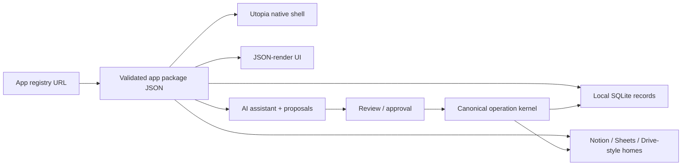

# Utopia

Utopia is a package-driven app platform for personal software.

The core idea is simple: a small native shell runs many useful apps from validated JSON packages. Data, screens, widgets, actions, permissions, provider connections, and AI behavior are described by app config instead of scattered bespoke screens.

Utopia is for one person first, then families, groups, and small companies as sync, sharing, roles, and recovery harden.

## License

Utopia is source-available under the [PolyForm Noncommercial License 1.0.0](./LICENSE).

Noncommercial personal, educational, research, charitable, government, and hobby use is permitted. Commercial use requires separate permission.

Earlier public revisions released under Apache-2.0 remain under their original terms; this license applies from the commit that changed `LICENSE` forward.

## Why this exists

Most personal software is trapped between two bad choices:

- rigid SaaS apps that almost fit;
- custom code that becomes expensive to maintain.

Utopia aims for a third shape:

- install an app package;
- connect the places where your data already lives;
- let AI help change the package safely;
- keep the native shell boring, stable, and reusable.

The long-term target is a platform where each new app package makes the shell more reusable, not more bespoke. The measured goal is simple: more apps should ship as package-only JSON, and any shell growth should become a reusable runtime capability.

## What it can build

Utopia is strongest today for structured personal database and workflow apps:

- food, pantry, recipes, meal planning, shopping;
- home inventory;
- plant care;
- personal chores;
- habit tracking;
- trip planning;
- small-team operating dashboards;
- lightweight CRM;
- collections, wishlists, reviews;
- routines, checklists, logs, calendars, feeds, boards, charts.

It is expanding into tool-shaped apps and lightweight interactive widgets, but “any app” is not proven yet.

Bundled app packages:

- [apps/food/food.v1.json](./apps/food/food.v1.json) — Food reference app.
- [apps/scientific-calculator/scientific-calculator.v1.json](./apps/scientific-calculator/scientific-calculator.v1.json) — calculator tool app.
- [apps/audio-loop-108/audio-loop-108.v1.json](./apps/audio-loop-108/audio-loop-108.v1.json) — local audio loop tool app.
- [apps/habit-grid/habit-grid.v1.json](./apps/habit-grid/habit-grid.v1.json) — package-only habit tracker.
- [apps/expense-splitter/expense-splitter.v1.json](./apps/expense-splitter/expense-splitter.v1.json) — package-only grouped balances and settlement proof.
- [apps/split-rent/split-rent.v1.json](./apps/split-rent/split-rent.v1.json) — package-only weighted allocation proof.
- [apps/workout-logger/workout-logger.v1.json](./apps/workout-logger/workout-logger.v1.json) — package-only persisted timed-flow proof.
- [apps/focus-intervals/focus-intervals.v1.json](./apps/focus-intervals/focus-intervals.v1.json) — package-only interval-cycle proof.

The 50-app adversarial suite lives under
[`tests/fixtures/adversarial-apps/`](./tests/fixtures/adversarial-apps) as test
input, not bundled products.

The platform generalization scorecard tracks whether new apps need domain-specific renderer work or reusable shell capabilities: [docs/platform-generalization-scorecard.md](./docs/platform-generalization-scorecard.md).

## The model



## Current shape

| Layer | Current status |
|---|---|
| Android | Native Expo / React Native shell |
| iOS | Native Xcode project generated |
| Web | Static Expo web export |
| macOS | Native React Native macOS shell/prototype with JSON rendering and local media bridge; not release-proven yet |
| UI | JSON-render powered surfaces with a widget registry |
| Data | Local SQLite operation store |
| Providers | Notion / Google Sheets style external homes |
| AI | Assistant and package/data proposal path |
| App install | Registry URL, app list, preview, approval, launch |

## Important files

### App JSON

- [apps/food/food.v1.json](./apps/food/food.v1.json) — first app package/domain.
- [apps/scientific-calculator/scientific-calculator.v1.json](./apps/scientific-calculator/scientific-calculator.v1.json) — non-Food tool package.
- [apps/audio-loop-108/audio-loop-108.v1.json](./apps/audio-loop-108/audio-loop-108.v1.json) — non-Food media tool package.
- [apps/habit-grid/habit-grid.v1.json](./apps/habit-grid/habit-grid.v1.json) — first package-only proof app.
- [apps/expense-splitter/expense-splitter.v1.json](./apps/expense-splitter/expense-splitter.v1.json) — grouped balances and deterministic settlement proof.
- [apps/split-rent/split-rent.v1.json](./apps/split-rent/split-rent.v1.json) — exact weighted-allocation proof.
- [apps/workout-logger/workout-logger.v1.json](./apps/workout-logger/workout-logger.v1.json) — persisted flow/timer proof.
- [packages/domain-config/domain-catalog.v1.json](./packages/domain-config/domain-catalog.v1.json) — active catalog and shell tabs.
- [packages/domain-config/domains/food.v1.json](./packages/domain-config/domains/food.v1.json) — bundled Food domain config.
- [packages/domain-config/domains/health.v1.json](./packages/domain-config/domains/health.v1.json) — Health preview.
- [packages/domain-config/domains/plants.v1.json](./packages/domain-config/domains/plants.v1.json) — Plants preview.

### Contracts

- [packages/domain-config/schemas/domain.v1.schema.json](./packages/domain-config/schemas/domain.v1.schema.json)
- [packages/domain-config/schemas/domain-catalog.v1.schema.json](./packages/domain-config/schemas/domain-catalog.v1.schema.json)
- [packages/domain-config/schemas/workflow.v1.schema.json](./packages/domain-config/schemas/workflow.v1.schema.json)
- [packages/domain-config/schemas/record.v1.schema.json](./packages/domain-config/schemas/record.v1.schema.json)

### App factory pieces

- [docs/github-app-factory.md](./docs/github-app-factory.md) — fork + `OPENAI_API_KEY` + natural-language app generation workflow.
- [docs/adversarial-app-tests.md](./docs/adversarial-app-tests.md) — adversarial runtime probes and current partial results.
- [docs/adversarial-app-matrix.json](./docs/adversarial-app-matrix.json) — checked 50-app falsification matrix; every row points to a test fixture.
- [requests/app-idea.md](./requests/app-idea.md) — plain-English request template for the GitHub workflow.
- [scripts/factory/generate-app-from-prompt.ts](./scripts/factory/generate-app-from-prompt.ts) — OpenAI structured-output generator for reviewable app packages.
- [packages/domain-config/templates/utopia-data-plane-template.v1.json](./packages/domain-config/templates/utopia-data-plane-template.v1.json)
- [packages/domain-config/templates/package-change-templates/package-change-blueprints.v1.json](./packages/domain-config/templates/package-change-templates/package-change-blueprints.v1.json)
- [packages/domain-config/templates/package-change-templates/widget-screen-intents.v1.json](./packages/domain-config/templates/package-change-templates/widget-screen-intents.v1.json)

### Registry install

- [app/install.tsx](./app/install.tsx) — app picker / install screen.
- [src/domain/package-install.ts](./src/domain/package-install.ts) — registry fetch, package preview, trust labels.
- [tests/fixtures/package-install/registry.json](./tests/fixtures/package-install/registry.json) — registry fixture.
- [tests/fixtures/package-install/valid-package.json](./tests/fixtures/package-install/valid-package.json) — installable package fixture.

## Food app

Food is the proof app.

It is intended to feel like a focused AI-native kitchen system:

- today’s meal plan;
- seven-day planning;
- pantry/fridge/freezer/shelf views;
- use-first food;
- recipes and recipe revisions;
- shopping list and receipts;
- nutrition observations;
- Notion / Sheets data homes;
- assistant workflows for “what can I cook tonight?” and “use these first.”

### Data-home selection behavior

Data-home options come from two checks only:

- declared by app manifest (`data_homes` / `data-home:*` capability);
- runtime availability from the adapter registry (`ready`, `requires_auth`, `offline`, `blocked`, or `unsupported`).

Rows that are unavailable must remain visible with truthy reasons and `canSelect: false`.

- not configured by app -> `... is not configured by this app.`
- runtime offline -> `... is currently offline.`
- auth required -> `... needs sign-in before use.`
- unsupported at runtime -> `... is not supported by this runtime.`

This contract is deterministic metadata; it does not assert live upstream provider proof by itself.

## Widget surface

The renderer supports a growing widget catalog. The product goal is not “more widgets forever”; it is fewer domain-specific widgets, stronger generic primitives, and explicit reusable runtime capabilities when JSON alone is not enough.

Current generic/package-level widgets include:

- assistant chat;
- calendar block;
- smart capture;
- provider status;
- data home settings;
- AI provider settings;
- theme and density controls;
- health permissions;
- posts;
- polls;
- feeds;
- checklist cards;
- charts;
- galleries;
- schema editor;
- widget catalog;
- file picker/export;
- video player;
- camera scanner;
- location/map;
- sensor readout;
- local notifications;
- contact picker;
- calendar event;
- biometric gate;
- health status;
- speech tool.

Known renderer debt:

- Food now uses shared `recordHeroSummary`, `groupedRecordShelf`, `horizontalRecordCarousel`, `recordTimeline`, `recordContentCard`, and `recordReviewCard` primitives; `askFoodBar` remains a separate assistant surface.
- Calculator and Audio Loop prove non-Food apps, but each uses a specialized reusable runtime widget: `scientificCalculator`, `audioLoopPlayer`.
- Habit Grid is the first package-only proof app: it uses existing `chartBlock`, `checklistCard`, `dataTable`, and `recordList` primitives.
- Expense Splitter and Split Rent are package-only expression proofs using the
  shared deterministic kernel and existing `recordList` and `dataTable` UI.
- Workout Logger uses generic `stepFlow` and `durationTimer` widgets backed by
  the persisted workflow journal.
- Focus Intervals reuses the same flow/timer contract for a second domain with
  no new runtime primitive.
- The scorecard must trend toward package-only apps and reusable capabilities, not app-specific shell growth.

Rule of thumb: JSON can configure any capability the renderer already exposes. New behavior belongs in generic widgets, not one-off app screens.

## App registry

Utopia already has the basic install path:

1. open Install;
2. set a registry URL;
3. fetch available app packages;
4. preview screens, collections, widgets, providers, permissions, plugins;
5. approve install;
6. launch the installed app.

This should evolve into a polished App Library with screenshots, categories, trust badges, permissions, install/open/remove, and shareable registries.

## Platforms

### Android

```bash
npm run android:dev
```

### iOS

```bash
npm run ios
```

Native project:

```bash
open ios/Utopia.xcodeproj
```

### Web

```bash
npm run web
```

Static export:

```bash
npm run export:web
```

### macOS

There is a native React Native macOS shell/prototype.

Useful commands:

```bash
npm run macos
npm run macos:build
```

Current macOS bridge scope:

- render package JSON surfaces;
- pick/open/save local files;
- open local video files through the native workspace bridge.

It is not release-proven like Android signed build/export proof yet.

## Development

Install dependencies:

```bash
npm install
```

Validate config and contracts:

```bash
npm run config:validate
```

Typecheck:

```bash
npm run typecheck
```

Run tests:

```bash
npm run test
```

Build exports:

```bash
npm run export:web
npm run export:android
npm run export:ios
```

## Quality gates

Useful focused gates:

```bash
npm run check:widget-catalog
npm run check:platform-generalization
npm run check:adversarial-app-matrix
npm run materialize:adversarial-apps
npm run check:native-capability-contract
npm run check:package-owned-routes
npm run check:food-app-vibe
npm run check:link-install
npm run check:json-render-only-ui
```

Broader gate:

```bash
npm run quality
```

## Design laws

1. App behavior should live in app packages when possible.
2. The native shell should stay small and reusable.
3. The renderer should expose generic capabilities, not domain-specific hacks.
4. The operation kernel is the only writer.
5. AI proposes changes; validated contracts decide what can run.
6. Provider sync should feel invisible, but remain verifiable.
7. Secrets never belong in git.
8. Prefer proven libraries over custom platform code.
9. Generated apps should feel like real products, not config demos.

## What is not done

Utopia is not yet a finished app factory.

Still needed:

- richer App Library UX;
- stronger package authoring flow;
- better visual editor / AI package editor;
- stronger generic widgets and less domain-specific renderer code;
- declarative native permission flows per package;
- enforced package capability boundary for untrusted registries;
- generated-app quality evals beyond schema validity;
- family/group sync, sharing, roles, recovery, and conflict UX proof;
- polished provider connection UX;
- production dependency/security cleanup;
- physical-device release proof;
- native HealthKit entitlement bridge;
- speech-to-text bridge.

## Product thesis

Utopia is not trying to be another notes app, database app, or chatbot wrapper.

It is trying to become a personal software substrate:

- JSON packages define apps;
- the renderer makes them native and useful;
- providers keep them connected to real data;
- AI helps reshape them;
- the kernel keeps writes safe.

The dream: create one excellent shell, then ship endless excellent apps through packages.
